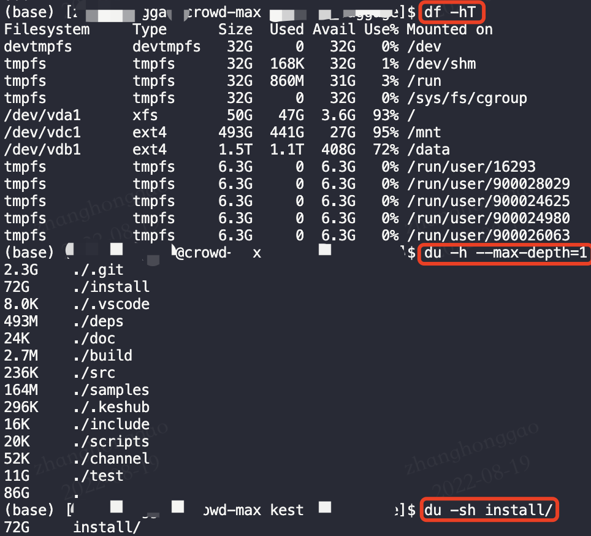
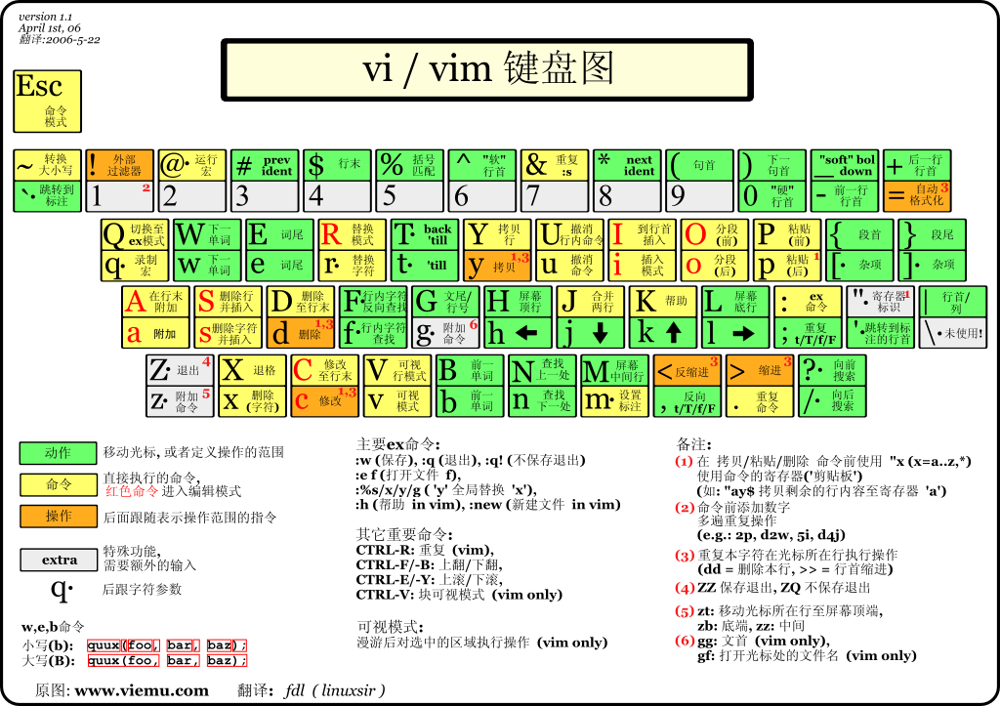

- [1，scp 命令复制远程文件](#1scp-命令复制远程文件)
- [2，ubuntu 系统使用使用 dpkg 命令安装和卸载 .deb 包](#2ubuntu-系统使用使用-dpkg-命令安装和卸载-deb-包)
- [3，vim 查找字符串](#3vim-查找字符串)
- [4，df 和 du 命令使用](#4df-和-du-命令使用)
- [5，ls -lh 查看指定文件大小](#5ls--lh-查看指定文件大小)
- [6，ctrl + r，反向查找历史命令](#6ctrl--r反向查找历史命令)
- [7，find 查找文件和文件夹](#7find-查找文件和文件夹)
- [8，hdfs 命令详解](#8hdfs-命令详解)
- [9，top 命令进行程序性能分析](#9top-命令进行程序性能分析)
- [10，tar 压缩、解压命令](#10tar-压缩解压命令)
- [11，linux 系统特殊符号作用](#11linux-系统特殊符号作用)
- [12， linxu 中 shell 变量含义](#12-linxu-中-shell-变量含义)
- [13，vim 跳转到行尾和行首命令](#13vim-跳转到行尾和行首命令)
- [14，vscode 列选择快捷键](#14vscode-列选择快捷键)
- [15，查看 cpu 信息](#15查看-cpu-信息)
- [16，mkdir -p 创建多层目录](#16mkdir--p-创建多层目录)
- [17，查看 gcc 所有安装的版本](#17查看-gcc-所有安装的版本)
- [18，查看系统版本命令](#18查看系统版本命令)
- [19，shell 读取文件每一行内容并输出](#19shell-读取文件每一行内容并输出)
- [20，实时查看 GPU 显存信息](#20实时查看-gpu-显存信息)
- [21，update-alternatives 管理软件版本](#21update-alternatives-管理软件版本)
- [22，管道和重定向命令](#22管道和重定向命令)
- [23，Bash快捷输入或删除命令](#23bash快捷输入或删除命令)
- [参考资料](#参考资料)


### 1，scp 命令复制远程文件

```bash
# 从本地复制到远程：
scp local_file remote_username@remote_ip:remote_file 
# 从远程复制到本地
scp root@www.runoob.com:/home/root/others/music /home/space/music/1.mp3 
```

### 2，ubuntu 系统使用使用 dpkg 命令安装和卸载 .deb 包

```bash
sudo dpkg -i package_name.deb  # 安装deb包
sudo dpkg -r package_name # 卸载 deb 包
sudo apt install path_to_deb_file # 安装deb包
sudo apt remove program_name # 卸载deb 包
```

### 3，vim 查找字符串

在 `normal` 模式下按下 `/` 进入查找模式，输入要查找的字符串并按下回车。`Vim` 会跳转到第一个匹配，按下 `n` 查找下一个，按下 `N` 查找上一个，`vim` 还支持正则表达式查找。

### 4，df 和 du 命令使用

* `df` ：查看**磁盘空间**占用情况
* `du` ：查看**目录**占用的空间大小。

```bash
df -hT #查看硬盘使用情况。
du -h --max-depth=1 floder_name # 查看当前目录下所有文件/文件夹的空间大小
du -h -d 0 . # 查看当前目录空间大小
du -sh foldername # 查看指定目录空间大小
```


### 5，ls -lh 查看指定文件大小

```bash
$ ls -lh .bashrc  # 能查看文件空间大小,不能查看目录大小
```

### 6，ctrl + r，反向查找历史命令

终端中按下 `ctrl + r`，可弹出搜索历史命令行，输入你要查找你输入过命令的关键信息，即可弹出完整历史命令。

### 7，find 查找文件和文件夹

`find` 支持基于正则表达式查找指定名字的文件，也支持根据文件类型、基于目录深度和文件时间戳进行搜索。

1. 查找目录：find /（查找范围） -name '查找关键字' -type d
2. 查找文件：find /（查找范围） -name 查找关键字 -print


### 8，hdfs 命令详解

[HDFS 常用命令](http://blog.sanyuehua.net/2017/11/01/Hadoop-HDFS/)

### 9，top 命令进行程序性能分析

`top` 命令是 `Linux` 下常用的性能分析工具，能够实时显示系统中各个进程的资源占用状况，类似于 `Windows` 的任务管理器。


`load average` 后面分别是 1分钟、5分钟、15分钟的负载情况。数据是每隔 5 秒钟检查一次活跃的进程数，然后根据这个数值算出来的。如果这个数除以 CPU  的数目，**结果高于 5 的时候就表明系统在超负荷运转了**。

### 10，tar 压缩、解压命令

* `tar -zxvf` 解压 `.tar.gz` 和 `.tgz`。
* `tar -xvf file.tar`  解压 tar 包
* `tar –cvf jpg.tar ./*.jpg`：将当前目录下所有 `jpg` 文件仅打包成 `jpg.tar` 后。
* `tar –zcvf xxx.tar.gz ./*.jpg`：打包后以 `gzip` 压缩，命名为 `xxx.tar.gz`。

在参数 `f` 之后的文件档名是自己取的，我们习惯上都用 `.tar` 来作为辨识。 如果加 `z` 参数，则以  `.tar.gz` 或  `.tgz` 来代表 `gzip` 压缩过的 `tar` 包； 如果加 `j` 参数，则以  `.tar.bz2` 来作为 `tar` 包名。

### 11，linux 系统特殊符号作用

1. `$`: 作为变量的前导符，引用一个变量的内容，比如：`echo $PATH`；在正则表达式中被定义为行末（`End of line`）。
2. `>>` : 表示将符号左侧的内容，以追加的方式输入到右侧文件的末尾行中。
3. `|`\*\* : 管道命令。\*\*管道命令 "|" 仅能处理前面一个命令传来的正确信息。

### 12， linxu 中 shell 变量含义

* `$1～$n`：添加到 `Shell` 的各参数值。`$1` 是第 `1` 参数、`$2` 是第 `2` 参数…。
* `$$`：`shell` 脚本本身的 `PID`。
* `$!`：`shell` 脚本最后运行的后台 `process` 的 `PID`。
* `$?`：最后运行的命令结束代码（返回值）。
* `$*`：所有参数列表。如 `"$*"` 用`「"」`括起来的情况、以 `"$1 $2 … $n"` 的形式输出所有参数。
* `$#`：添加到 `shell` 的参数个数。
* `$0`：`shell` 本身的文件名。

### 13，vim 跳转到行尾和行首命令



1. 跳到文本的最后一行行首：按`“G”`,即`“shift+g”`；
2. 跳到最后一行的最后一个字符 ： 先重复 1 的操作即按“G”，之后按“\$”键，即`“shift+4”`；
3. 跳到第一行的第一个字符：先按两次`“g”`；
4. `^` 跳转行首，`$` 跳转行尾；

### 14，vscode 列选择快捷键

* VSCode 列选择快捷键：Alt+Shift+左键

### 15，查看 cpu 信息
> 总核数 = 物理 cpu 个数 \* 每颗物理 cpu 的核数
总逻辑 cpu 数 = 物理 cpu 个数 \* 每颗物理 cpu 的核数 \* 超线程数

1. 查看物理 cpu 个数：`cat /proc/cpuinfo | grep "physical id"| sort| uniq| wc -l`
2. 查看每个物理 cpu 中的 core 个数（核数）：`cat /proc/cpuinfo| grep "cpu cores"| uniq`
3. 查看逻辑 cpu 的个数： `cat /proc/cpuinfo| grep "processor"| wc -l` 

```bash
# lscpu | grep -E '^Thread|^Core|^Socket|^CPU\(' 查看 cpu 核数和线程数
```


### 16，mkdir -p 创建多层目录

`mkdir -p /xxx/xxx/` 创建多层目录

### 17，查看 gcc 所有安装的版本

```bash
# centos 系统
rpm -qa | grep gcc | awk '{print $0}'
# ubuntu 系统
dpkg -l | grep gcc | awk '{print $2}'
# 查看系统当前使用 gcc 版本
gcc -v
```


### 18，查看系统版本命令

* `lsb_release -a`:  适用于大部分 Linux 系统，会显示出完整的版本信息，`centos` 系统无法直接使用该命令，需要安装 yum install -y redhat-lsb。
* `cat /etc/os-release`: 适用于所有 Linux 系统。能显示较为全面的系统信息。
* `cat /proc/version`:  该文件记录了 Linux 内核的版本、用于编译内核的 `gcc` 的版本、内核编译的时间，以及内核编译者的用户名。


> `release` 文件通常被视为操作系统的标识。在 `/etc` 目录下放置了很多记录着发行版各种信息的文件，每个发行版都各自有一套这样记录着相关信息的文件。`LSB`（Linux 标准库Linux Standard Base）能够打印发行版的具体信息，包括发行版名称、版本号、代号等。

### 19，shell 读取文件每一行内容并输出

```bash
for line in `cat  test.txt`
do
    echo $line
done
```
### 20，实时查看 GPU 显存信息

`watch -n 1 nvidia-smi # 每1s显示一次显存信息`

### 21，update-alternatives 管理软件版本

`update-alternatives` 命令用于处理 Linux 系统中软件版本的切换，使其多版本共存。alternatives 程序所在目录 /etc/alternatives 。语法：

```bash
update-alternatives --help
用法：update-alternatives [<选项> ...] <命令>

命令：
  --install <链接> <名称> <路径> <优先级>
    [--slave <链接> <名称> <路径>] ...
                           在系统中加入一组候选项。
  --remove <名称> <路径>   从 <名称> 替换组中去除 <路径> 项。
  --remove-all <名称>      从替换系统中删除 <名称> 替换组。
  --auto <名称>            将 <名称> 的主链接切换到自动模式。
  --display <名称>         显示关于 <名称> 替换组的信息。
  --query <名称>           机器可读版的 --display <名称>.
  --list <名称>            列出 <名称> 替换组中所有的可用候选项。
  --get-selections         列出主要候选项名称以及它们的状态。
  --set-selections         从标准输入中读入候选项的状态。
  --config <名称>          列出 <名称> 替换组中的可选项，并就使用其中哪一个，征询用户的意见。
  --set <名称> <路径>      将 <路径> 设置为 <名称> 的候选项。
  --all                    对所有可选项一一调用 --config 命令。

<链接> 是指向 /etc/alternatives/<名称> 的符号链接。(如 /usr/bin/pager)
<名称> 是该链接替换组的主控名。(如 pager)
<路径> 是候选项目标文件的位置。(如 /usr/bin/less)
<优先级> 是一个整数，在自动模式下，这个数字越高的选项，其优先级也就越高。
..........
```

安装命令

```bash
sudo update-alternatives --install link name path priority [ --slave slink sname spath]
# 该命令完成 /usr/bin/gcc 到 /etc/alternatives/gcc 再到 /usr/local/${gcc_version}/bin/gcc 符号链接到建立。
update-alternatives --install /usr/bin/gcc gcc /usr/local/${gcc_version}/bin/gcc 100
```
选项注释:

* `link` 是在 /usr/bin/, /usr/local/bin/ 等默认PATH搜索目录
* `name` 是在 /etc/alternatives 目录中的链接名
* `path` 是真正的可执行程序的位置，可以在任何位置
* `priority` 是优先级，数字越大优先级越高

### 22，管道和重定向命令

* 批处理命令连接执行，使用 `|`
* 串联: 使用分号 `;`
* 前面成功，则执行后面一条，否则，不执行：`&&`
* 前面失败，则后一条执行： `||`

实例1：判断 /proc 目录是否存在，存在输出success，不存在输出 failed。

```bash
$ ls /proc > log.txt && echo  success! || echo failed.
success!
$ if ls /proc > log.txt;then echo success!;else echo failed.;fi  # 与前面脚本效果相同
success!
$ :> log.txt  # 清空文件
```

### 23，Bash快捷输入或删除命令

常用快捷键：

```bash
Ctl-U   删除光标到行首的所有字符,在某些设置下,删除全行
Ctl-W   删除当前光标到前边的最近一个空格之间的字符
Ctl-H   backspace,删除光标前边的字符
Ctl-R   匹配最相近的一个文件，然后输出
```

### 参考资料
1. [linux find 命令查找文件和文件夹](https://www.cnblogs.com/jiftle/p/9707518.html)
2. [每天一个linux命令（44）：top命令](https://www.cnblogs.com/peida/archive/2012/12/24/2831353.html)
3. [Shell中截取字符串的用法小结](https://www.cnblogs.com/kevingrace/p/8868262.html)
4. [查看 Linux 发行版名称和版本号的 8 种方法](https://linux.cn/article-9586-1.html)
5. [Linux Commands - Complete Guide](https://linoxide.com/linux-commands-brief-outline-examples/)