# 深入理解计算机系统-第3章程序的机器级表示.md
计算机执行机器代码，用字节序列编码低级的操作，包括处理数据、管理内存、读写存储设备上的数据，以及利用网络通信。编译器基于编程语言的规则、目标机器的指令集和操作系统遵循的惯例，经过一系列阶段生成机器代码。

在本章中，我们将详细学习一种特别的汇编语言，了解如何将 C 程序编译成这种形式的机器代码。阅读编译器产生的汇编代码，需要具备的技能不同于手工编写汇编代码，我们必须了解典型的编译器在将 C 程序结构变换成机器代码时所做的转换。相对于 C 代码表示的计算操作，优化编译器能够重新排列执行顺序，消除不必要的计算，用快速操作替换慢速操作，甚至将递归计算变换成迭代计算。但是源代码与对应的汇编代码的对应关系通常不太容易理解，因为这是一种逆向工程（reverse engineering）-通过研究系统和逆向工作。

本章内容会涉及到 x86-64 汇编级指令代码。

### 1，历史观点
`Intel` 处理器系列俗称 `x86`，经历了一个长期的、不断进化的发展过程。

### 2，程序编码
`Linux` 系统默认的编译器时 `GCC C` 编译器。编译器选项 `-Og` 会指示编译器使用会生成符合原始 `C` 代码整体结构的机器代码的优化等级，通常使用 `-O1` 或 `-O2` 选项。

`x86-64` 的机器代码和原始的 C 代码差别非常大，一些通常对 C 语言程序员隐藏的处理器状态都是可见的:

* **程序计数器**（PC，在 x86-64 中用 `%rip` 表示）给出将要执行的下一条指令在内存中的地址。
* **整数寄存器文件**包含 16 个命名的位置，分别存储 64 位的值。这些寄存器可以存储地址（对应于C 语言的指针）或整数数据。有的寄存器被用来记录默写重要的程序状态，有的寄存器保存临时数据，如过程的参数和局部变量，以及函数的返回值。
* **条件码寄存器**保存着最近执行的算术或逻辑指令的状态信息。它们用来实现控制或数据流中的条件变化，如用来实现 if 和 else 语句。
* 一组向量寄存器可以存放一个或多个整数或浮点数值。

### 3，数据格式
`C` 语言数据类型在 `x86-64` 中的大小。


浮点数主要有两种形式：单精度（4 字节）值，对应于 C 语言数据类型 float，双精度（8 字节）值，对应于 C 语言数据类型 double。如上图所示，大多数 GCC 生成的汇编代码指令都有一个字符的后缀，表明操作数的大小，例如，数据传送指令有四个变种: `movb`（传送字节）、`movw`（传送字）、`movl`（传送双字）和`movq`（传送四字）。

### 4，访问信息指令
一个 `x86-64` 的中央处理单元（`CPU`）包含一组 `16` 个存储 `64` 位值的**通用目的寄存器，**这些寄存器用来**存储整数数据和指针**。下图显示了这 `16` 个寄存器，它们的名字都以 `%r` 开头，后面还跟着一些不同的命名规则的名字。最初的 8086 中有 8 个 16 位的寄存器，即图 3-2 中的 %ax 到 %bp，每个寄存器都有特殊的用途，它们的名字就反映了这些不同的用途。拓展到 IA32 架构时，这些寄存器也拓展成 32 位寄存器，标号从 %eax 到 %ebp。**拓展到 x86-64 后，用来的 8 个寄存器拓展成 64 位，标号从 ****%rax**** 到 ****%rbp****，除此之外，还增加了 8 个寄存器，标号从 ****%r8**** 到 ****%r15****。**


#### 4.1，操作数指示符
大多数指令有一个或多个操作数（operand），指示出执行一个操作中要使用的源数据值，以及防止结果的目的位置。不同操作数被分为三种类型。

* 立即数（`immediate`），用来表示常数值。
* 寄存器（`register`）
* 内存引用: 它会根据计算出来的地址访问某个内存位置。

如图 3-3 所示，有多重不同的**寻址模式**，允许不同形式的内存引用。


#### 4.2，数据传送指令
最频繁使用的指令是**将数据从一个位置复制到另一个位置**的指令。图 3-4 列出的最简单形式的数据传送指令-MOV 类: **把数据从源位置复制到目的位置，不做任何变化**。

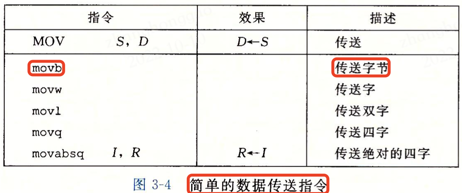

简单的数据传送指令示例代码如下。（记住，第一个是源操作数，第二个是目的操作数）


#### 4.3，数据传送示例


#### 4.4，压入和弹出数据
栈和队列都是一种"操作受限"的线性表（逻辑结构），只允许在一端插入和删除数据；**栈的特性是先进后出，队列是先进先出**。**栈**在处理函数调用过程中很重要，通过 push 指令把数据压入栈中，通过 pop 指令删除数据。

**栈可以可以通过数组实现**，总是从数组的一端插入和删除元素，这一端称为**栈顶，栈顶元素的地址是所有栈中元素地址中最低的，栈指针 ****%rsp**** 保存着站定元素的地址。**入栈和出栈汇编指令描述如下，栈操作指令都只有一个操作数-压入的数据源和弹出的栈顶数据。


将一个四字值压入栈中，分为两步，**首先先将栈指针减 8，然后将值写到新的栈顶地址**，因此 `pushq` 指令等价于下面两条指令:

```bash
subq $8,%rsp Decrement stack pointer
moq %rbp,(%rsp)
```
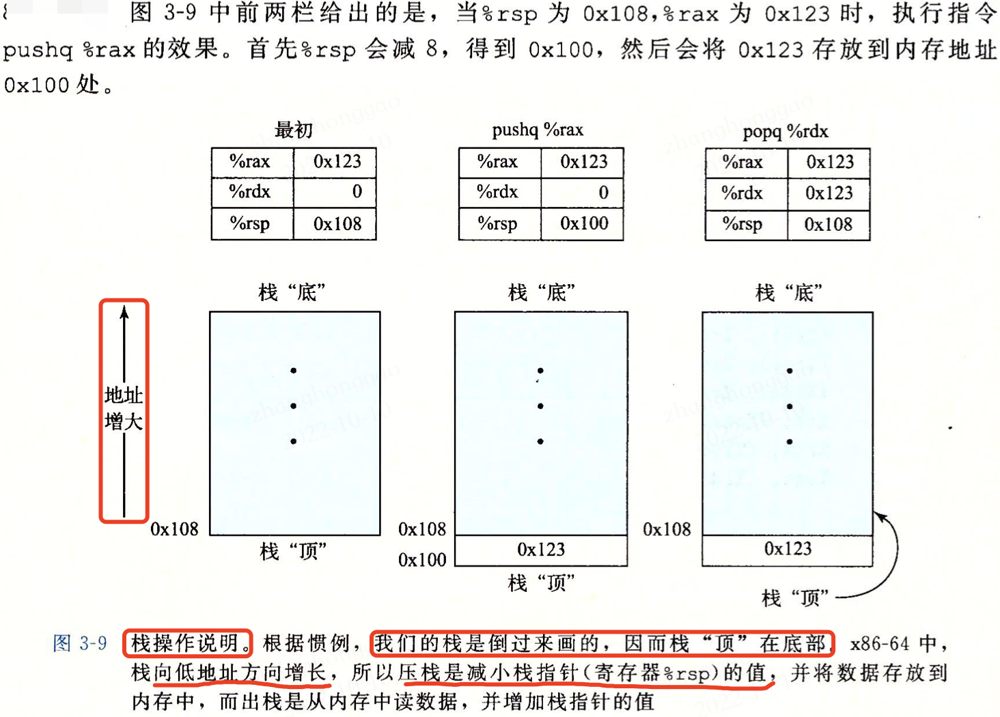

### 5，算术和逻辑操作指令
图 3-10 列出了 x86-64 的一些整数和逻辑操作。和访问信息指令一样，算术和逻辑操作指令类也有各种带不同大小操作数的变种。例如，指令类 ADD 由四条加法指令组成: addb、addw、addl 和 addq，分别是字节加法、字加法、双字加法和四字加法。**算术和逻辑操作指令分为四组：加载有效地址、一元操作、二元操作和移位。二元操作数有两个操作数，而一元操作数有一个操作数。**

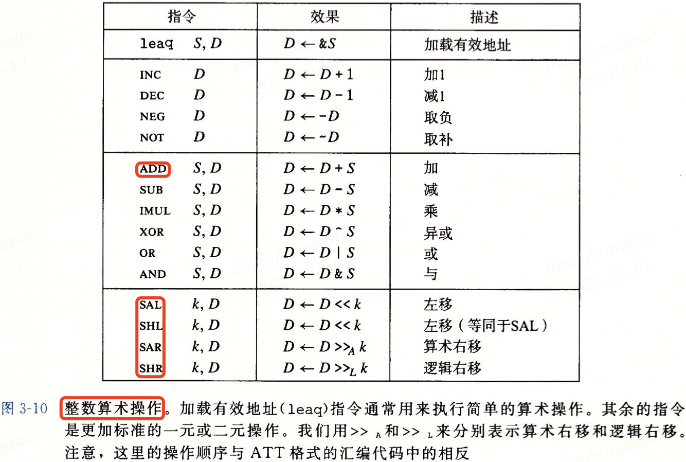

#### 5.1，加载有效地址
加载有效地址（load effective address）指令 leaq 实际上是 movq 指令的变形。leaq 指令可以简洁地描述普通的算术操作，如果寄存器 %rdx 的值为 x，那么指令 `leaq 7(%rdx, %rdx, 4),%rax` 将设置寄存器 `%rax` 的值为 `5x+7`。目的操作数必须是一个寄存器。

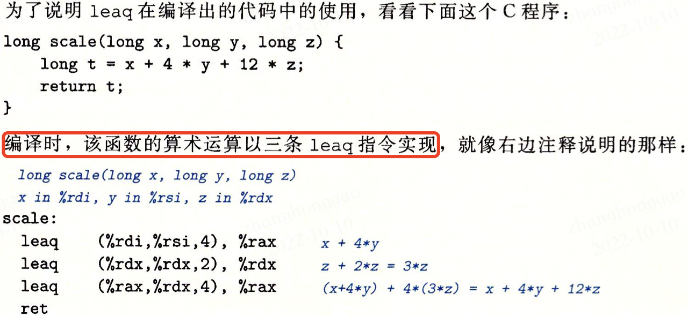

#### 5.2，一元和二元操作
对于二元操作指令，第一个操作数可以是立即数、寄存器或内存位置，第二个操作可以是寄存器或内存位置。

#### 5.3，移位操作
移位操作指令，先给出移位量，第二项给出要移位的数，移位量可以是立即数，或者在单字节寄存器 `%cl` 中，移位量是由 `%c1` 寄存器的低 `m` 位决定的。例如当寄存器 `%c1` 的十六进制位 0xFF 时，指令 `salb` 会移 7 位，`salw` 会移 15 位，`sall` 会移 31 位，`salq` 会移 63 位。

#### 5.4，总结


### 6，控制指令
前面的两类指令都是**直线代码**行为，也就是指令一条接着一条顺序地执行。C 语言中的某些结构，比如条件语句、循环语句和分支语句，要求有条件的执行，根据数据测试的结果来决定操作执行的顺序。

#### 6.1，条件码
除了整数寄存器，CPU 还维护着一组单个位的条件码（condition code）寄存器，它们描述了最近的算术或逻辑操作的属性，可以**通过检测条件码寄存器来执行条件分支指令**。最常用的条件码有：

* `CF`： 进位标志。最近的操作使最高位产生了进位，可用来检查无符号操作的溢出。
* `ZF`: 零标志。最近的操作得出的结果为 0。
* `SF`: 符号标志位。最近的操作得到的结果为负数。
* `OF`: 溢出标志。最近的操作导致一个补码已出-正溢出或负溢出。

除了图 3-10 的整数算术操作指令会设置条件码，还有两类指令 `CMP` 和 `TEST` ，**但它们只设置条件码而不改变任何其他寄存器。**如下图 3-13 所示，`CMP` 指令根据两个操作数之差来设置条件码。

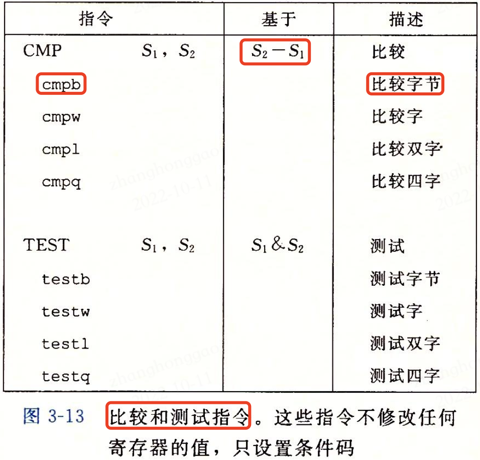

#### 6.2，访问条件码
条件码通常不会直接读取，常使用方法有三种：

1. 可以根据条件码的某种组合，将一个字节设置为 0 或者1。
2. 可以有条件跳转到程序的某个其他的部分。
3. 可以有条件地传送数据。


#### 6.3，跳转指令
**跳转**（jump）指令会导致执行切换到程序中一个全新的位置，示例代码如下。


图 `3-15` 列举了不同的跳转指令，`jmp` 指令是无条件跳转，可以是直接跳转，即跳转目标是作为指令的一部分编码的；也可以是间接跳转，即跳转目标是从寄存器或内存位置中读出的。汇编语言中，直接跳转是会给出一个标号作为跳转目标的，例如上面示例代码中的标号“.L1"；间接跳转的写法是 "*"后面跟一个操作数指示符 jmp \**%rax，用寄存器 %rax 中的值作为跳转目标。

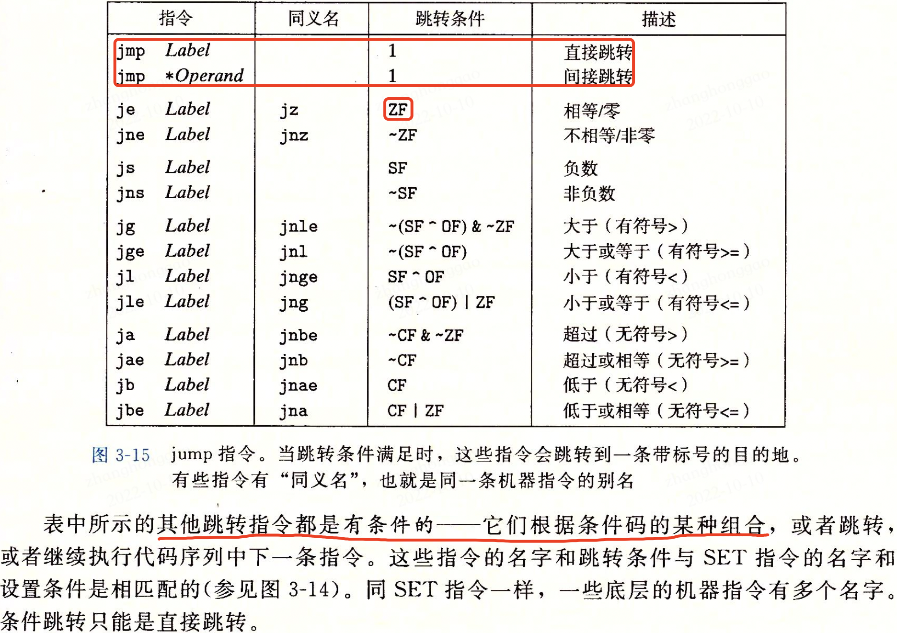

#### 6.4，跳转指令的编码
略

#### 6.5，用条件控制来实现条件分支
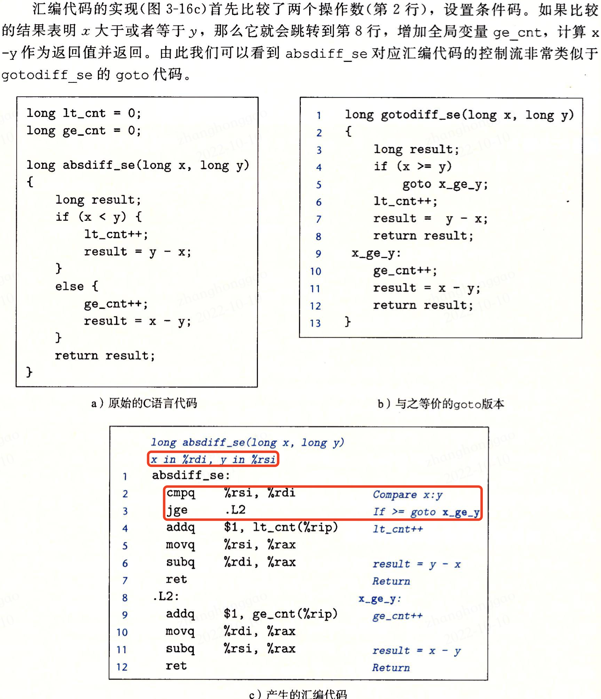

#### 6.6，用条件传送来实现条件分支
实现条件操作的传统方法是通过使用控制的条件转移。当条件满足时，程序沿着一条路径执行，而当条件不满足时，就走另一条路径。这种机制虽然简单通用，但是在现代处理器上，它可能会非常低效。

为了理解为什么教育条件数据传送的代码会比基于条件控制转移的代码性能要好，我们必须了解一些关于现代处理器如何运行的知识。处理器是通过流水线（pipelining）来获得高性能，在流水线中，一条指令的处理要经过一系列的阶段，每个阶段执行所需操作的一小部分（例如，从内存取指令、确定指令类型、从内存读数据、执行算术运算、向内存写数据，已经更新程序计数器）。这种方法通过重叠连续指令的步骤获得高性能，例如在取一条指令的同事，执行它前面一条指令的算术运算。要做到这一点，要求事先确定要执行的指令序列，这样才能保持流水线中充满了待执行的指令。


同条件跳转不同，处理器无需预测测试的结果就可以执行条件传送。处理器只是读源值（可能从内存中），检查条件码，然后要么更新目的寄存器，要么保持不变。条件传送指令类如图 3-18 所示。

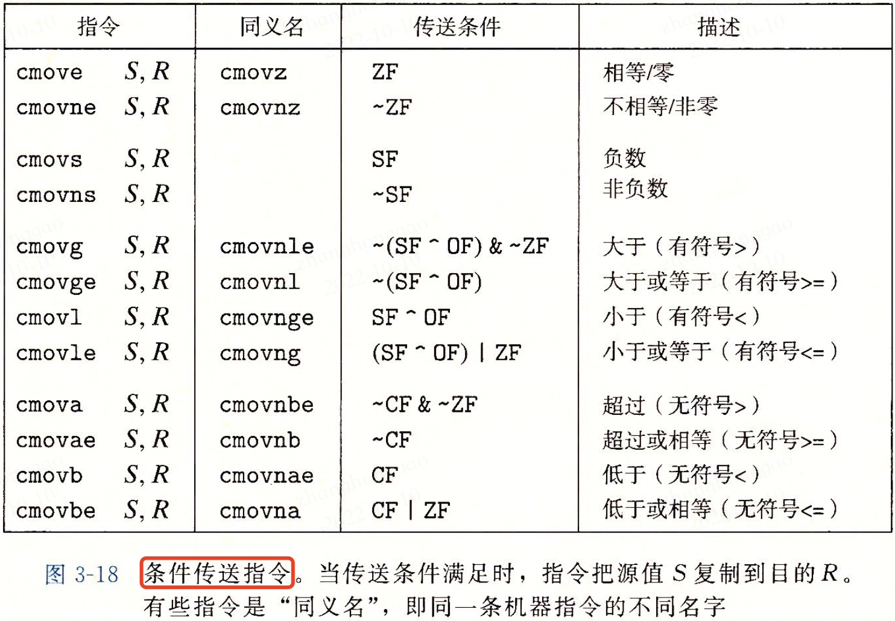

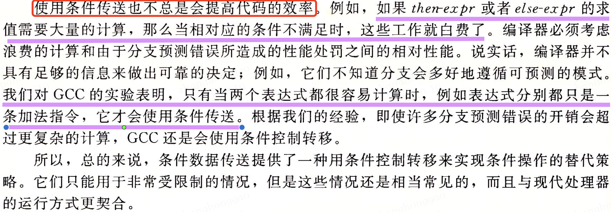

#### 6.7，循环
`C` 语言提供了多种循环结构，如 `do-while`、`while` 和 `for`。汇编中没有直接的循环指令存在，但可以用条件测试和跳转指令组合起来实现循环的效果。GCC 和其他汇编器产生的循环代码主要基于两种基本的循环模式：`do-while` 循环和 `while` 循环。这里以给出一个函数实现 $n!$，其 C 代码、goto 代码和汇编代码如下。

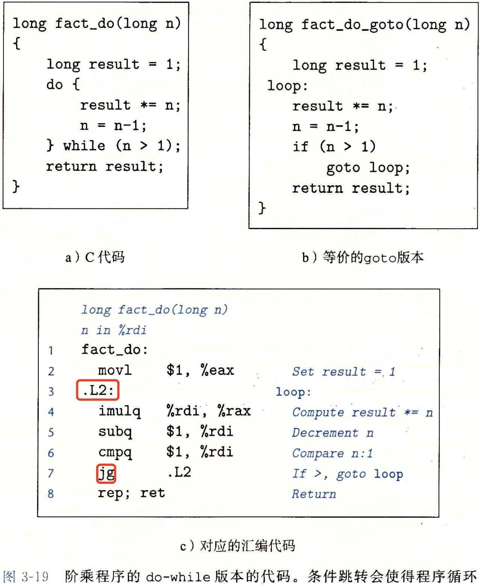

```bash
long fact_do(long n)
n in %rdi
fact_do:
    mov1 $1, %eax Set result = 1
.L2:
    imulq %rdi, %rax Compute result *= n
    subq $1, %rdi Decrement n
    cmpq $1, %rdi Copare n:1
    jg .L2 if >, goto loop
    rep; ret Return
```
### 7，过程
过程是软件中一种很重要的抽象，不同编程语言中，过程的形式多样：函数（function）、方法（method）、子例程（subroutine）、处理函数（handler）等等，但是它们都有一些共同的特性。

**编程语言过程调用机制的一个关键特性在于使用了栈数据结构提供的先进后出的内存管理原则。**


### 8，数组的分配和访问
> 数据结构-数组的定义和使用参考这篇文章[常见数据结构-数组](https://blog.csdn.net/qq_20986663/article/details/127252593?spm=1001.2014.3001.5501)。

#### 8.1，基本原则
`x86-64` 的内存引用指令可以用来简化数组访问。例如，假设 E 是一个 int 型的数组，而我们想计算 $E[i]$，在此，E 的地址存放在寄存器 %rdx 中，而 i 存放在寄存器 `%rcx` 中，指令 `movl (%rdx, %rcx, 4), %eax` 会执行地址计算 $x_{E} + 4i$,读取这个内存位置的值，并将结果存放到寄存器 `%eax` 中。

#### 8.2，指针运算
单操作数操作符 & 和 \* 可以产生指针和间接引用指针。

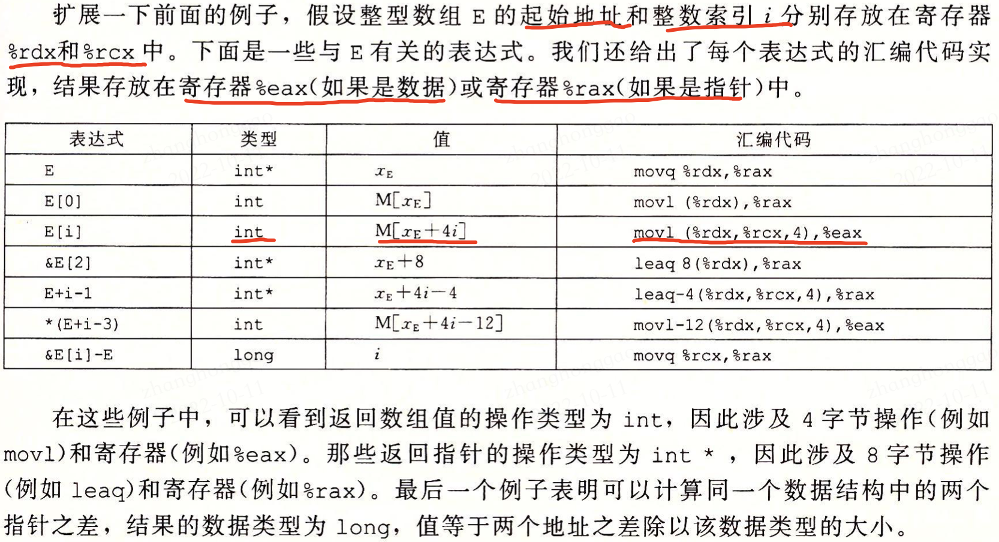

#### 8.3，嵌套到数组（多维数组）
要访问多维数组元素，编译器会以**数组起始为基地址，（可能需要经过伸缩的）偏移量为索引，产生计算期望的元素的偏移量，然后使用某种 MOV 指令**。对于一个声明如下的二维数组: 

```cpp
T D[R][C]; // T 是数据类型
```
它的数组元素 `D[i][j]` 的内存地址为 $\&D[i][j] = x_{D} + L(C\cdot i + j)$。

这里，$L$是数据类型 $T$以字节为单位的大小。以 $5\times 3$的整形数组 A 为例，假设数组起始地址、行列索引 $x_A$、$i$和$j$分别在寄存器 %rdi、%rsi 和 %rdx 中，然后可以用下面的代码将数组元素 A\[i\]\[j\] 复制到寄存器 %eax 中：

```bash
A in %rdi, i in %rsi, and j in %rdx
leaq (%rsi, %rsi, 2), %rax     Compute 3i
leaq (rdi, %rax, 4), %rax      Compute x_A + 12i
movq (rax, %rdx, 4), %eax      Read from M[x_A + 12i + 4j]
```
上面这段代码计算元素的地址为 $x_A + 12i + 4j = x_A + 4(3i + j)$，使用了 x86-64 地址运算的伸缩和加法特性。

### 9，异数的数据结构
略

### 10，在机器级程序中将控制与数据结合起来
略

### 11，浮点代码
略

### 参考资料
《深入理解操作系统第三版-第3章》

