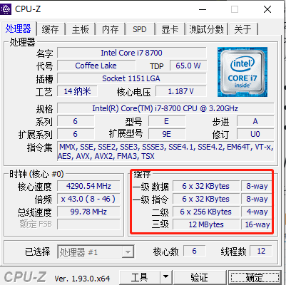

## 知识点目录

+ 操作系统
+ 计算机网络
+ 面向对象
+ 数据库
+ Linux系统开发
+ 常用工具（Cmake/Git/Docker/正则表达式）

## 操作系统

### 操作系统中堆和栈的区别

+ 操作系统中堆和栈都是指内存空间，不同的是堆为按需申请、动态分配，例如 `C++` 中的 `new` 操作（当然 C++ 的 new 不仅仅是申请内存这么简单）。**堆**可以简单理解为当前使用的空闲内存，其申请和释放需要程序员自己写代码管理。
+ 操作系统中的栈是程序运行时自动拥有的一小块内存，大小在编译时由编译器参数决定，是用于局部变量的存放或者函数调用栈的保存。在 `C` 中声明一个局部变量（如 `int a`）会存放在栈中，当其离开作用域后，所占用的内存则会被释放，栈用于保存函数调用栈时和数据结构的栈是有关系的。在函数调用过程中，常常会多层甚至递归调用。每一个函数调用都有各自的局部变量值和返回值，每一次函数调用其实是先将当前函数的状态压栈，然后在栈顶开辟新空间用于保存新的函数状态，接下来才是函数执行。当函数执行完毕之后，栈先进后出的特性使得后调用的函数先返回，这样可以保证返回值的有序传递，也保证函数现场可以按顺序恢复。操作系统的栈在内存中高地址向低地址增长，也即低地址为栈顶，高地址为栈底。这就导致了栈的空间有限制，一旦局部变量申请过多（例如开个超大数组），或者函数调用太深（例如递归太多次），那么就会导致栈溢出（Stack Overflow），操作系统这时候就会直接把你的程序杀掉。

> 参考[知乎问答-什么是堆？什么是栈？他们之间有什么区别和联系？](https://www.zhihu.com/question/19729973/answer/390903646)

### Linux查看cpu和cache信息

1，`Linux` 查看 `cpu` 信息**命令**：`cat /proc/cpuinfo`。

```shell
(base) pc:$ cat /proc/cpuinfo
processor	: 0
vendor_id	: GenuineIntel
cpu family	: 6
model		: 158
model name	: Intel(R) Core(TM) i7-8700 CPU @ 3.20GHz
stepping	: 10
microcode	: 0xb4
cpu MHz		: 3192.005
cache size	: 12288 KB
physical id	: 0
siblings	: 1
core id		: 0
cpu cores	: 1
apicid		: 0
initial apicid	: 0
fpu		: yes
fpu_exception	: yes
cpuid level	: 22
wp		: yes
flags		: fpu vme de pse tsc msr pae mce cx8 apic sep mtrr pge mca cmov pat pse36 clflush mmx fxsr sse sse2 ss syscall nx pdpe1gb rdtscp lm constant_tsc arch_perfmon nopl xtopology tsc_reliable nonstop_tsc cpuid pni pclmulqdq ssse3 fma cx16 pcid sse4_1 sse4_2 x2apic movbe popcnt tsc_deadline_timer aes xsave avx f16c rdrand hypervisor lahf_lm abm 3dnowprefetch cpuid_fault invpcid_single pti ssbd ibrs ibpb stibp fsgsbase tsc_adjust bmi1 avx2 smep bmi2 invpcid rdseed adx smap clflushopt xsaveopt xsavec xsaves arat md_clear flush_l1d arch_capabilities
bugs		: cpu_meltdown spectre_v1 spectre_v2 spec_store_bypass l1tf mds swapgs itlb_multihit srbds
bogomips	: 6384.01
clflush size	: 64
cache_alignment	: 64
address sizes	: 43 bits physical, 48 bits virtual
power management:
...
processor	: 3
...
```

2，`Linux` 查询 `L1/L2/L3 cache`大小：`cat /sys/devices/system/cpu/cpu0/cache/index*/size`(`*`为 `0/1/2/3`)

```shell
(base) harley@harley-pc:~$ cat /sys/devices/system/cpu/cpu0/cache/index0/size
32K
(base) harley@harley-pc:~$ cat /sys/devices/system/cpu/cpu0/cache/index0/type
Data
(base) harley@harley-pc:~$ cat /sys/devices/system/cpu/cpu0/cache/index1/type
Instruction
(base) harley@harley-pc:~$ cat /sys/devices/system/cpu/cpu0/cache/index1/size
32K
(base) harley@harley-pc:~$ cat /sys/devices/system/cpu/cpu0/cache/index2/size
256K
(base) harley@harley-pc:~$ cat /sys/devices/system/cpu/cpu0/cache/index3/size
12288K
```

现代 `CPU`的 `L1 cache` 是逻辑核私有的，L1 cache分指令L1 cache和数据L1 cache，大小相等都为 `32 KB`；目前，L2 cache也是片内私有，所以每个核只有`256 KB`；而对于L3 cache，一个物理核CPU的所有逻辑核共享，所以在每个逻辑核来看，L3 cache都为`12288 KB`。本机的虚拟机总共有 `1` 个物理核，而本机共有 `6` 核 `12` 线程，所以可推算得到**本机的 `Cache` 信息：

+ L1 cache：
  + L1 Data: `192 KB = 32 x 6 KB`
  + L1 Instruction: `192 KB = 32 x 6 KB`
+ L2 cache：`1536 KB = 256 X 6 KB`
+ L3 cache：`12288 KB`

### Windows查看cpu和cache信息

任务管理器--->性能，即可查看 `cpu` 和 `L1/L2/L3 Cache` 大小，如下图所示：


或者下载安装 [`cpuz`](https://www.cpuid.com/softwares/cpu-z.html) 软件，打开即可查看，如下图所示。



### 并发与并行区别

+ **并发**是指宏观上在一段时间内能同时运行多个程序，而**并行**则指在同一时刻能运行多个指令。
+ 并行需要硬件支持，如多流水线、多核处理器或者分布式计算系统。
+ 操作系统通过引入进程和线程，使得程序能够并发运行。

## 数据库

### 什么是事务

事务是指满足 `ACID` 特性的一组操作，可以通过 `Commit` 提交一个事务，也可以用 `Rollback` 进行回滚。

### 并发一致性问题

+ 丢失修改
+ 读脏数据
+ 不可重复读
+ 脏影读

## 多进程与多线程区别

+ **进程是资源分配的最小单位，线程是CPU调度（独立调度）的最小单位**。
+ 多个进程之间相互独立，一个任务就是一个进程，进程内的“子任务”称为线程；线程是进程的一部分，一个进程至少有一个线程。
+ 同一个进程中的所有线程的数据是共享的（进程通讯），线程之间可以直接通信；但是进程之间的数据是独立的，进程之间的交流需要借助中间代理（｀IPC`）来实现。
+ 由于创建或撤销进程时，系统要为之分配资源或回收资源，如内存空间、I/O设备等，所以进程间调用、通讯和切换开销均比多线程大，单个线程的崩溃会导致整个应用的退出。
+ 存在大量IO，网络耗时或者需要和用户交互等操作时，使用多线程（线程开销小、切换速度快）有利于提高系统的并发性和用户界面快速响应从而提高友好性。

## 进程/线程通信

### 进程间通信

进程间通信（IPC, InterProcess Communication）：是指在不同进程之间传播或交换信息。`IPC` 的方式有：管道、消息队列、信号量、共享存储、Socket等。`Socket`　支持不同主机的两个进程的　`IPC`。
> python Process类参数：`target`表示调用的对象，就是子进程要执行的任务

`Python` 多线程通信可以通过导入`Process`（创建进程）　和`Queue`(创建队列)：`from multiprocessing import Process, Queue`，具体通信过程如下：

1. 父进程创建 `Queue`,并传递给各个子进程：`q = Queue()` `pw = Process(target=write, args=(q,))`
2. 分别启动写入数据和读数据子进程：`pw.start()` `pr.start()`
3. 等待进程技术：`pw.join()`

### 线程通信

一个进程所含的不同线程是共享内存的，所以线程之间共享数据有一个问题是多个线程共享一个变量，导致内容改乱了。解决办法是，如果不同线程间有共享的变量，其中一个方法就是在修改前给其上一把锁`lock`，确保一次只有一个线程能修改。`Python` 创建线程方式如下：

```python
t = threading.Thread(target=loop, name='LoopThread')  # `target`表示调用的对象(自己定义的任务函数)
```

`Python` 创建锁可以使用，`threading.lock()` 方法，实现对一个共享变量的锁定，修改完后 `release` 供其它线程使用，具体加锁 `python` 代码如下：

```python
balance = 0
lock = threading.Lock()  # 创建锁

def run_thread(n):
    for i in range(100000):
        # 先要获取锁:
        lock.acquire()
        try:
            # 放心地改吧:
            change_it(n)
        finally:
            # 改完了一定要释放锁:
            lock.release()
```

## 并发与并行

> [多进程与多线程的区别](https://www.cnblogs.com/kaituorensheng/p/3603057.html)
并行指物理上同时执行，并发指能够让多个任务在逻辑上交织执行的程序设计。

要让单核　`CPU` 运行多任务，就得用到**并发技术**，实现并发技术相当复杂，最容易理解的是“时间片轮转进程调度算法”，它的思想简单介绍如下：在操作系统的管理下，所有正在运行的进程轮流使用CPU，每个进程允许占用CPU的时间非常短(比如10毫秒)，这样用户根本感觉不出来CPU是在轮流为多个进程服务，就好象所有的进程都在不间断地运行一样。但实际上在任何一个时间内有且仅有一个进程占有CPU。如果一台计算机有多个CPU，情况就不同了，如果进程数小于CPU数，则不同的进程可以分配给不同的CPU来运行，这样，多个进程就是真正同时运行的，这便是并行。但如果进程数大于CPU数，则仍然需要使用并发技术。因此，我们可以得出以下结论：

+ 总线程数<= CPU数量：并行运行
+ 总线程数 >  CPU数量：并发运行