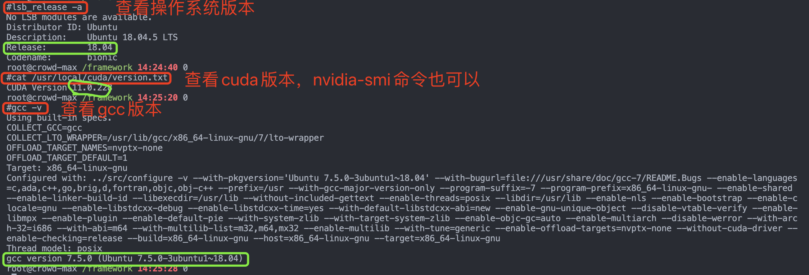
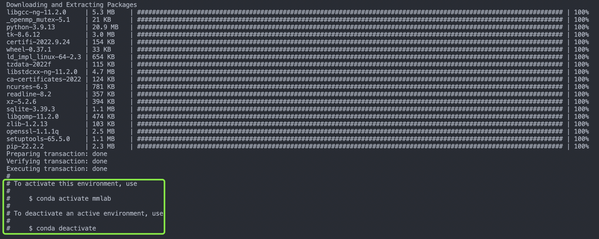
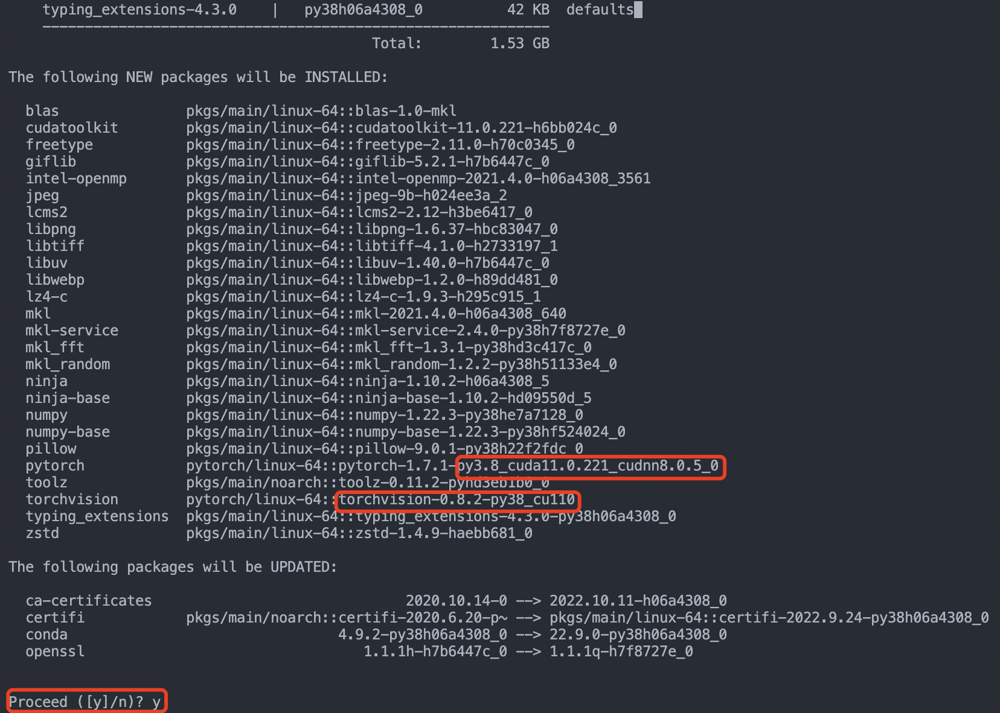

# ubuntu16.04安装mmdetection库.md
## 一，前言
### 1.1，更新 pip 和 conda下载源
在下载安装好 `python3+pip` 或 `anconda3` 的基础上，建议更新为清华/阿里镜像源（默认的 `pip` 和 `conda`下载源速度很慢）。

1，`pip`** 更新下载源为清华源的命令**如下:

```bash
pip config set global.index-url https://pypi.tuna.tsinghua.edu.cn/simple
```
2，`conda`** 更新源的方法：**

各系统都可以通过修改用户目录下的 `.condarc` 文件。`Windows` 用户无法直接创建名为 `.condarc` 的文件，可先执行 `conda config --set show_channel_urls yes` 生成该文件之后再修改`.condarc` 文件内容如下: 

```bash
channels:
  - defaults
show_channel_urls: true
default_channels:
  - https://mirrors.tuna.tsinghua.edu.cn/anaconda/pkgs/main
  - https://mirrors.tuna.tsinghua.edu.cn/anaconda/pkgs/r
  - https://mirrors.tuna.tsinghua.edu.cn/anaconda/pkgs/msys2
custom_channels:
  conda-forge: https://mirrors.tuna.tsinghua.edu.cn/anaconda/cloud
  msys2: https://mirrors.tuna.tsinghua.edu.cn/anaconda/cloud
  bioconda: https://mirrors.tuna.tsinghua.edu.cn/anaconda/cloud
  menpo: https://mirrors.tuna.tsinghua.edu.cn/anaconda/cloud
  pytorch: https://mirrors.tuna.tsinghua.edu.cn/anaconda/cloud
  pytorch-lts: https://mirrors.tuna.tsinghua.edu.cn/anaconda/cloud
  simpleitk: https://mirrors.tuna.tsinghua.edu.cn/anaconda/cloud
```
### 1.2，查看 conda 和 pip 版本
```bash
root# conda --version
conda 22.9.0
root# pip --version
pip 20.2.4 from /opt/miniconda3/lib/python3.8/site-packages/pip (python 3.8)
```
## 二，MMDetection 简介
`MMDetection` 是一个基于 `PyTorch` 的目标检测开源工具箱。它是 [OpenMMLab](https://openmmlab.com/) 项目的一部分。主分支代码目前支持 `PyTorch 1.5` 以上的版本。主要特性为：

* **模块化设计**
* **丰富的即插即用的算法和模型**
* **速度快**
* **性能高**

> 更多详情请参考 [MMDetection 仓库 README](https://github.com/open-mmlab/mmdetection/blob/master/README_zh-CN.md)。

## 三，MMDetection 安装
### 3.1，依赖环境
* 系统：**首选 Linux**，其次 `macOS` 和 `Windows`（理论上支持，实际安装需要踩很多坑）
* `Python 3.6+`
* 首选 CUDA 11.3+、其次推荐 CUDA 9.2+
* 首选 Pytorch 1.9+，其次推荐 PyTorch 1.3+
* `GCC 5+`
* [MMCV](https://mmcv.readthedocs.io/en/latest/#installation)

### 3.2，安装过程记录
#### 1，安装操作系统+cuda
我是在 `docker` 容器中安装和进行深度学习算法开发的，其操作系统、`cuda`、`gcc` 环境如下：



#### 2，安装 Anconda3
官网下载 [Anconda3 linux 安装脚本](https://repo.anaconda.com/archive/Anaconda3-2022.10-Linux-x86_64.sh)，并安装 `Anconda3`（很好装一路 `yes` 即可），并使用 `conda` 新建虚拟环境，并激活虚拟环境进入。

```bash
conda create -n mmlab python=3.9 -y # 创建 mmlab 的虚拟环境，其中python解释器版本为3.9
conda activate mmlab # 激活虚拟环境进入
```
虚拟环境安装成功后的部分过程截图如下所示：



如果你激活虚拟环境出现如下所示错误。

```bash
CommandNotFoundError: Your shell has not been properly configured to use 'conda activate'.
To initialize your shell, run

    $ conda init <SHELL_NAME>

Currently supported shells are:
  - bash
  - fish
  - tcsh
  - xonsh
  - zsh
  - powershell

See 'conda init --help' for more information and options.

IMPORTANT: You may need to close and restart your shell after running 'conda init'.
```
可通过以下命令重新激活 `conda` 环境，即可解决问题，方法参考自 [stack overflow 问题](https://stackoverflow.com/questions/61915607/commandnotfounderror-your-shell-has-not-been-properly-configured-to-use-conda)。

```bash
source ~/anaconda3/etc/profile.d/conda.sh # anaconda3 的安装路径有可能不一样，自行修改
conda activate mmlab
```
#### 3，安装 pytorch-gpu
首选安装 `pytorch-gpu` 版本，如果是**在线安装**命令如下**。**

```bash
conda install pytorch=1.7.1 cudatoolkit=11.0 torchvision=0.8.2 -c pytorch
```
> 官网命令的 cuda11.0 的 torchaudio==0.7.2 版本不存在，故去除。

安装过程信息（记得检查 `pytorch` 版本是 `cuda11.0` 的）截图如下：



安装成功后，进入 `python` 解释器环境，运行以下命令，判断 pytorch-gpu 版本是否安装成功。

```bash
>>> import torch
>>> torch.cuda.is_available()
True
>>> torch.cuda.device_count()
2
>>>
```
同时可通过以下命令查看 `CUDA` 和 `PyTorch` 的版本

```bash
python -c 'import torch;print(torch.__version__);print(torch.version.cuda)'
```
总的来说，`pytorch` 等各种 `python` 包有**离线和在线**两种方式安装：

* **在线**：`conda/pip` 方法安装，详细命令参考 [pytorch 官网](https://pytorch.org/)，但是这种方式实际测试下来**可能**会有问题，需要自己肉眼检查安装的版本是否匹配。
* **离线**：浏览器下载安装包，然后通过 `pip` 或者 `conda` 方式离线安装。
   * `pip` **可通过**[此链接](https://download.pytorch.org/whl/torch_stable.html) 浏览器下载各种 `pytorch` 版本的二进制安装包，**到本地安装**（`pip install *.whl`）。
   * `conda` 通过[清华源链接](https://mirrors.tuna.tsinghua.edu.cn/anaconda/cloud/pytorch/linux-64/)，浏览器下载对应版本压缩包，然后 `conda install --offline pytorch压缩包的全称（后缀都不能忘记）`

> 不通过浏览器下载 whl 包，而是 `pip install ``https://download.pytorch.org/whl/cu110/torch-1.7.1%2Bcu110-cp39-cp39-linux_x86_64.whl` 方式可能会有很多问题，比如网络问题可能会导致安装失败。

> WARNING: Retrying (Retry(total=4, connect=None, read=None, redirect=None, status=None)) after connection broken by 'NewConnectionError('<pip.\_vendor.urllib3.connection.HTTPSConnection object at 0x7f74f60d6760>: Failed to establish a new connection: \[Errno 101\] Network is unreachable')': /whl/cu110/torch-1.7.1%2Bcu110-cp39-cp39-linux\_x86\_64.whl

> 或者下载到一半的网络连接时常超过限制。

> pip.\_vendor.urllib3.exceptions.ReadTimeoutError: HTTPSConnectionPool(host='download.pytorch.org', port=443): Read timed out.

#### 4，安装 `mmdetection`
> **不建议安装 cpu 版本**，因为很多算子不可用，其次截止到2022-11-3日，macos 系统 cpu 环境的 `mmdet.apis` 是不可用的。

建议使用 [MIM](https://github.com/open-mmlab/mim) 来自动安装 `MMDetection` 及其相关依赖包-`mmcv-full` 。

```bash
pip install mim
mim install mmdet
```


## 参考资料
* `mmdetection` 和 `pytorch` 官网
* https://download.pytorch.org/whl/torch\_stable.html