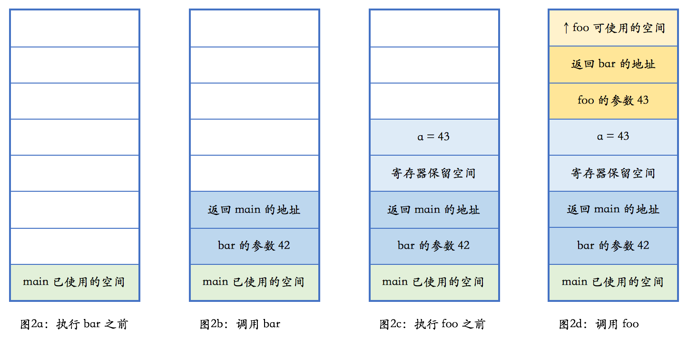

- [基本概念](#基本概念)
- [堆](#堆)
- [栈](#栈)
- [RAII](#raii)
  - [如何使用 RAII](#如何使用-raii)
- [参考资料](#参考资料)

## 基本概念

**堆**，英文是 `heap`，在内存管理的语境下，指的是动态内存分配的区域，和数据结构中的“大根堆和小根堆”不是一个概念。同时，这里堆分配的内存需要手工释放，否则会造成内存泄漏。
`C++` 标准里有一个和堆相关的概念是**自由存储区**，英文是 free store，特指使用 `new` 和 `delete` 来分配和释放内存的区域。一般而言，这是堆的一个子集：

+ `new` 和 `delete` 操作的区域是 `free store`；
+ `malloc` 和 `free` 操作的区域是 `heap`。

> `new` 和 `delete` 通常底层使用 malloc 和 free 来实现，所以 free store 也是 heap，对其区分的实际意义不大，两者可以等同。

**栈**，英文是 `stack`，在内存管理的语境下，指的是函数调用过程中产生的本地变量和调用数据的区域。这个栈和数据结构里的栈高度相似，都满足“后进先出”（last-in-first-out 或 LIFO）。
**RAII**，完整的英文是 Resource Acquisition Is Initialization，是 C++ 所特有的资源管理方式。RAII 依托栈和析构函数，来对所有的资源——包括堆内存在内——进行管理。对 RAII 的使用，使得 C++ 不需要类似于 Java 那样的垃圾收集方法，也能有效地对内存进行管理。

综上，`C++` 程序中的内存分为两个部分：

+ **栈**：在函数内部声明的所有变量都将占用栈内存。
+ **堆**：这是程序中未使用的内存，在程序运行时可用于动态分配内存。

## 堆

> 在 C++ 里，这种情况下有 99% 的可能性不应该使用堆内存分配，而应使用栈内存分配。

`C++` 使用如下代码在堆上分配内存：

```cpp
auto ptr = new std::vector<int>(n,t )  // 构造包含 n 个初始值为 t 的元素的容器
```

在堆上分配内存 c++/java 使用 `new` 关键字，`python` 是隐式构造，不需要特殊关键字，这个过程会涉及到三个可能的内存管理器操作：

1. 内存管理器分配指定大小的内存，可用内存不足时要从操作系统申请新的内存。
2. 释放内存时除了把内存标记为不使用，还要将其合并在一起，防止内存碎片化。
3. c++ 不适用垃圾回收，java/python 中有这个操作。

因为程序运行异常导致 `new` 的内存没有通过 `delete` 释放掉，叫作 ”内存泄漏“。

## 栈

首先通过下面示例代码来说明 `C++` 里函数调用、本地变量是如何使用栈的。

```cpp
void foo(int n)
{
  …
}
void bar(int n)
{
  int a = n + 1;
  foo(a);
}
int main()
{
  …
  bar(42);
  …
}
```

代码执行过程中，操作系统栈的变化情况如下：



通过上图示例可以知道，**栈**是向上增长的。在包括 x86 在内的大部分计算机体系架构中，**栈的增长方向是低地址**，因而上方意味着低地址。

1. 函数调用另一个函数时，先把参数压入栈中，再把下一行汇编指令的地址压入栈，并跳转到调用的那个函数；
2. 进入新函数后，需要做必须的保存工作，调整栈指针，分配出本地变量所需的空间；
3. 执行函数中的代码，执行完毕后，根据调用者压入栈的地址，返回到调用者未执行的代码中继续执行。

**本地变量所需的内存在栈上**，跟函数执行所需的其他数据在一起。当函数执行完成之后，这些内存也就自然而然释放掉了。可以看到：

+ 栈上的分配极为简单，移动一下栈指针而已。
+ 栈上的释放也极为简单，函数执行结束时移动一下栈指针即可。
+ 由于后进先出的执行过程，不可能出现内存碎片。

## RAII

> RAII 源于 C++，在 Java，C#，D，Ada，Vala 和 Rust 中也有应用。

RAII，全称资源获取即初始化（英语：Resource Acquisition Is Initialization），它是在一些面向对象语言中的一种惯用法，是 C++ 语言的**一种管理资源、避免内存泄漏的方法**。在计算机系统中，资源是数量有限且对系统正常运行具有一定作用的元素。比如：网络套接字、互斥锁、文件句柄和内存等等。系统资源是有限的，所以在程序中使用系统资源都必须遵循如下步骤：

1. 申请资源；
2. 使用资源；
3. 释放资源。

RAII 要求，资源的有效期与持有资源的对象的生命期严格绑定，即由对象的构造函数完成资源的分配（获取），同时由析构函数完成资源的释放。在这种要求下，只要对象能正确地析构，就不会出现资源泄露问题。

### 如何使用 RAII

由于系统的资源不具有自动释放的功能，而 `C++` 中的类具有自动调用析构函数的功能。如果把资源用类进行封装起来，对资源操作都封装在类的内部，在析构函数中进行释放资源。当定义的局部变量的生命结束时，它的析构函数就会自动的被调用，如此，就不用程序员显示的去调用释放资源的操作了。

## 参考资料

+ [现代C++实战30讲](https://time.geekbang.org/column/intro/100040501)
+ [C++中的RAII机制](https://www.jianshu.com/p/b7ffe79498be)
