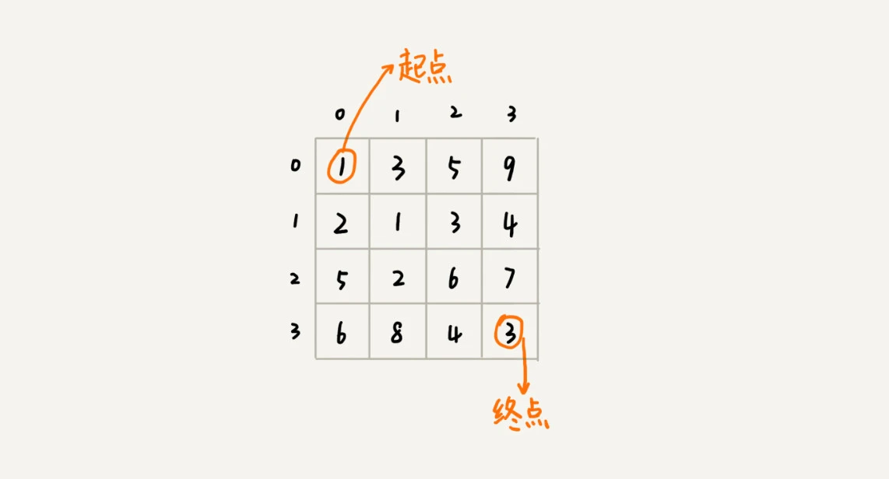

> 学习目标：彻底搞懂最优子结构、无后效性和重复子问题。什么样的问题可以用动态规划解决？解决动态规划问题的一般思考过程是什么样的？贪心、分治、回溯、动态规划这四种算法思想又有什么区别和联系？

### 一，“一个模型三个特征”理论讲解

一个模型指的是适合用动态规划算法解决的问题的模型，这个模型也被定义为“多阶段决策最优解模型”。具体解释如下：

一般是用动态规划来解决**最优**问题。而解决问题的过程，需要经历多个决策阶段。每个决策阶段都对应着一组状态。然后我们寻找一组**决策序列**，经过这组决策序列，能够产生最终期望求解的最优值。

#### 1. 最优子结构

最优子结构指的是，问题的最优解包含子问题的最优解。反过来说就是，我们可以通过子问题的最优解，推导出问题的最优解。把最优子结构，对应到前面定义的动态规划问题模型上，就是**后面阶段的状态可以通过前面阶段的状态推导出来**。

#### 2. 无后效性

无后效性有两层含义，第一层含义是，在推导后面阶段的状态的时候，我们只关心前面阶段的状态值，不关心这个状态是怎么一步一步推导出来的。第二层含义是，某阶段状态一旦确定，就不受之后阶段的决策影响。无后效性是一个非常“宽松”的要求。只要满足前面提到的动态规划问题模型，其实基本上都会满足无后效性。

#### 3. 重复子问题

不同的决策序列，到达某个相同的阶段时，可能会产生重复的状态。

#### 二，“一个模型三个特征”实例剖析

结合一个具体的动态规划问题更能详细理解上述理论，**示例问题描述如下**：

假设我们有一个 `n` 乘以 `n` 的矩阵 `w[n][n]`。矩阵存储的都是正整数。棋子起始位置在左上角，终止位置在右下角。我们将棋子从左上角移动到右下角。每次只能向右或者向下移动一位。从左上角到右下角，会有很多不同的路径可以走。我们把每条路径经过的数字加起来看作路径的长度。那从左上角移动到右下角的最短路径长度是多少呢？



`min_dist(i, j)` 可以通过 `min_dist(i, j-1)` 和 `min_dist(i-1, j)` 两个状态推导出来，所以这个问题符合“最优子结构”。

```cpp
min_dist(i, j) = min(min_dist(i-1,j), min_dist(i, j-1))
```

### 二，两种动态规划解题思路总结

知道了如何鉴别一个问题是否可以用动态规划来解决，接下来就是总结动态规划解决问题的一般思路。解决动态规划问题，一般有两种思路。分别叫作：状态转移表法和状态转移方程法。

#### 1. 状态转移表法

**一般能用动态规划解决的问题，都可以使用回溯算法的暴力搜索解决**。所以，当我们拿到问题的时候，我们可以先用简单的回溯算法解决，然后定义状态，每个状态表示一个节点，然后对应画出递归树。从递归树中，我们很容易可以看出来，是否存在重复子问题，以及重复子问题是如何产生的。以此来寻找规律，看是否能用动态规划解决。

找到重复子问题之后，接下来，我们有两种处理思路，第一种是直接用回溯加“备忘录”的方法，来避免重复子问题。从执行效率上来讲，这跟动态规划的解决思路没有差别。第二种是使用动态规划的解决方法，**状态转移表法**。

我们先画出一个状态表。状态表一般都是二维的，所以你可以把它想象成二维数组。其中，每个状态包含三个变量，行、列、数组值。我们根据决策的先后过程，从前往后，根据递推关系，分阶段填充状态表中的每个状态。最后，我们将这个递推填表的过程，翻译成代码，就是动态规划代码了。
> 适合状态是二维的情况，再多维的话就不适合了，毕竟人脑不适合处理高维度的问题。

起点到终点，有很多种不同的走法，回溯算法比较适合无重复又不遗漏地穷举出所有走法，从而对比找出一个最短走法。

1，**回溯**解法的 `C++` 代码如下：

```cpp
// leetcode64. 最小路径和. 回溯法-会超出时间限制
class Solution {
private:
    int minDist = 10000;
    void minDistBT(vector<vector<int>>& grid, int i, int j, int dist, int m, int n) {
        if (i == 0 && j == 0) dist = grid[0][0];
        if (i == m-1 && j == n-1) {
            if (dist < minDist) minDist = dist;
            return;
        }
        if (i < m-1) {
            minDistBT(grid, i + 1, j, dist + grid[i+1][j], m, n);  // 向右走
        }
        if (j < n-1) {
            minDistBT(grid, i, j + 1, dist + grid[i][j+1], m, n);  // 向下走
        }
    }
public:
    int minPathSum(vector<vector<int>>& grid) {
        int m = grid.size();
        int n = grid[0].size();
        int dist = 0;
        minDistBT(grid, 0, 0, dist, m, n);
        return minDist;
    }
};
```

有了回溯代码之后，接下来，自然要画出递归树，以此来寻找重复子问题。在递归树中，一个状态（也就是一个节点）包含三个变量 `(i, j, dist)`，其中 `i`，`j` 分别表示行和列，`dist` 表示从起点到达 `(i, j)` 的路径长度。从图中，可以看出，尽管 `(i, j, dist)` 不存在重复，但是 `(i, j)` 重复的有很多。对于 `(i, j)` 重复的节点，我们只需要选择 `dist` 最小的节点，继续递归求解，其他节点就可以舍弃了。


2，**动态规划**解法的 `C++` 代码如下：

```cpp
// 对应 leetcode64. 最小路径和
class Solution {  // 动态规划：状态转移表法
public:
    int minPathSum(vector<vector<int>>& grid) {
        int m = grid.size();
        int n = grid[0].size();
        vector<vector<int> > states(m, vector<int>(n, 0));
        // 第一个阶段初始化
        int sum = 0;
        for(int i=0; i<n;i++){  // 初始化 states 的第一行数据
            sum += grid[0][i];
            states[0][i] = sum;
        }
        sum = 0;
        for(int j=0; j<m; j++){  // 初始化 states 的第一列数据
            sum += grid[j][0];
            states[j][0] = sum;
        }

        // 分阶段求解，下层状态的值是基于上一层状态来的
        for(int i=1; i<m; i++){
            for(int j=1; j<n; j++){
                states[i][j] = grid[i][j] + std::min(states[i-1][j],states[i][j-1]);
            }
        }
        return states[m-1][n-1];
    }
};
```


#### 2. 状态转移方程法

根据最优子结构，写出递归公式，也就是所谓的状态转移方程。**状态转移方程，或者说递归公式是解决动态规划的关键**。递归加“备忘录”的方式，将状态转移方程翻译成来 `C++` 代码。

```cpp
// 状态转移方程
min_dist(i, j) = w[i][j] + min(min_dist(i, j-1), min_dist(i-1, j))
```

```cpp
// 对应 leetcode64. 最小路径和
class Solution {  // 状态转移方程法
private:
    int minDist(int i, int j, vector<vector<int> >& matrix, vector<vector<int> >& mem) { // 调用minDist(n-1, n-1);
        if (i == 0 && j == 0) return matrix[0][0];
        if (mem[i][j] > 0) return mem[i][j];

        int minUp = 10000;
        if (i - 1 >= 0) minUp = minDist(i - 1, j, matrix, mem);
        int minLeft = 10000;
        if (j - 1 >= 0) minLeft = minDist(i, j - 1, matrix, mem);
        int currMinDist = matrix[i][j] + std::min(minUp, minLeft);

        mem[i][j] = currMinDist;

        return currMinDist;
    }
public:
    int minPathSum(vector<vector<int>>& grid) {
        int m = grid.size();
        int n = grid[0].size();
        vector<vector<int> > mem(m, vector<int>(n, -1));

        return minDist(m - 1, n - 1, grid, mem);
    }
};
```


### 三，四种算法比较分析

如果将这四种算法思想分一下类，那贪心、回溯、动态规划可以归为一类，而分治单独可以作为一类，因为它跟其他三个都不大一样。为什么这么说呢？因为前三个算法解决问题的模型，都可以抽象成**多阶段决策最优解**模型，而分治算法解决的问题尽管大部分也是最优解问题，但是，大部分都不能抽象成多阶段决策模型。

尽管动态规划比回溯算法高效，但是，并不是所有问题，都可以用动态规划来解决。能用动态规划解决的问题，需要满足三个特征，最优子结构、无后效性和重复子问题。在重复子问题这一点上，动态规划和分治算法的区分非常明显。分治算法要求分割成的子问题，不能有重复子问题，而动态规划正好相反，动态规划之所以高效，就是因为回溯算法实现中存在大量的重复子问题。

贪心算法实际上是动态规划算法的一种特殊情况。它解决问题起来更加高效，代码实现也更加简洁。不过，它可以解决的问题也更加有限。它能解决的问题需要满足三个条件，最优子结构、无后效性和贪心选择性（这里我们不怎么强调重复子问题）。其中，最优子结构、无后效性跟动态规划中的无异。“贪心选择性”的意思是，通过局部最优的选择，能产生全局的最优选择。每一个阶段，我们都选择当前看起来最优的决策，所有阶段的决策完成之后，最终由这些局部最优解构成全局最优解。

### 四，内容总结

什么样的问题适合用动态规划解决？这些问题可以总结概括为“一个模型三个特征”。其中，“一个模型”指的是，问题可以抽象成分阶段决策最优解模型。“三个特征”指的是最优子结构、无后效性和重复子问题。

哪两种动态规划的解题思路？它们分别是状态转移表法和状态转移方程法。其中，状态转移表法解题思路大致可以概括为，**回溯算法实现 - 定义状态 - 画递归树 - 找重复子问题 - 画状态转移表 - 根据递推关系填表 - 将填表过程翻译成代码**。状态转移方程法的大致思路可以概括为，**找最优子结构 - 写状态转移方程 - 将状态转移方程翻译成代码**。

### 练习题

假设我们有几种不同币值的硬币 v1，v2，……，vn（单位是元）。如果我们要支付 w 元，求最少需要多少个硬币。比如，我们有 3 种不同的硬币，1 元、3 元、5 元，我们要支付 9 元，最少需要 3 个硬币（3 个 3 元的硬币）。

### 参考资料

[动态规划理论：一篇文章带你彻底搞懂最优子结构、无后效性和重复子问题](https://time.geekbang.org/column/article/75702)
