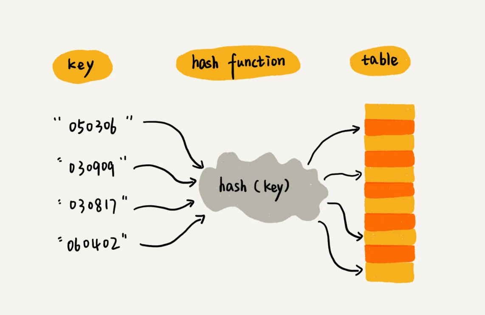
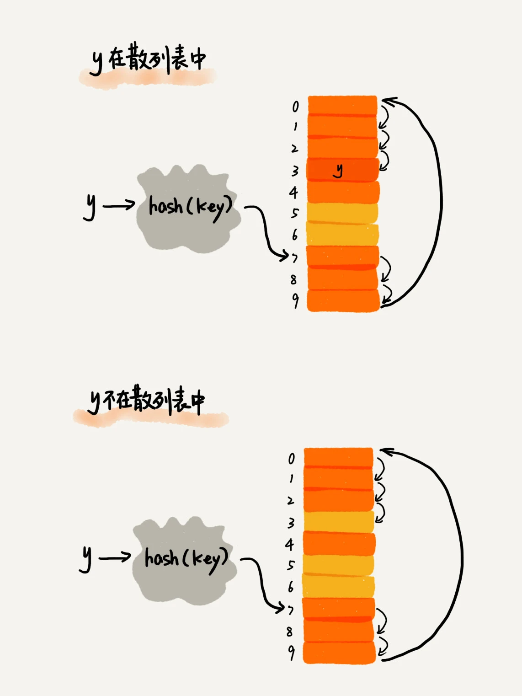

### 一，散列表理解

散列表的英文叫“Hash Table”，我们平时也叫它“哈希表”或者“Hash 表”，**散列表用的是数组支持按照下标随机访问数据的特性，所以散列表其实就是数组的一种扩展，基于数组演化而来。**

**散列表**是通过散列函数将“关键字”（键 `key`）映射为数组下标，并将数据存储在数组下标对应的位置中。当我们按照“关键字”（键）查询元素时，我们再用**同样的散列函数**，将“关键字”（键 `key`）转化数组下标，从对应的数组下标的位置取数据（“散列值” `Hash` 值）。
> Hash 函数计算所得到的 Hash 值本质是一个索引（数组下标），并不代表索引下所存储的数据。

映射过程如下图所示：



因此，我们可以使用散列函数和数组创建散列表（ hash
table） 的数据结构。散列表是我们学习的第一种包含额外逻辑的数据结构。**数组和链表都是被直接映射到内存，但散列表更复杂，它使用散列函数来确定元素的存储位置**。

一般不需要我们自己实现散列表结构，任一优秀的语言都提供了散列表实现。比如 `Python` 提供的散列表实现为字典，你可使用函数`dict()` 来创建散列表。`C++` 中的关联容器 `map` 或者 `set` 。`map` 使用如下：

```cpp
map<string, int> word_count;
```

### 二，散列函数

散列函数，顾名思义，它是一个函数。我们可以把它定义成 `hash(key)`，其中 `key` 表示元素的键值，`hash(key)` 的值表示经过散列函数计算得到的散列值。

散列函数设计的三个基本要求：

1. 散列函数计算得到的散列值是一个非负整数(如 `uint` 类型。数组下标是从 `0` 开始的，所以散列函数生成的散列值也要是非负整数。)；
2. 如果 key1 = key2，那 hash(key1) == hash(key2)；
3. 如果 key1 ≠ key2，那 hash(key1) ≠ hash(key2)（**如果相等，则发生散列冲突/哈希冲突**）。

第三个要求看起来合情合理，但是在真实情况下，要想找到一个不同的 `key` 对应的散列值都不一样的散列函数，几乎是不可能的。即便像业界著名的 `MD5、SHA、CRC` 等哈希算法，也无法完全避免这种**散列冲突**。而且，因为数组的存储空间有限，也会加大散列冲突（即即存在多个 `key` 指向同一个索引。）的概率。

### 三，散列冲突

**再好的散列函数也无法避免散列冲突**。那究竟该如何解决散列冲突问题呢？我们常用的散列冲突解决方法有两类，**开放寻址法**（open addressing）和**链表法**（chaining）。

#### 3.1，开放寻址法

**开放寻址法**的核心思想是，**如果出现了散列冲突，我们就重新探测一个空闲位置，将其插入**。空闲位置探测的方法有 `3` 种，第一个比较简单的探测方法是**线性探测**（`Linear Probing`），其概念如下：

当我们往散列表中插入数据时，如果某个数据经过散列函数散列之后，存储位置已经被占用了，我们就从当前位置开始，依次往后查找，看是否有空闲位置，直到找到为止。

**在开放寻址+线性探测的散列表中查找元素**：

首先通过散列函数求出要查找元素的键值（关键字）对应的散列值，然后比较数组中下标为散列值的元素和要查找的元素。如果相等，则说明就是我们要查找的元素；否则就顺序向后依次查找。注意这里的查找和以前的查找不一样，因为存在散列冲突的情况，所以必须遍历到数组中的空闲位置，还没有找到的情况下查找才会结束。

key（元素）->hash value(数组下标)

> 由于使用的线性探测，如果目标元素出现散列冲突（即数组下标为散列值的元素（`key`）可能和被查找元素(`key`)不同），则一定会被存储在散列值的下一个空闲位置。所以查找过程中如果碰到空闲位置则目标元素不存在。



线性探测法其实存在很大问题。当散列表中插入的数据越来越多时，散列冲突发生的可能性就会越来越大，空闲位置会越来越少，线性探测的时间就会越来越久。极端情况下，我们可能需要探测整个散列表，所以**最坏情况下的时间复杂度为 O(n)**。同理，在删除和查找时，也有可能会线性探测整张散列表，才能找到要查找或者删除的数据。

对于开放寻址冲突解决方法，除了线性探测方法之外，还有另外两种比较经典的探测方法，二次探测（`Quadratic probing`）和双重散列（`Double hashing`）。

所谓**二次探测**，跟线性探测很像，线性探测每次探测的步长是 `1`，那它探测的下标序列就是 hash(key)+0，hash(key)+1，hash(key)+2……而二次探测探测的步长就变成了原来的“二次方”，也就是说，它探测的下标序列就是 hash(key)+0，hash(key)+1^2，hash(key)+2^2……

所谓**双重散列**，意思就是不仅要使用一个散列函数。我们使用一组散列函数 hash1(key)，hash2(key)，hash3(key)……我们先用第一个散列函数，如果计算得到的存储位置已经被占用，再用第二个散列函数，依次类推，直到找到空闲的存储位置。

不管采用哪种探测方法，当散列表中空闲位置不多的时候，散列冲突的概率就会大大提高。为了尽可能保证散列表的操作效率，一般情况下，我们会尽可能保证散列表中有一定比例的空闲槽位。我们用装载因子（`load factor`）来表示空位的多少。装载因子的计算公式是：

```shell
散列表的装载因子 = 填入表中的元素个数/散列表的长度
```

**装载因子越大，说明空闲位置越少，冲突越多，散列表的性能会下降**。

#### 3.2，链表法

链表法是一种更加常用的散列冲突解决办法，相比开放寻址法，它要简单很多。链表法定义：将所有散列值（哈希值）相同的 `Key` 通过链表存储，`key` 按顺序插入到链表中。

如下图，在散列表中，每个“桶（`bucket`）”或者“槽（`slot`）”会对应一条链表，所有散列值相同的元素我们都放到相同槽位对应的链表中。


当插入的时候，我们只需要通过散列函数计算出对应的散列槽位，将其插入到对应链表中即可，所以插入的时间复杂度是 $O(1)$。当查找、删除一个元素时，我们同样通过散列函数计算出对应的槽，然后遍历链表查找或者删除。

查找或删除操作的时间复杂度跟链表的长度 $k$ 成正比，也就是 $O(k)$。对于散列比较均匀的散列函数来说，理论上讲，$k=n/m$，其中 $n$ 表示散列中数据的个数，$m$ 表示散列表中“槽”的个数。

### 总结

散列表来源于数组，它借助散列函数对数组这种数据结构进行扩展，利用的是数组支持按照下标随机访问元素的特性。散列表两个核心问题是**散列函数设计**和**散列冲突解决**。散列冲突有两种常用的解决方法，开放寻址法和链表法。散列函数设计的好坏决定了散列冲突的概率，也就决定散列表的性能。

### 散列表实战问题


### 参考资料

[数据结构和算法之美-散列表（上）](https://time.geekbang.org/column/article/64233)