- [第 2 章 模型评估与选择](#第-2-章-模型评估与选择)
  - [2.1 经验误差与过拟合](#21-经验误差与过拟合)
  - [2.2 评估方法](#22-评估方法)
    - [2.2.1 留出法](#221-留出法)
    - [2.2.2 交查验证法](#222-交查验证法)
    - [2.2.3 自助法](#223-自助法)
    - [2.2.4 调参与最终模型](#224-调参与最终模型)
  - [2.3 性能度量](#23-性能度量)
    - [2.3.1 错误率与精度](#231-错误率与精度)
    - [2.3.2 查准率、查全率与F1](#232-查准率查全率与f1)
    - [2.3.3 ROC 与 AUC](#233-roc-与-auc)
  - [2.5 偏差与方差](#25-偏差与方差)
- [第 3 章 线性模型](#第-3-章-线性模型)
  - [3.5 多分类学习](#35-多分类学习)
  - [3.6 类别不平衡问题](#36-类别不平衡问题)
- [第 5 章 神经网络](#第-5-章-神经网络)
  - [5.1 神经元模型](#51-神经元模型)
  - [5.2 感知机与多层网络](#52-感知机与多层网络)
  - [5.3 误差反向传播算法](#53-误差反向传播算法)
  - [5.4 全局最小与局部最小](#54-全局最小与局部最小)
  - [5.5 其他常见神经网络](#55-其他常见神经网络)
  - [5.6 深度学习](#56-深度学习)
- [第 9 章 聚类](#第-9-章-聚类)
  - [9.1 聚类任务](#91-聚类任务)
  - [9.2 性能度量](#92-性能度量)
  - [9.3 距离计算](#93-距离计算)
  - [9.4 原型聚类](#94-原型聚类)
    - [9.4.1 k 均值算法](#941-k-均值算法)
- [参考资料](#参考资料)

## 第 2 章 模型评估与选择
### 2.1 经验误差与过拟合

+ 精度：精度=1-错误率。如果在 $m$ 个样本中有 $a$ 个样本分类错误，则错误率 $E=a/m$，精度 = $1-a/m$。
+ **误差**：一般我们把学习器的实际预测输出与样本的真实输出之间的差异称为“误差”（`error`）。学习器在训练集上的误差称为“训练误差”（`training error`），在**新样本**上的误差称为“泛化误差”（`generalization error`）。
+ “**过拟合**：学习器把训练样本自身的一些特点当作了所有潜在样本都会具有的一般性质，从而导致泛化性能下降，这种现象称为”过拟合“（`overfitting`）。过拟合是机器学习算法面临的一个关键问题。
+ **欠拟合**：和过拟合想法，指的是学习器对训练样本的一般性质都未学号。欠拟合比较容器解决，在决策树中增加分治、在神经网络学习中学习训练轮数（`Epoch`）等方法都是有效的。

好的学习器应该尽可能学出适用于所有潜在样本的”普遍规律“。由于事先无法知道新样本是什么样子，所以无法直接获得泛化误差，同时训练误差又由于过拟合现象的存在而不适合作为标准，那么现实中如何进行模型评估与选择就是一个重要的问题了。

### 2.2 评估方法

通常使用一个测试集来评估学习器对新样本的判别能力，把测试集上的”测试误差“（`testing error`）作为泛化误差的近似。值得注意的是，测试集应该尽可能与训练集互斥，即测试样本尽量不在训练集中出现（学习器之前没有见到过）。

对于一个包含 $m$ 个样本的数据集 $D = {(x_1, y_1)}, (x_2, y_2),...,(x_m, y_m)$，将其划分为训练集 $S$ 和测试集 $T$，有两种常见的方法：**留出法和交叉验证法**。

#### 2.2.1 留出法

”留出法“（`hold-out`） 直接将数据集 $D$ 划分为两个户次互斥的集合，一个集合作为训练集 $S$，另一个作为测试集 $T$，即 $D = S \cup T$，$S \cap T = \varnothing$。值得注意的是，训练/测试集的划分应该尽可能保持数据分布的一致性，避免数据划分过程引入额外的偏差而对最终结果产生影响。从采样(`sampling`)的角度来看数据集的划分过程，则保留类别比例的采样方式称为”分层采样“（`stratified sampling`）。例如数据集 $D$ 有 `1000` 个样本，`800` 个正样本，`200` 个负样本，将 `70%` 的样本作为训练集，`30%` 的样本作为测试集。考虑分层采样，则训练 $S$ 集的构成为：正样本 $= 1000\times 70\% \times (800/1000) = 560$，负样本 $=1000\times 70\% \times (200/1000) = 140$，同理可得测试集 `T` 包含 `240` 个正样本，`60` 个负样本。

另一个问题是即使在给定训练集/测试集样本比例后，依然存在多种划分方式对样本 $D$ 进行分割，例如前 `280` 个正样本和后 `280` 个正样本构建的训练集是不一样的。因此，单次使用留出法得到的的估计结果往往不可靠，在使用留出法时，一般采用若干次随机划分、重复进行实验评估后取平均值作为留出法的评估结果。

#### 2.2.2 交查验证法

”交叉验证法“（`cross validation`）先将数据集 $D$ 划分为 $k$ 个大小相似的**互斥子集**，即 $D = D_1\cup D_2\cup...\cup D_k，D_i \cap D_j = \varnothing$。同时每个子集都应该尽可能保持**数据分布的一致性**，即类别比例相等，从 $D$ 中通过分层采样得到。然后，每次用 $k-1$ 个子集的并集作为训练集，剩下的一个子集作为测试集，这样可获得 $k$ 组训练集/测试集，从而可进行 $k$ 组训练和测试，把 $k$ 次测试结果取平均后返回。交叉验证法评估结果的稳定性和保真性在很大程度上取决于 $k$ 的取值，为了强调这一点，通常把交叉验证法称为“$k$ 折交叉验证”（`k-fold cross validation`）。$k$ 的常用取值分别是 `10、5、20` 等。图 `2.2` 给出了 `10` 折交叉验证的示意图。

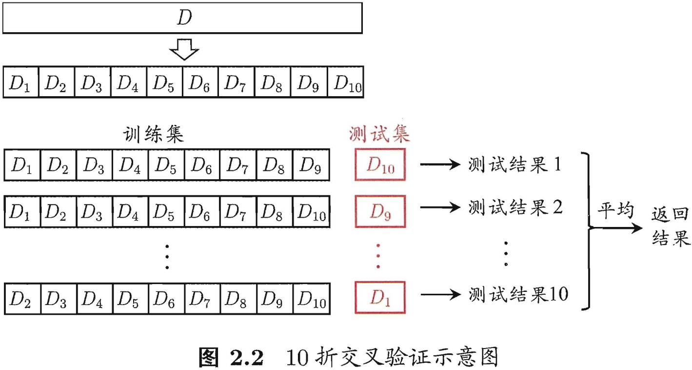

“10 次 10 折交叉验证法”与 “100 次留出法“都是进行了 `100` 次训练/测试。

交叉验证法的一个特例是留一法（`Leave-One-Out`，简称 `LDO`），留一法不受随机样本划分方式的影响，因为 $m$ 个样本只有唯一的划分方式划分为 $m$ 个子集-每个子集包含一个样本。虽然留一法的评估结果往往被认为比较准确，但是训练开销简直太大了，真实项目中很少见到有人这样用，而且留一法的估计结果未必永远比其他评估方法准确，毕竟“天下没有免费的午餐”。

#### 2.2.3 自助法

“自助法”（`bootstrapping`） ：给定包含 $m$ 个样本的数据集 $D$，对它进行采样产生数据集 ${D}'$：每次随机从 $D$ 中挑选一个样本，将其拷贝放入 ${D}'$，然后再将其放回 $D$ 中，下次采样依然可能被采样到；这个过程重复 $m$ 次，就得到了包含 $m$ 个样本的数据集 ${D}'$。显然，$D$ 中有一部分样本会在 ${D}'$ 中多次出现，另外一部分样本不出现。做一个简单估计，样本在 $m$ 次采样中始终不被采到的概率是 $(1-\frac{1}{m})^m$，取极限得到
$$(1-\frac{1}{m})^m \rightarrow \frac{1}{e}\approx 0.368$$

即通过自助采样，初始数据集 $D$ 中约有 `36.8%` 的样本未出现在采样数据集 ${D}'$ 中。

自助法只适用于数据集较小、难以有效划分训练/测试集的情况。值得注意的是，自助法产生的数据集改变了初始数据集的分布，这回引入估计偏差。

#### 2.2.4 调参与最终模型

需要认为设定的参数称为超参数，模型训练无法优化它的。现实当中常对每个参数选定一个范围和变化补偿，例如在 `[0,0.2]` 范围内以 `0.05` 为补偿，要评估的的候选参数有 `5` 个最终选定的参数从这 `5` 个候选值中产生，结果也许不是最佳值，但这是计算开销和性能估计之间进行折中的结果。

在模型评估与选择过程中由于需要流出一部分数据进行评估测试，事实上我们只使用了一部分数据训练模型。因此，在模型选择完成后，学习算法和参数配置已定，此使应该用数据集 $D$ 重新训练模型。这个模型在训练过程中使用了**所有 $m$ 个训练样本**，这个模型也是最终提交给用户的模型。

另外，值得注意的是，我们通常把学得模型在实际使用过程中遇到的数据集称为测试数据，为了加以区分，前面讲到的模型评估与选择中用于评估测试的数据常称为“验证集（`validation set`）”。

在研究对比不同算法的泛化性能时，我们用测试集上的判别效果来估计模型在实际使用时的泛化能力，而把训练数据另外划分为训练集和验证集，基于验证集上的性能来进行模型选择和调参。

### 2.3 性能度量

对学习器的泛化性能进行评估，不仅需要有效可行的实验估计方法，还需要衡量模型泛化能力的评价标准，这就是性能度量（`performance measure`）。

在预测任务中，给定样本集 $D={(x_1,y_1),(x_2,y_2),...,(x_m,y_m)}$，其中 $y_i$ 是示例 $x_i$ 的真实标签。要评估学习器 $f$ 的性能，需要把学习器预测结果 $f(x)$ 与真实标签 $y$ 进行比较。

回归任务最常用的性能度量是“均方误差”（`mean squared error`）。
$$E(f;D) = \frac{1}{m}\sum_{i=1}^{m}(f(x_i)-y_i)^2$$

#### 2.3.1 错误率与精度

+ 错误率：分类错误的样本数占样本总数的比例；
+ 精度：分类正确样本的样本数占样本总数的比例。

错误率和精度是分类任务中最常用的两种性能度量，适用于二分类，也适用于多分类任务。分类错误率和精度的定义如下：
$$E(f;D) = \frac{1}{m}\sum_{i=1}^{m}(f(x_i) \neq y_i)^2$$
$$acc(f;D) = \frac{1}{m}\sum_{i=1}^{m}(f(x_i) = y_i)^2 = 1 - E(f;D)$$

#### 2.3.2 查准率、查全率与F1

错误率和精度虽然常用，但是并不能满足所有任务需求。比如以西瓜问题为例，假设瓜农拉来一车西瓜，我们用训练好的模型对西瓜进行判别，现如精度只能衡量有多少比例的西瓜被我们判断类别正确（两类：好瓜、坏瓜）。但是若我们更加关心的是“挑出的西瓜中有多少比例是好瓜”，或者”所有好瓜中有多少比例被挑出来“，那么精度和错误率这个指标显然是不够用的。

对于**二分类**问题，可将样例根据真实类别与学习器预测类别的组合划分为真正例（`true positive`）、假正例（`false positive`）、真反例（`true negative`）、假反例（`false negative`）四种情况，令 $TP、FP、TN、FN$ 分别表示其对应的样例数，显然有 $TP+FP+TN+FN = $ 样例总数。分类结果的”混淆矩阵“（`confusion matrix`）如下表所示。


查准率（精确率） $P$ 与查全率（召回率） $R$ 分别定义为：

$$P = \frac{TP}{TP+FP}$$
$$R = \frac{TP}{TP+FN}$$

查准率和查全率是一对矛盾的的度量。一般来说，查全率高时，查准率往往偏低；而查全率高时，查准率往往偏低。通常只有在一些简单任务中，才可能使查全率和查准率都很好高。

精准率和召回率的关系可以用一个 `P-R` 图来展示，以查准率 `P` 为纵轴、查全率 `R` 为横轴作图，就得到了查准率－查全率曲线，简称 **P-R** 曲线，`PR` 曲线下的面积定义为 `AP`。

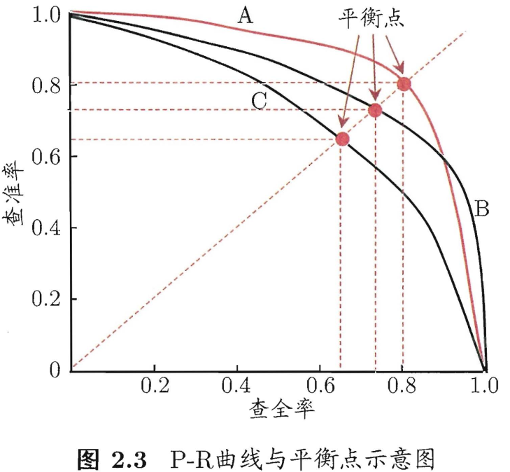
> 为了绘图方便和美观，示意图显示出单调平滑曲线，但现实任务中的 `P-R` 曲线是非单调、不平滑的，且在很多局部有上下波动。

**如何理解 P-R 曲线呢**？

> 可以从排序型模型或者分类模型理解。以逻辑回归举例，逻辑回归的输出是一个 `0` 到 `1` 之间的概率数字，因此，如果我们想要根据这个概率判断用户好坏的话，我们就必须定义一个阈值 。通常来讲，逻辑回归的概率越大说明越接近 `1`，也就可以说他是坏用户的可能性更大。比如，我们定义了阈值为 `0.5`，即概率小于 `0.5` 的我们都认为是好用户，而大于 `0.5` 都认为是坏用户。因此，对于阈值为 `0.5` 的情况下，我们可以得到相应的**一对**查准率和查全率。
但问题是：这个阈值是我们随便定义的，我们并不知道这个阈值是否符合我们的要求。 因此，为了找到一个最合适的阈值满足我们的要求，我们就必须遍历 `0` 到 `1` 之间所有的阈值，而每个阈值下都对应着一对查准率和查全率，从而我们就得到了 `PR` 曲线。
最后如何找到最好的阈值点呢？ 首先，需要说明的是我们对于这两个指标的要求：我们希望查准率和查全率同时都非常高。 但实际上这两个指标是一对矛盾体，无法做到双高。图中明显看到，如果其中一个非常高，另一个肯定会非常低。选取合适的阈值点要根据实际需求，比如我们想要高的查全率，那么我们就会牺牲一些查准率，在保证查全率最高的情况下，查准率也不那么低。

在进行性能比较时，如果一个学习器的曲线被另一个学习器的曲线完全包住，则可断言后者性能优于前者，如图 2.3，学习器 `A` 性能优于学习器 `C`。比较 `P-R` 曲线下面积的大小，也可判别学习器的优劣，它在一定程度上表征了学习器在查准率和查全率上取得”双高“的比例，但这个值不容易估算，因此人们又设计了一些综合考虑查准率、查全率的性能度量，如”平衡点（`Break-Event Point`，简称 `BEP`）“。

`BEP` 是”查准率=查全率“时的取值，基于学习器的比较，可以认为学习器 `A` 优于 `B`。但 `BEP` 过于简单了，更为常用的是 $F1$ 度量。

$$F1 = \frac{2\times P\times R}{P+R} = \frac{2\times TP}{样例总数+TP-TN}$$

$F1$ 度量的一般形式：$F_{\beta}$，能让我们表达出对查准率/查全率的偏见，$F_{\beta}$ 计算公式如下：

$$F_{\beta} = \frac{1+\beta^{2}\times P\times R}{(\beta^{2}\times P)+R}$$

其中 $\beta > 1$ 对查全率有更大影响，$\beta < 1$ 对查准率有更大影响。

很多时候我们会有多个混淆矩阵，例如进行多次训练/测试，每次都能得到一个混淆矩阵；或者是在多个数据集上进行训练/测试，希望估计算法的”全局“性能；又或者是执行多分类任务，**每两两类别**的组合都对应一个混淆矩阵；....总而来说，我们希望能在 $n$ 个二分类混淆矩阵上综合考虑查准率和查全率。

一种直接的做法是先在各混淆矩阵上分别计算出查准率和查全率，记为$(P_1,R_1),(P_2,R_2),...,(P_n,R_n)$然后取平均，这样得到的是”宏查准率（`Macro-P`）“、”宏查准率（`Macro-R`）“及对应的”宏$F1$（`Macro-F1`）“：
$$Macro\ P = \frac{1}{n}\sum_{i=1}^{n}P_i$$
$$Macro\ R = \frac{1}{n}\sum_{i=1}^{n}R_i$$
$$Macro\ F1 = \frac{2 \times Macro\ P\times Macro\ R}{Macro\ P + Macro\ R}$$

另一种做法是将各混淆矩阵对应元素进行平均，得到 $TP、FP、TN、FN$ 的平均值，再基于这些平均值计算出”微查准率“（`Micro-P`）、”微查全率“（`Micro-R`）和”微$F1$“（`Mairo-F1`）

$$Micro\ P = \frac{\overline{TP}}{\overline{TP}+\overline{FP}}$$
$$Micro\ R = \frac{\overline{TP}}{\overline{TP}+\overline{FN}}$$
$$Micro\ F1 = \frac{2 \times Micro\ P\times Micro\ R}{MacroP+Micro\ R}$$

#### 2.3.3 ROC 与 AUC

`ROC` 曲线示意图如下。

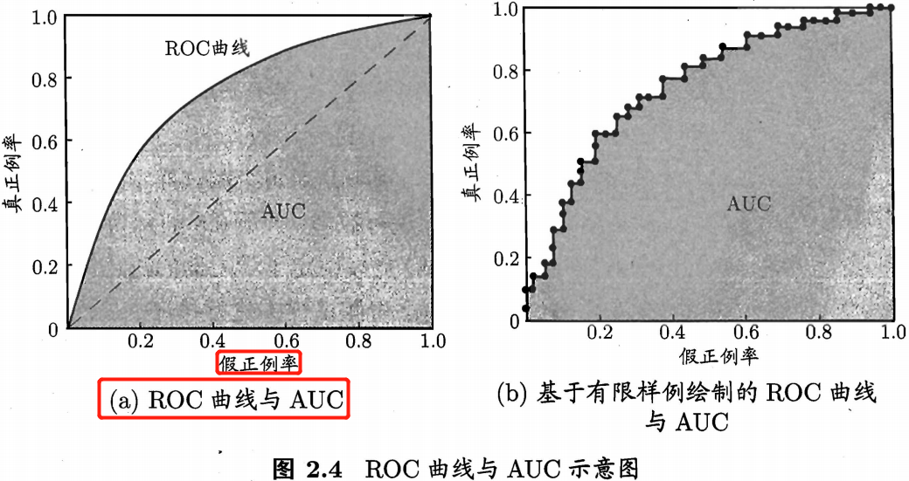

### 2.5 偏差与方差

通过前面的学习，我们已经知道如何设计实验（训练集、验证集的划分）来**对学习器的泛化误差进行评估**，并且也了解了诸如**精度、查准率、查全率及 `F1`** 等性能度量指标。但这不够，我们还希望了解”为什么“具有这样的性能。”偏差-方差分解“（`bias-variance decomposition`）是解释学习算法泛化性能的一种重要工具。

假设对于测试样本 $x$,令 $y_D$ 为 $x$ 在数据集中的标记（即标签，可能会存在噪声），$y$ 才是 $x$ 的真实标记，$f(x;D)$ 为训练集 $D$ 上学得模型 $f$ 在 $x$ 上的预测输出。以回归任务为例，**算法的泛化误差**计算如下：

$$E(f;D) = \mathbb{E}_{D} [(f(x;D) - y_{D})^2]$$

直接计算上式是不行的，我们得进行分解，分解之前需要先知道方差、偏差、噪声的定义。学习算法的**期望预测**为

$$\bar{f}(x) = \mathbb{E}_{D} [(f(x;D)]$$

**方差定义**: 模型预测的期望值与预测值之差的平方的期望值，使用样本数相同的不同训练集产生的**方差**为

$$D(x) = var(x) = \mathbb{E}_{D}[(f(x;D) - \mathbb{E}_{D}[(f(x;D)])^2] = \mathbb{E}_{D}[(f(x;D) - \bar{f}(x))^2]$$

> 方差在统计描述和概率分布中各有不同的定义，并有不同的公式。

**噪声**为

$$\varepsilon^2 = \mathbb{E}_{D}[(y_{D} - y)^2]$$

模型预测的期望值与真实值的差称为**偏差**（`bias`），即
$$bias^2(x) = (\bar{f}(x)-y)^2$$

假定噪声为 `0` ，即 $\mathbb{E}_{D}[(y_{D}-y)]=0$，有了以上定义，通过多项式展开合并，并利用恒等变形、期望的运算性质可将期望泛化误差公式进行分解得到：
> 公式推理证明，可参考[这里](https://datawhalechina.github.io/pumpkin-book/#/chapter2/chapter2?id=_241)。

$$E(f;D) = \mathbb{E}_{D}[(f(x;D)-\bar{f}(x))^2] + (\bar{f}(x)-y)^2 + \mathbb{E}_{D}[(y_{D}-y)^2]$$

于是，

$$ E(f;D) = var(x) + bias^2(x) + \varepsilon^2$$

通过上式，可知**泛化误差可分解为方差、偏差与噪声之和**。回顾偏差、方差、噪声的定义：

+ **偏差**：度量了学习算法的期望预测与真实结果的偏离程度，刻画了学习算法本身的拟合能力。
+ **方差**：度量了同样大小的训练集的变动导致的学习性能的变化，刻画了数据扰动所造成的影响，或者说刻画了模型的稳定性和泛化能力。
+ **噪声**：表达了当前任务上任何学习算法所能达到的期望泛化误差的下界，即刻画了学习问题本身的难度。

通过对泛化误差进行分解说明，模型泛化性能是由学习算法的能力、数据的充分性以及任务本身的难度所共同决定的。**模型欠拟合**表现为偏差较大, 此时偏差主导了泛化错误率；**模型过拟合**表现为偏差小但是方差很大，方差主导了泛化错误率。

一般来说，偏差与方差是有冲突的，这称为偏差-方差窘境（`bias-variane dilemma`）。

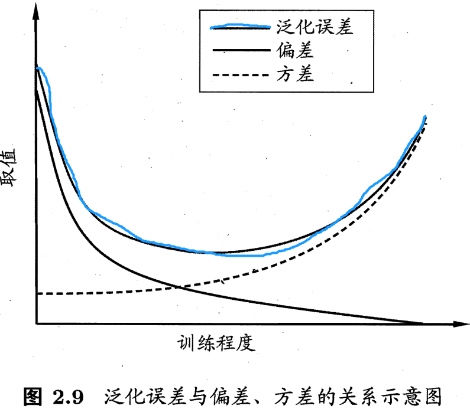

## 第 3 章 线性模型

### 3.5 多分类学习

### 3.6 类别不平衡问题

$$\frac{y'}{1-y'} = \frac{y}{1-y}\times \frac{m^-}{m^+}$$

公式中，$y$ 是预测值，分类器决策规则为：若 $\frac{y}{1-y}$ 则预测为正例。令 $m^+$ 表示正例数目， $m^-$ 表示反例数目，则观测几率是 $\frac{m^-}{m^+}$。

类别不平衡学习的一个基本策略是 **“再缩放”**（rescaling）。再缩放技术主要有三种方法实现：

+ 对训练集的反类样例进行“欠采样”（undersampling），即去除一些反例使得正负样例数目接近，然后再进行学习。
+ 对训练集的正类样例进行“过采样”（oversampling），即增加一些正例使得正、负样例数目接近，然后再进行学习（或者叫模型训练）。
+ 直接对原始训练集进行学习，但是在对训练好的分类器进行预测时，将式（3.48）嵌入到分类器推理过程中，称为“阈值移动”（threshold-moving）。

值得注意的是过采样的方法不能简单地对初始正例样本进行重复采样，否则会招致严重的过拟合；过采样方法的代表性算法 SMOTE 是通过对训练集的正例进行插值来产生额外的正例（图像数据就进行数据增强）。

## 第 5 章 神经网络

### 5.1 神经元模型

神经网络有很多种定义，一种较为广泛的定义是，其是由具有适应性的简单单元组成的广泛并行互连的网络，它的组织能够模拟生物神经系统对真实世界物体所作出的交互反应。

神经网络中最基本的成分是神经元（`neuron`）模型，即上述定义中的简单单元。经典的"M-P神经元模型”如下所示，其中的 $f$ 表示激活函数，$w$ 表示神经元权重。

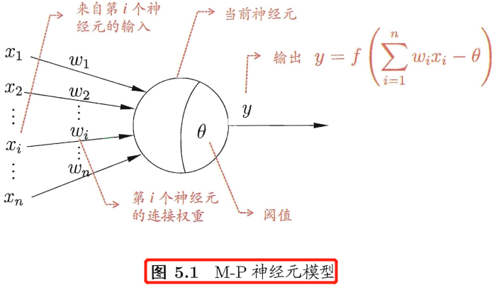

### 5.2 感知机与多层网络

感知机（`perception`）由两层神经元组成，如下图所示，输入层接收外界输入信号后传递给输出层，输出层是 M-P 神经元，也称“阈值逻辑单元”（`threshold logic unit`）。感知机能容易地实现逻辑与、或、非运算，只需要设置合理的 $w$、$\theta$ 参数。感知机模型的公式可表示为：

$$y_j = f(\sum_{i}w_ix_i - \theta_j)$$

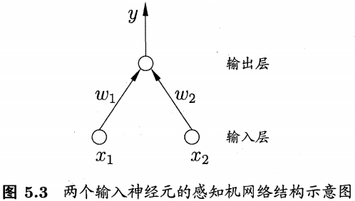

给定训练数据集，感知机的 $w$ 和 $\theta$ 参数可通过学习得到。其学习规则很简单，对于训练样本$(x,y)$，如果感知机输出为 $\hat{y}$，则感知机的参数将做如下调整：

$$
w_{i} \leftarrow w_{i} + \Delta w_i \\
\Delta w_i = \eta(y - \hat{y})x
$$

其中 $\eta$ 称为学习率，从上式可以看出当感知机预测输出 $\hat{y}$ 和样本标签 $y$ 相等时，参数不改变；否则将根据偏差的严重程度进行相应调整。

需要注意的是，感知机只能解决与、或、非这样的线性可分（即存在一个线性超平面将它们分开）问题，但是甚至不能解决异或这样简单的非线性可分问题。

要解决非线性可分问题，可以使用多功能神经元。如下图所示的就是一种常见的“多层前馈神经网络”（`multi-layer feedforward neural`），每层神经元与下一层神经元全互连，同层神经元之间不连接，也不存在跨层连接。
> “前馈” 并不意味着网络中信号不能反向传播，而单纯是指网络拓扑结构上不存在环或回路。

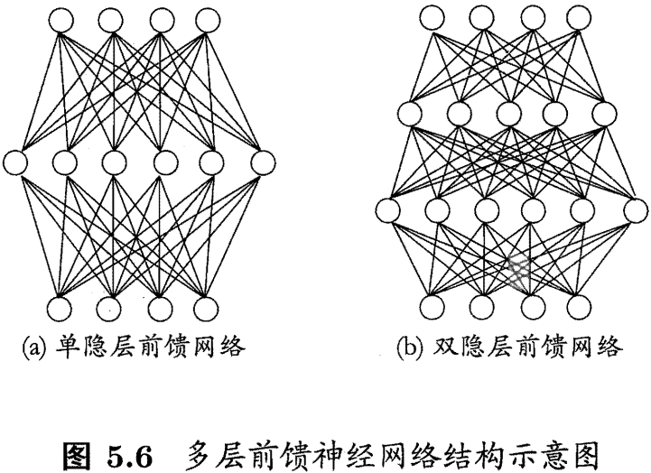

### 5.3 误差反向传播算法

很明显多层神经网络的学习能力比单层网络（单层感知机）强得多。感知机参数的学习规则很简单，因此其对于多层神经网络是不够用的，由此，诞生了强大的误差反向传播（`error BackPropagation`，简称 `BP`）算法，并使用至今，现阶段的所有深度神经网络的参数都是由 `BP` 算法训练得到的。

反向传播指的是计算神经⽹络参数梯度的⽅法。总的来说，反向传播依据微积分中的链式法则，沿着从输出层到输⼊层的顺序，**依次计算并存储⽬标函数有关神经⽹络各层的中间变量以及参数的梯度**。
> 前向传播：输入层-->输出层；反向传播：输出层-->输入层。

下面通过前馈神经网络的 `BP` 算法来深入理解 `BP` 过程。

给定训练集 $D = {(x_1, y_1), (x_2, y_2),...,(x_m, y_m)}, x \in \mathbb{R}^d, y_i \in \mathbb{R}^l$，即每个输入样本都由 $d$ 个属性表征，模型输出的是 $l$ 维实值向量。为了便于 `BP` 算法的推导，下图给出了一个拥有 $d$ 个输入神经元、$l$ 个输出神经元、$q$ 个隐层神经元的多层前馈神经网络，其中输出层第 $j$ 个神经元的阈值用 $\theta_j$ 表示，隐层第 $h$ 个神经元的阈值用 $\gamma_h$ 表示。输入层第 $i$ 个神经元与隐层第 $h$ 个神经元之间的连接权重参数为 $v_{ih}$，隐层第 $h$ 个神经元与输出层第 $j$ 个神经元之间的连接权为 $w_{hj}$。记隐层第 $h$ 个神经元接收到的输入为 $\alpha_h = \sum_{i=1}^{d}v_{ih}x_i$，输出层第 $j$ 个神经元接收到的输入为 $\beta_j = \sum_{h=1}^{q}w_{hj}b_h$，其中 $b_h$ 为隐层第 $h$ 个神经元的输出。这里假设隐层和输出层神经元的激活函数都为 `Sigmoid` 函数。

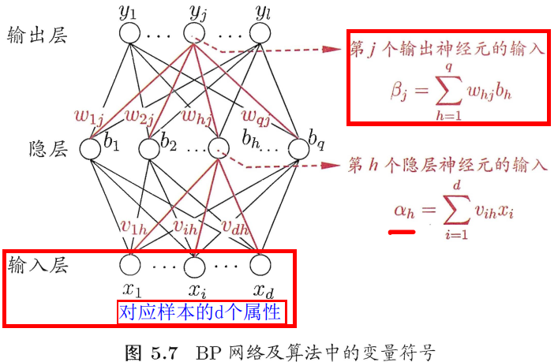

对训练样本 $(x_k,y_k)$，假设神经网络的输出为 $\hat{y}_k =(\hat{y}_1^k,\hat{y}_2^k,...,\hat{y}_l^k)$，即

$$
\hat{y}_j^k = f(\beta_j - \theta_j)\tag{5.3}，
$$

则网络在 $(x_k,y_k)$ 上的均方误差损失为

$$
E_k = \frac{1}{2}\sum_{j=1}^{l}(\hat{y}_j^k - y_k)^2\tag{5.4}，
$$

输入层到隐层需要 $d \times q$ 个权重参数、隐层到输出层需要需要 $q \times l$ 个权重参数，以及 $q$ 个隐层的神经元阈值、$l$ 个输出层的神经元阈值。`BP` 是一个迭代学习算法，在迭代的每一轮中采用广义的感知机学习规则对参数进行更新估计，因此任意参数 $v$ 的更新估计表达式都可为

$$
v\leftarrow v + \Delta v\tag{5.5}
$$

下面我会首先推导出隐层到输出层的权重 $w_{hj}$ 更新公式，而后类别推导 $\theta_{j}$、$v_{ih}$、$\gamma_{h}$。

`BP` 算法是基于梯度下降（`gradient desent`）策略，以目标的负梯度方向对参数进行调整，对式$(5.4)$的误差 $E_k$，给定学习率 $\eta$，可得权重参数更新公式如下：

$$
w \leftarrow w + -\eta \frac{\partial E_k}{\partial w}
$$

同时，

$$
\Delta w_{hj} = -\frac{\partial E_k}{\partial w_{hj}}\tag{5.6}
$$

注意到 $w_{hj}$ 先影响到第 $j$ 个输出层神经元的输入值 $\beta_j$，再影响到其输出值 $\hat{y}_j^k$，最后才影响到损失 $E_k$，根据梯度的链式传播法则，有

$$
\frac{\partial E_k}{\partial w_{hj}} = \frac{\partial E_k}{\partial \hat{y}_j^k}\frac{\partial \hat{y}_j^k}{\partial \beta_j}\frac{\partial \beta_j}{\partial w_{hj}} \tag{5.7}
$$ 

根据前面 $\beta_j$ 的定义，显然有

$$
\frac{\partial \beta_j}{\partial w_{hj}} = b_h \tag{5.8}
$$

再因为 `Sigmoid` 函数的一个很好的性质：

$$
{f}'(x) = f(x)(1-f(x)) \tag{5.9}
$$

再联合式$(5.3)$和$(5.4)$，有：

$$\begin{align}
-\frac{\partial E_k}{\partial \hat{y}_j^k} \frac{\partial \hat{y}_j^k}{\partial \beta_j}
&= -\frac{\partial \left [\frac{1}{2} \sum_{j=1}^{l}(\hat{y}_{j}^{k} - y_{j}^{k})^{2}\right ]}{\partial \hat{y}_{j}^{k}} \frac{\partial \left [f(\beta_{j} - \theta_{j})\right ]}{\partial \beta_{j}} \nonumber\\
&= -\frac{1}{2}\times 2(\hat{y}_j^k - y_j^k) {f}'(\beta_j - \theta_j) \nonumber\\
&= -(\hat{y}_j^k - y_j^k) f(\beta_j - \theta_j)\left [1-f(\beta_j - \theta_j)\right ] \nonumber\\
&= -(\hat{y}_j^k - y_j^k) \hat{y}_j^k (1-\hat{y}_j^k) \nonumber\\
&= \hat{y}_j^k (1-\hat{y}_j^k) (y_j^k - \hat{y}_j^k ) \tag{5.10}
\end{align}$$

注意这里的 $f$ 是 `Sigmoid` 函数。令 $g_{j} = \hat{y}_j^{k} (1-\hat{y}_j^{k}) (y_{j}^{k} - \hat{y}_{j}^{k} )$ 。将 $g_{j}$ 和式 $(5.8)$ 带入式 $(5.6)$，就得到了 `BP` 算法中关于 $w_{hj}$ 的更新公式：

$$
\Delta w_{hj} = \eta g_{j}b_{h} \tag{5.11}
$$

类似式 $(5.10)$ 的推导过程可得其他参数的更新公式：

$$
\Delta \theta_j = -\eta g_j \tag{5.12}
$$
$$
\Delta v_{ih} = -\eta e_{h}x_{i} \tag{5.13}
$$
$$
\Delta \theta_j = -\eta e_h \tag{5.14}
$$

$v_{ih}$ 梯度的详细推导公式如下所示。因为，

$$ \begin{aligned} \cfrac{\partial E_k}{\partial v_{ih}}
&= \sum_{j=1}^{l} \cfrac{\partial E_k}{\partial \hat{y}_j^k} \cdot \cfrac{\partial \hat{y}_j^k}{\partial \beta_j} \cdot \cfrac{\partial \beta_j}{\partial b_h} \cdot \cfrac{\partial b_h}{\partial \alpha_h} \cdot \cfrac{\partial \alpha_h}{\partial v{ih}} \\
&= \sum_{j=1}^{l} \cfrac{\partial E_k}{\partial \hat{y}_j^k} \cdot \cfrac{\partial \hat{y}_j^k}{\partial \beta_j} \cdot \cfrac{\partial \beta_j}{\partial b_h} \cdot \cfrac{\partial b_h}{\partial \alpha_h} \cdot x_i \\
&= \sum_{j=1}^{l} \cfrac{\partial E_k}{\partial \hat{y}_j^k} \cdot \cfrac{\partial \hat{y}_j^k}{\partial \beta_j} \cdot \cfrac{\partial \beta_j}{\partial b_h} \cdot f^{\prime}(\alpha_h-\gamma_h) \cdot x_i \\
&= \sum_{j=1}^{l} \cfrac{\partial E_k}{\partial \hat{y}_j^k} \cdot \cfrac{\partial \hat{y}_j^k}{\partial \beta_j} \cdot w_{hj} \cdot f^{\prime}(\alpha_h-\gamma_h) \cdot x_i \\
&= \sum_{j=1}^{l} (-g_j) \cdot w_{hj} \cdot f^{\prime}(\alpha_h-\gamma_h) \cdot x_i \\
&= -f^{\prime}(\alpha_h-\gamma_h) \cdot \sum_{j=1}^{l} g_j \cdot w_{hj} \cdot x_i \\ 
&= -b_h(1-b_h) \cdot \sum_{j=1}^{l} g_j \cdot w_{hj} \cdot x_i \\
&= -e_h \cdot x_i \end{aligned}$$

所以

$$
\Delta v_{ih} =-\eta \cfrac{\partial E_k}{\partial v_{ih}} =\eta e_h x_i
$$


> 最后一层激活使用 `softmax` 激活和交叉熵损失函数的反向传播推导，可参考[这里](https://blog.csdn.net/DaVinciL/article/details/90898194)。
> 最后一层激活使用 `sigmoid` 激活和交叉熵损失函数的反向传播推导，可参考[这里](https://www.cnblogs.com/nowgood/p/sigmoidcrossentropy.html)。

学习率 $\eta \in (0,1)$ 控制着算法每一轮迭代中更新的步长，若太大则容易振荡，太小则收敛速度幽会过慢。有时为了做精细调节，可令式$(5.11)$与$(5.12)$使用 $\eta_1$， 式$(5.13)$与$(5.14)$使用 $\eta_2$，两者未必相等。

下图给出了 `BP` 算法的工作流程：

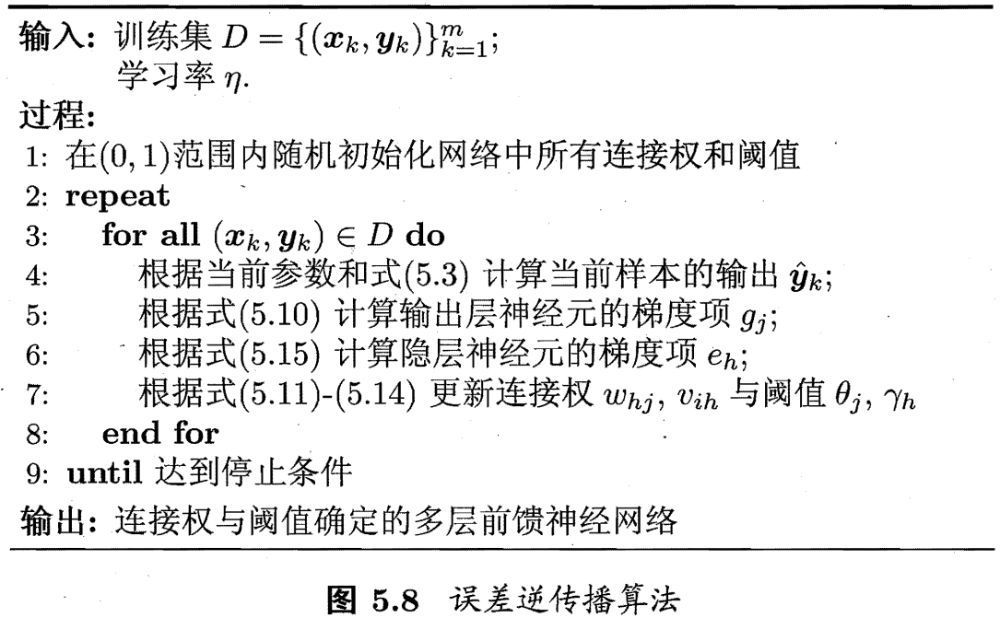

对每个训练样本，`BP` 算法操作流程如下：

1. **前向传播**:将输入样本输入给输入神经元，然后逐层将信号前向传播，直到输出层产生结果。
2. **反向传播**：计算输出层的误差，沿着输出层到输入层的顺序，依次计算并存储损失函数有关各层的中间变量及参数梯度，并对参数进行调整。
3. `1，2` 过程循环进行，直到达到某些停止条件为止，如训练误差已达到一个很小的值。

> 停止条件与缓解 `BP` 过拟合的策略有关。

值得注意的是，`BP` 算法的目标是要最小化训练集 $D$ 上的累计误差：

$$
E = \frac{1}{m}\sum_{k=1}{m}E_k，\tag{5.16}
$$

但是我们前面描述的“标准 BP 算法”的计算过程，其实每次仅针对一个训练样本更新连接权重和阈值的，因此，图5.8中算法发更新规则同样也是基于单个 $E_k$ 推导而得的。如果类似地推导出基于累计误差最小化的更新规则，就得到了累计误差反向传播（`accumulated error backpropagation`）算法。

一般来说，标准 `BP` 算法每次更新仅针对单个样本，参数更新很频繁，而且不同样本对进行更新的效果可能出现“抵消”现象。因此，为了达到同样的累计误差极小点，标准 `BP` 算法往往需要进行更多次数的迭代。而累计 `BP` 算法直接将累计误差最小化，它是在读取整个训练集 $D$ 一遍（`one epoch`）后才对神经网络各层权重参数进行更新，其参数更新频率低得多。但是在很多任务中，累计误差下降到一定程度后，进一步下降会非常缓慢，这是标准 `BP` 往往会更快获得较好的解，尤其是在训练集 $D$ 非常大时很明显。
> 标准 BP 算法和累计 BP 算法的区别类似于随机梯度下降（stochastic gradient descent，简称 SGD）与标准梯度下降之间的区别。

`[Hornik et al.,1989]` 证明，只需一个包含足够多神经元的隐层（即深度神经网络层数足够多），多层前馈神经网络就能以任意精度逼近任意复杂度的连续函数。但是，深度神经网络层数的选择依然是一个未决问题，在实际应用中通常依靠“试错法”（`trial-by-error`）调整。

因为神经网络的表示能力太过强大，因此 `BP` 神经网络在训练过程中经常遭遇过拟合，即训练误差持续降低，但验证集误差却可能上升。目前常用来缓解 `BP` 网络过拟合问题的策略，有以下两种：

第一种策略是“早停”（`early stopping`）:将数据分为训练集和验证集，训练集用来更新权重参数，验证集用来估计误差，若训练集误差降低但验证集误差升高，则停止训练，同时返回具有最小验证集误差的权重参数模型。

第二种策略是“正则化”（`regulazation`）：其基本思想是在误差目标函数中增加一个用于描述网络复杂度的部分，例如连接权重与阈值的平方和。仍令 $E_k$ 表示第 $k$ 个训练样本上的误差，$w_i$表示连接权重和阈值，则误差目标函数$(5.16)$更改为：

$$E = \lambda \frac{1}{m}\sum_k^m E_k + (1- \lambda)\sum_{i} w_i^2 \tag{5.17}$$

其中 $\lambda \in (0,1)$用于对经验误差与网络复杂度这两项进行折中，常通过交叉验证法估计。

常用的刻画模型复杂度 $R(w)$ 的函数有两种，一种是 $L1$ 正则化，即绝对值的之和；另一种是 $L2$ 正则化，即绝对值平方之和，计算公式如下：

$$
R(w) = ||w||_1 = \sum_i|w_i| \\
R(w) = ||w||_2 = \sum_i|w_i^2| 
$$

无论是哪一种正则化，其基本思想都是希望通过限制权重的大小，使得模型不能任意拟合训练数据中随机噪声。$L1$ 与 $L2$ 有很大区别，$L1$ 正则化会让参数变得更加稀疏，而 $L2$ 不会。所谓参数变得更加稀疏是指会有更多的参数变为 `0`，这样可以达到类似特征选取的功能。

> L2范数正则化（regularization）等价于权重衰减的概念。

### 5.4 全局最小与局部最小

若用 $E$ 表示神经网络在训练集上的误差，则它显然是关于连接权重 $w$ 和阈值 $\theta$ 的函数。此使，神经网络的训练过程可看作是一个参数寻优的过程，即在参数空间中，寻找一组最优参数使得 $E$ 最小。

显然，参数空间内梯度为零的点，只要其误差函数值小于零点的误差函数值，就是局部极小点；可能存在多个局部极小值，但有且仅有一个全局最小值。

基于梯度的搜索是使用最为广泛的参数寻优方法。在这类方法中，一般先从参数随机初始解出发，迭代寻找最优参数解。每次迭代我们先计算误差函数在当前点的梯度，然后根据梯度确定搜索方向。例如，由于负梯度方向是函数值下降最快的方向，因此梯度下降法就是沿着负梯度方向搜索最优解。若误差函数在当前点的梯度为零，则已达到局部极小，参数更新量也将为零，也意味着参数的迭代更新将在此停止。

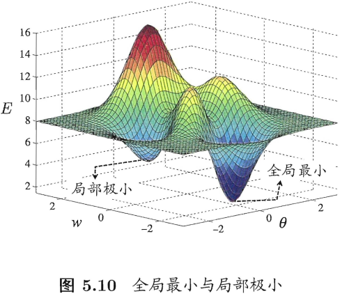

在现实任务中，我们常用以下启发式策略（非理论策略）来试图“跳出”局部极小，从而进一步接近全局最小：

+ 以多组不同参数值初始化多个神经网络，按标准方法训练后，取其中最小的解作为最终参数。
+ 使用”模拟退火“（`simulated annealing`）技术。模拟退火在每一步都以一定的概率接受比当前解更差的结果，从而有助于”跳出“局部极小。在每次迭代过程中，接收”次优解“的概率要随着时间的推移而逐渐降低，从而保证算法的稳定性。
+ 使用随机梯度下降算法。

### 5.5 其他常见神经网络

`2010` 年之前常见的神经网络有 `RBF` 网络、`ART` 网络、`SOM` 网络、`级联相关网络`、`Elman网络`、`Boltzmann` 机。
### 5.6 深度学习

典型的深度学习模型就是很深层（层数很多）的神经网络。值得注意的是，从增加模型复杂度的角度来看，增加隐藏层的数目显然比增加隐藏层神经元的数目更有效，即**网络的“深”比“宽”重要**。因为隐藏层层数的增加不仅增加了拥有激活函数神经元的数目，还增加了激活函数嵌套的层数，即**非线性能力进一步增强**。
## 第 9 章 聚类

### 9.1 聚类任务

在“无监督学习”中，训练样本是无标签信息的，目标是通过对无标记训练样本的学习来揭示数据的内在性质和规律，为进一步的数据分析提供基础。这类学习任务中应用最广的就是“聚类”（`clustering`）算法，其他的无监督学习任务还有密度估计（`density estimation`）、异常检测（`anomaly detection`）等。

聚类的任务是将数据集中的样本划分为若干个通常是不相交的**子集**，每个子集称为一个“簇”（`cluster`），簇所对应的概念和语义由使用者来把握。

聚类可用作其他学习任务的一个前驱过程。基于不同的学习策略，有着多种类型的聚类算法，聚类算法涉及的两个基本问题是性能度量和距离计算。

### 9.2 性能度量

聚类性能度量也叫聚类“有效性指标”（`validity index`），和监督学习的性能度量作用类似，都是用来评估算法的好坏，同时也是聚类过程中的优化目标。

聚类性能度量大致有两类。一类是将聚类结果与某个“参考模型（`reference model`）”进行比较，称为“外部指标（`external index`）”；另一类是直接考察聚类结果而不利用任何参考模型，称为“内部指标”（`inderna index`）。

外部指标包括 `Jaccard` 指数（简称 `JC`）、`FM` 指数（简称 `FMI`）和 `Rand` 指数（简称 `RI`），范围在 `[0,1]` 之间，且越大越好；内部指标包括 `DB` 指数（简称 `DBI`）和 `Dunn` 指数（简称 `DI`），`DBI` 值越小越好，`DI` 越大越好。
> 具体计算公式太多了，这里不给出，可以参考原书 `199` 页。

### 9.3 距离计算

函数 $dist(\cdot,\cdot)$ 用于计算两个样本之间的距离，如果它是一个“距离度量”（`distance measure`），则需满足一些基本性质：
+ 非负性：$dist(x_i,x_j) \geq 0$；
+ 同一性：$dist(x_i,x_j)=0$ 当前仅当 $x_i = x_j$；
+ 对称性：$dist(x_i,x_j) = dist(x_j,x_i)$；
+ 直递性：$dist(x_i,x_j \geq dist(x_i,x_k) + dist(x_k,x_j))$。

给定样本 $x_i = (x_{i1};x_{i2};...;x_{in})$ 与 $x_j = (x_{j1};x_{j2};...;x_{jn})$，最常用的是“闵可夫斯距离”（`Minkowski distance`）。

$$dist_{mk}(x_i,x_j) = (\sum_{u=1}^{n}\left | x_{iu} - x_{ju} \right |^p)^\frac{1}{p}$$

上式其实就是 $x_i - x_j$ 的 $L_p$ 范数 $\left \| x_i - x_j \right \|_p$。$p = 2$，上式为欧氏距离。 

属性通常划分为“连续属性”（`continuous attribute`）和“离散属性”（`categotical attribute`），前者在定义域上有无穷多个可能的取值，后者在定义域上是有限个取值。但是在涉及距离计算时，属性上定义了“序”更为重要。能直接在属性上计算距离：“1” 和 “2” 比较近、和“4”比较远，这样的属性称为“有序属性”（`ordinal attribute` ）；而定义域为{汽车、人、椅子}这样的离散属性则不能直接在属性上计算距离，称为“无序属性”（`non-ordinal atribute`）。显然，**闵可夫斯距离可用于有序属性**。

对无序属性采用 `VDM`（`Value Difference Metric`），同时将闵可夫斯距离和 `VDM` 集合可处理混合属性。

### 9.4 原型聚类

原型聚类算法假设聚类结构能通过一组原型刻画，这里的原型是指样本空间中具有代表性的点。一般算法先对原型进行初始化，然后对原型进行迭代更新求解。采用不同的原型表示、不同的求解方式，将产生不同的算法。

#### 9.4.1 k 均值算法

`K-Means` 算法的思想很简单，对于给定的样本集，按照样本之间的距离大小，将样本集划分为 $K$ 个簇，让簇内的点尽量紧密的连在一起，而让簇间的距离尽量的大。

给定样本集 $D = \{x_1, x_2,...,x_m\}$，假设簇划分为 $C = \{C_1,C_2,...,C_m\}$，算法目标是最小化平方误差。

$$E = \sum_{i=1}^{k}\sum_{x \in C_{i}}\left \| x - u_i \right \|_2^2$$

其中 $u_i=\frac{1}{C_i}\sum_{x \in C_{i}}x$ 是簇 $C_i$ 的均值向量，也称质心。上式一定程度上刻画了簇内样本围绕簇均值向量的紧密程度，$E$ 值越小簇内样本相似程度越高。

找到 $E$ 的最优解需要靠擦样本集 $D$ 所有可能的簇划分，这是一个 $NP$ 难问题。$k$ 均值算法采用了贪心策略，通过迭代优化近似求解，算法流程如图 `9.2` 所示。其中第 `1` 行对均值向量进行初始化，`4-8` 行与 `9-16` 行依次对当前簇划分即均值向量迭代更新，若更新后聚类结果保持不变，则在第 `18` 行将当前簇划分结果返回。

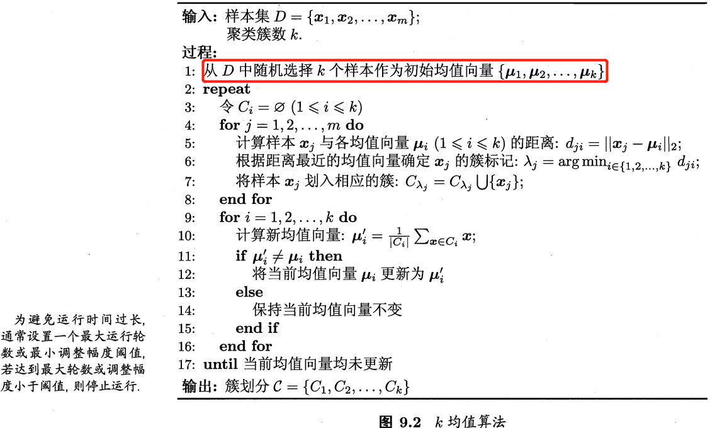

参考此[文章](https://www.pythonf.cn/read/116646)的代码，我修改为如下精简版的 `K-Means` 算法代码。

```python
def kmeans(dataset, k):
    """K-means 聚类算法

    Args:
        dataset ([ndarray]): 数据集，二维数组
        k ([int]): 聚簇数量
    """
    m = np.shape(dataset)[0]  # 样本个数
    
    # 1, 随机初始化聚类中心点
    center_indexs = random.sample(range(m), k)
    center = dataset[center_indexs,:]
    
    cluster_assessment = np.zeros((m, 2))
    cluster_assessment[:, 0] = -1  # 将所有的类别置为 -1
    cluster_changed = True 
    while cluster_changed:
        cluster_changed = False
        # 4-8，计算样本x_i与各聚类中心的距离，根据距离最近的聚类中心确定x_j的簇标记，并将对应样本x_i划入相应的簇
        for i in range(m):
            # 初始化样本和聚类中心的距离，及样本对应簇
            min_dist = inf
            c = 0
            # 确定每一个样本离哪个中心点最近，和属于哪一簇
            for j in range(k):
                dist = distEclud(dataset[i,:], center[j,:])
                if dist < min_dist:
                    min_dist = dist
                    c = i
            # 更新样本所属簇
            if cluster_assessment[i, 0] != c:  # 仍存在数据在前后两次计算中有类别的变动，未达到迭代停止要求
                cluster_assessment[i, :] = c, min_dist  # 更新样本所属簇
                cluster_changed = True
        # 9-16 更新簇中心点位置
        for j in range(k):
            changed_center = dataset[cluster_assessment[:,0] == j].mean(axis=0)
            center[j,:] = changed_center
            
    return cluster_assessment, center

if __name__ == '__main__':
    x1 = np.random.randint(0, 50, (50, 2))
    x2 = np.random.randint(40, 100, (50, 2))
    x3 = np.random.randint(90, 120, (50, 2))
    x4 = np.random.randint(110, 160, (50, 2))
    test = np.vstack((x1, x2, x3, x4))

    # 对特征进行聚类
    result, center = kmeans(test, 4, is_kmeans=False, is_random=False)
    print(center) # 打印簇类中心点
```

## 参考资料
《机器学习》-周志华