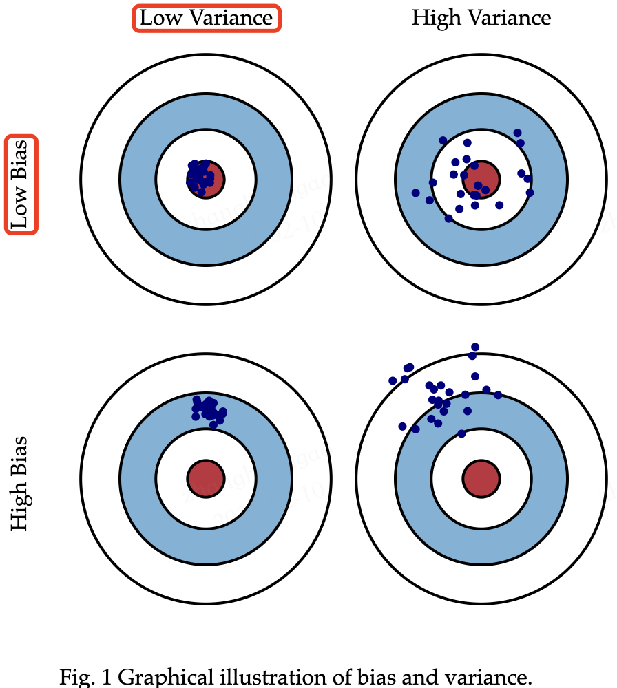
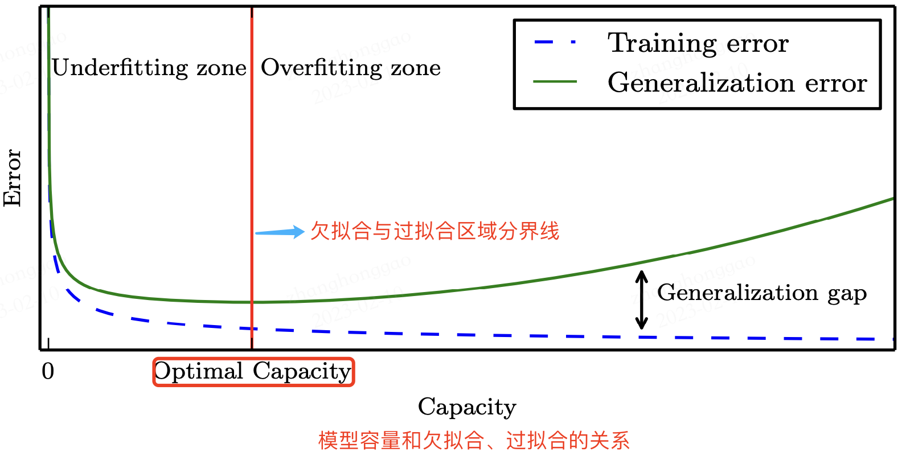
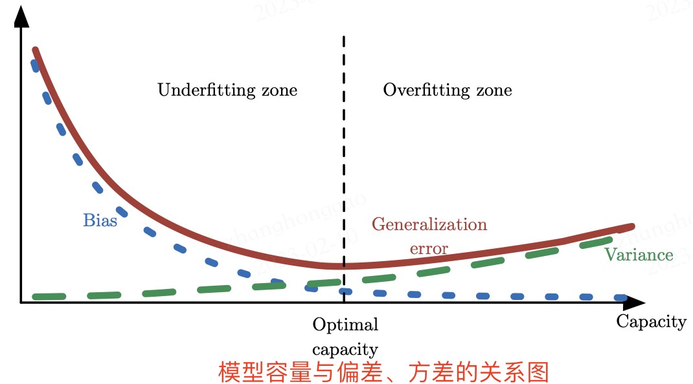

- [一，余弦相似度与欧氏距离](#一余弦相似度与欧氏距离)
  - [1.1，余弦相似度](#11余弦相似度)
  - [1.2，欧式距离](#12欧式距离)
  - [1.3，余弦相似度和欧氏距离的区别](#13余弦相似度和欧氏距离的区别)
- [二，Bias(偏差)和Varience(方差)](#二bias偏差和varience方差)
- [2.1，概念定义](#21概念定义)
  - [2.2，图形定义](#22图形定义)
  - [2.3，数学定义](#23数学定义)
  - [2.4，导致偏差和方差的原因](#24导致偏差和方差的原因)
  - [2.5，深度学习中的偏差与方差](#25深度学习中的偏差与方差)
- [三，模型容量、过拟合和欠拟合](#三模型容量过拟合和欠拟合)
- [四，样本方差与总体方差](#四样本方差与总体方差)
- [五，先验概率与后验概率](#五先验概率与后验概率)
  - [5.1，条件概率](#51条件概率)
  - [5.2，先验概率](#52先验概率)
  - [5.3，后验概率](#53后验概率)
  - [5.4，贝叶斯公式](#54贝叶斯公式)
  - [5.5，后验概率实例](#55后验概率实例)
- [六，相对熵(KL散度)与交叉熵](#六相对熵kl散度与交叉熵)
  - [6.1，信息熵](#61信息熵)
  - [6.2，相对熵/KL散度](#62相对熵kl散度)
  - [6.3，交叉熵 cross-entroy](#63交叉熵-cross-entroy)
  - [6.4，为什么交叉熵可以用作代价](#64为什么交叉熵可以用作代价)
  - [6.5，KL 散度与交叉熵的关系](#65kl-散度与交叉熵的关系)
- [七，随机梯度下降算法](#七随机梯度下降算法)
  - [八，超参数和验证集](#八超参数和验证集)
- [九，正则化方法](#九正则化方法)
- [参考资料](#参考资料)

> 深度学习是机器学习的一个特定分支，要想充分理解深度学习，就必须对机器学习的基本原理有深刻的理解。机器学习的本质属于应用统计学，其更多地关注如何用计算机统计地估计复杂函数，而不太关注为这些函数提供置信区间，大部分机器学习算法可以分成监督学习和无监督学习两类；通过组合不同的算法部分，例如优化算法、代价函数、模型和数据集可以建立一个完整的机器学习算法。

## 一，余弦相似度与欧氏距离

### 1.1，余弦相似度

通过对两个文本分词，`TF-IDF` 算法向量化，利用空间中两个向量的夹角，来判断这两个向量的相似程度：(`计算夹角的余弦，取值 0-1`)

+ 当两个向量夹角越大，距离越远，最大距离就是两个向量夹角 180°；
+ 夹角越小，距离越近，最小距离就是两个向量夹角 0°，完全重合。
+ 夹角越小相似度越高，但由于有可能一个文章的特征向量词特别多导致整个向量维度很高，使得计算的代价太大不适合大数据量的计算。

**计算两个向量a、b的夹角余弦：**
我们知道，余弦定理：$cos(\theta) = \frac {a^2+b^2+c^2}{2ab}$ ，由此推得两个向量夹角余弦的计算公式如下：
$$cos(\theta) = \frac {ab}{||a|| \times ||b||} = \frac {x_{1}x_{2}+y_1y_2}{\sqrt{x^2_1+y^2_1}\sqrt{x^2_2+y^2_2}}$$
（分子就是两个向量的内积，分母是两个向量的模长乘积）

### 1.2，欧式距离
> 欧式距离和 L2 范数计算公式相同。

在欧几里得空间中，欧式距离其实就是向量空间中两点之间的距离。点 $x = (x_{1}, ..., x_{n})$ 和 $y = (y_{1}, ..., y_{n})$ 之间得欧氏距离计算公式如下：
$$d(x,y) = \sqrt {((x_{1}-y_{1})^{2} + (x_{2}-y_{2})^{2} + ... + (x_{n}-y_{n})^{2})}$$

### 1.3，余弦相似度和欧氏距离的区别

+ 欧式距离和余弦相似度都能度量 `2` 个向量之间的相似度
+ 放到向量空间中看，欧式距离衡量`两点之间`的直线距离，而余弦相似度计算的是`两个向量`之间的夹角
+ 没有归一化时，欧式距离的范围是 `[0, +∞]`，而余弦相似度的范围是 `[-1, 1]`；余弦距离是计算相似程度，而欧氏距离计算的是相同程度（对应值的相同程度）
+ 归一化的情况下，可以将空间想象成一个超球面（三维），欧氏距离就是球面上两点的直线距离，而向量余弦值等价于两点的球面距离，本质是一样。

## 二，Bias(偏差)和Varience(方差)

当我们讨论预测模型时，预测误差可以分解为我们关心的两个主要子成分：“**偏差**”引起的误差和“**方差**”引起的误差。 在模型最小化偏差和方差的能力之间存在权衡。 了解这两类错误可以帮助我们诊断模型结果，避免出现过拟合或欠拟合的错误。
 
另外，**有两个不同的概念都被称为“方差”**。一种是**理论概率分布的方差**。而另一种方差是一组观测值的特征(**统计意义上的方差**)。观测值通常是从真实世界的系统中测量的。如果给出系统的所有可能的观测，则它们算出的方差称为总体方差；然而，一般情况下我们只使用总体的一个子集（样本），由此计算出的方差称为样本方差。用样本计算出的方差可认为是对整个总体的方差的估计量。
> 更多名词定义参考 [总体、样本、总体方差、样本方差、抽样方差和标准误差](https://zhuanlan.zhihu.com/p/106706044)。

## 2.1，概念定义

统计领域为我们提供了很多工具来实现机器学习目标，不仅可以解决训练集上的任务，还可以泛化。偏差-方差指标方法是试图对学习算法（模型）的期望泛化错误率进行拆解:

$$Error = Bias + Varience$$
> Varience(Error due to Variance), Bias(Error due to Bias)

+ `Error`: 反映的是整个模型的准确度。
+ `Bias`：偏差引起的误差被视为我们模型的预期（或平均）预测与我们试图预测的正确值之间的差异，即模型的**准确性**。当然，您只有一个模型，因此谈论预期或平均预测值可能看起来有点奇怪。但是，想象一下您可以多次重复整个模型构建过程：每次您收集新数据并运行新分析时都会创建一个新模型。由于基础数据集中的随机性，生成的模型将具有一系列预测。偏差通常衡量这些模型的预测与正确值之间的差距。
+ `Varience`：方差引起的误差被视为给定数据点的模型预测的可变性，即**即模型的稳定性。同样，假设您可以多次重复整个模型构建过程。方差是给定点的预测在模型的不同实现之间的变化程度。
+ `Bias`: 反映的是模型在**样本上的输出与真实值之间的误差**，即模型的准确性。以打靶事件为例，`low bias`，一般就得复杂化模型，表现出来就是点都打在靶心中间，但这样容易过拟合 (`overfitting`)，过拟合对应下图是 `high variance`，点很分散。
+ `Varience`: 反映的是模型每一次输出的结果与模型输出期望之间的误差，即模型的稳定性，是训练集上训练出来的模型在测试集上的表现。同样以打靶事件为例，`low variance` 对应就是点都打的很集中，但不一定是靶心附近，手很稳，但是瞄的不准。

### 2.2，图形定义

`Bias` 和 `Varience` 的图形定义：

我们可以使用靶心图创建偏差和方差的图形可视化。想象一下，目标的中心是一个可以完美预测正确值的模型。当我们远离靶心时，我们的预测会变得越来越糟。

`Low Bias` 表现出来就是点都打在靶心中间，但这样容易过拟合 (`overfitting`)，过拟合对应下图是 `High Variance`，表现就是点很分散，没有集中在一起，手不稳啊（对应就是模型预测结果变化性太大）。
`Low Variance` 对应就是点都打的很集中，但不一定是靶心附近，手很稳，但是瞄的不一定准。

我们可以绘制四种不同的情况，代表高低偏差和方差的组合。

> 图片来源 [Understanding the Bias-Variance Tradeoff](http://scott.fortmann-roe.com/docs/BiasVariance.html)。

总的来说，参数估计、偏差和方差虽然是统计领域的基本概念，但它们的关系也和机器学习的模型容量、欠拟合和过拟合的概念紧密相联。

偏差和方差度量着估计量的两个不同误差来源：
- **偏差度量着偏离真实函数或参数的误差期望**。
- **方差度量着数据上任意特定采样可能导致的估计期望的偏差**。

### 2.3，数学定义

假设对测试样本 $x$, 令 $y_{D}$ 为 $x$ 在数据集中的标记，$y$ 为 $x$ 的真实标记， $f(x;D)$ 为在训练集 $D$ 上学习到的模型 $f$ 在 $x$ 上的预测输出。
+ 训练过程中期望输出与真实标记（标签）的差别称为偏差（`bias`）：$bias^{2}(x) = (\bar{f} - y)^{2}$
+ （交叉验证训练模型）使用样本数相同不同训练集训练出来的模型在测试集上产生的`方差`为： $var(x) = E_{D}[(f(x;D) - \bar{f})^{2}] $

### 2.4，导致偏差和方差的原因
>  [机器学习中的Bias(偏差)，Error(误差)，和Variance(方差)有什么区别和联系？](https://www.zhihu.com/question/27068705)

+ 偏差通常是由于我们对学习算法做了错误的假设，或者模型的复杂度不够；
    + 比如真实模型是一个二次函数，而我们假设模型为一次函数，这就会导致偏差的增大（欠拟合）；
    + 由偏差引起的误差通常在训练误差上就能体现，或者说训练误差主要是由偏差造成的
+ 方差通常是由于模型的复杂度相对于训练集过高导致的；
    + 比如真实模型是一个简单的二次函数，而我们假设模型是一个高次函数，这就会导致方差的增大（过拟合）；
    + 由方差引起的误差通常体现在测试误差相对训练误差的增量上。

### 2.5，深度学习中的偏差与方差

+ 神经网络的拟合能力非常强，因此它的训练误差（偏差）通常较小；
+ 但是过强的拟合能力会导致较大的方差，使模型的测试误差（泛化误差）增大；
+ 深度学习的核心工作之一就是**研究如何降低模型的泛化误差**，这类方法统称为`正则化方法`。

## 三，模型容量、过拟合和欠拟合

+  模型容量是指模型拟合各种函数的能力，决定了模型是欠拟合还是过拟合。
+  **欠拟合**就是指模型的训练误差过大，即偏差（`bias`）过大，表现为模型不够”准“，优化算法目的在于解决欠拟合问题。
+  **过拟合**就是指训练误差和测试误差间距过大，即方差（`variance`）过大，表现为模型不够”稳“，正则化目的在于解决过拟合问题。
+  机器学习模型的目的是解决欠拟合和过拟合的问题，这也是机器学习算法的两个挑战。

> 训练误差 `train error`，泛化误差 `generalization error`（也叫测试误差 `test error`)。

模型容量与偏差、方差的关系图如下所示：

从上图可以看出，当容量增大(x 轴)时，偏差(蓝色虚线)随之减小，而方差(绿色虚线)随之增大，使得泛 化误差(加粗曲线)产生了另一种 U 形。如果我们沿着轴改变容量，会发现**最佳容量**（optimal capacity），当容量小于最佳容量会呈现欠拟合，大于时导致过拟合。这种关系与第一章中讨论的容量、欠拟合和过拟合之间的关系类似。

## 四，样本方差与总体方差

**1，均方误差（MSE，mean squared error）与均方根误差(RMSE)**

均方误差是预测值与真实值之差的平方和的平均值，即误差平方和的平均数。计算公式形式上接近方差，它的开方叫均方根误差 `RMSE`，均方根误差才和标准差形式上接近。
计算公式如下：
$$\frac{1}{n} \sum_{i=1}^{n}[f(x_i)-y_i]^2$$
在机器学习中均方误差常用作**预测和回归问题的损失函数**，均方误差越小，说明模型预测的越准确，反之则越不准确。

**2，总体方差**

> 方差是在概率论和统计学中衡量随机变量或一组数据时离散程度的度量，在统计描述和概率分布中各有不同的定义，并有不同的公式。概率论中方差用来度量随机变量和其数学期望（即均值）之间的偏离程度。*

*统计中的方差（样本方差）是样本实际值与实际值的总体平均值之差的平方和的平均值**，即将各个误差之平方（而非取绝对值，使之肯定为正数）相加之后再除以总数。

**总体方差**计算公式如下：
$$\sigma ^2 = \frac{\sum_{i=1}^{N}(X_{i}-\mu)^2}{N}$$
公式解析：
1. 因为和样本数无关，所以分母为样本数
2. 累加每个值和均值差值的平方，对应于每个值相对于均值的偏差，对应于离散程度，平方是对离散程度的加剧，同时能让差值总为正数，以符合偏差的概念意义
3. $\sigma$ 的平方表示总体方差，$X$ 表示变量，$\mu $ 表示总体的均值，$N$ 表示总体样本数量。

由于方差是数据的平方，与检测值本身相差太大，难以直观的衡量，所以常用方差开根号换算回来，就成了标准差（Standard Deviation）用$\sigma$ 表示。

**3，样本方差**

在实际项目中，总体均值难以得到时，应用样本统计量替代总体参数，经校正后，样本方差的计算公式如下：
> 样本方差是指总体各单位变量值与其算术平均数的离差平方的平均数。样本方差的意义是用来估计总体方差（统计术语：样本方差是对总体方差的无偏估计）。

$$\sigma ^2 = \frac{\sum_{i=1}^{n-1}(X_{i}-\overline{x_{i}..x_{n}})^2}{n-1}$$
$\overline{x_{i}..x_{n}}$ 表示样本均值公式分母由总体方差的 `N` 变为了 `n-1`，使得样本方差更能反映总体方差。

## 五，先验概率与后验概率
> 更多深入内容可参考《花书》第三章概率与信息论。

### 5.1，条件概率

一个事件发生后另一个事件发生的概率。设 A 与 B 为样本空间 Ω 中的两个事件，其中 P(B)>0。那么在事件 B 发生的条件下，事件 A 发生的条件概率为：

$$
P(A|B) = \frac {P(A\cap B)} {P(B)}
$$

### 5.2，先验概率

事件发生前的概率，可以是基于以往经验/分析，也可以是基于历史数据的统计，甚至可以是人的主观观点给出。一般是**单独**事件概率，如 $P(x)$, $P(y)$。

### 5.3，后验概率

+ 事情已经发生，要求这件事情发生的原因是由某个因素引起的可能性的大小（**由果推因**：就是在知道“果”之后，去推测“因”的概率）
+ 后验概率和和先验概率的关系可以通过`贝叶斯`公式求得，公式如下：
$$
P(B_{i}|A) = \frac {P(B_{i}\cdot P(A|B_{i}}{P(B_{1})\cdot P(A|B_{1}) + P(B_{2})\cdot P(A|B_{2}) }
$$

### 5.4，贝叶斯公式

贝叶斯公式是建立在条件概率的基础上寻找事件发生的原因（即大事件 `A` 已经发生的条件下，分割中的小事件 `Bi` 的概率），设 `B1,B2,...` 是样本空间 `Ω` 的一个划分，则对任一事件 `A（P(A)>0)`, 有：$$P(B_{i}|A) = \frac {P(A|B_{i})P(B_{i})}{\sum_{j=1}^{n}P(B_{j})P(A|B_{j})}$$

+ `Bi` 常被视为导致试验结果A发生的”原因“；
+ `P(Bi)(i=1,2,...)` 表示各种原因发生的可能性大小，故称先验概率；
+ `P(Bi|A)(i=1,2...)` 则反映当试验产生了结果A之后，再对各种原因概率的新认识，故称后验概率。

### 5.5，后验概率实例

假设一个学校里有 `60％` 男生和 `40%` 女生。女生穿裤子的人数和穿裙子的人数相等，所有男生穿裤子。一个人在远处随机看到了一个穿裤子的学生。那么这个学生是女生的概率是多少？
+ 使用贝叶斯定理，事件A是看到女生，事件B是看到一个穿裤子的学生。我们所要计算的是 $P(A|B)$。
+ $P(A)$ 是忽略其它因素，看到女生的概率，在这里是 40%；
+ $P(A')$ 是忽略其它因素，看到不是女生（即看到男生）的概率，在这里是 60%；
+ $P(B|A)$ 是女生穿裤子的概率，在这里是 50%；
+ $P(B|A')$ 是男生穿裤子的概率，在这里是 100%；
+ $P(B)$ 是忽略其它因素，学生穿裤子的概率，$P(B) = P(B|A)P(A) + P(B|A')P(A')$，在这里是 0.5×0.4 + 1×0.6 = 0.8。

根据贝叶斯定理，我们计算出后验概率P(A|B):

$$
P(A|B) = \frac {P(B|A)P(A)}{P(B)} = \frac {0.5\times 0.4} {0.8}
$$

## 六，相对熵(KL散度)与交叉熵

> 也可参考文章[【直观详解】信息熵、交叉熵和相对熵](https://charlesliuyx.github.io/2017/09/11/%E4%BB%80%E4%B9%88%E6%98%AF%E4%BF%A1%E6%81%AF%E7%86%B5%E3%80%81%E4%BA%A4%E5%8F%89%E7%86%B5%E5%92%8C%E7%9B%B8%E5%AF%B9%E7%86%B5/)、[为什么交叉熵（cross-entropy）可以用于计算代价](https://www.zhihu.com/question/65288314)和[神经网络基础部件-损失函数详解](https://github.com/HarleysZhang/deep_learning_alchemy/blob/main/2-deep_learning_basic/%E7%A5%9E%E7%BB%8F%E7%BD%91%E7%BB%9C%E5%9F%BA%E7%A1%80%E9%83%A8%E4%BB%B6-%E6%8D%9F%E5%A4%B1%E5%87%BD%E6%95%B0%E8%AF%A6%E8%A7%A3.md)。

### 6.1，信息熵

**其实信息熵是香农信息量（$log\frac{1}{p}$）的期望（均值），它不是针对每条信息，而是针对整个不确定性结果集而言，信息熵越大，事件不确定性就越大。单条信息只能从某种程度上影响结果集概率的分布**。信息熵定义：

$$H(P) = \sum_{i} P(i)log_{a} \frac{1}{P(i)} = -\sum_{i}P(i)log_{a} P(i)$$

$P_{i}$ 表示第 $i$ 个事件发生得概率，总的来说信息熵其实从某种意义上反映了**信息量存储下来需要多少存储空间**。
总结为：根据真实分布，我们能够找到一个最优策略，以**最小的代价消除系统的不确定性**（比如编码），而这个代价的大小就是**信息熵**。

### 6.2，相对熵/KL散度

`KL` 散度，有时候也叫 `KL 距离`，一般被用于计算两个分布之间的不同，记为 $D_{KL}(P||Q) = H(P,Q) - H(P)$，对于同一个离散随机变量 $\textrm{x}$ 有两个单独的概率分布 $P(x)$ 和 $Q(x)$，其 `KL` 散度为：

$$D_{KL}(P \| Q) = \sum_i P(i)log_{a} \frac{P(i)}{Q(i)} = \sum_i P(i)[logP(x) - log Q(x)]$$

当 $P(i) = Q(i)$ 的时候，该值为 `0`，深度学习过程也是一个降低该值的过程，**该值越低，训练出来的概率 $Q$ 越接近样本集概率 $P$，即越准确**，或者可以理解为相对熵是一把标尺，用来衡量两个函数是否相似，相似就是 0。即，**相对熵 = 某个策略的交叉熵 - 信息熵**（根据系统真实分布计算而得的信息熵，为最优策略），**当信息熵为常量时，交叉熵与KL散度相等**。
### 6.3，交叉熵 cross-entroy

交叉熵是由信息熵而得来的，和 `KL` 散度关系密切，拓展用在机器学习/深度学习中作损失函数。假定在确定性更大的概率分布情况下，用更不确定的存储策略来计算，比如使用 `P` 的概率乘上 `Q` 的存储因子，套用信息熵公式：
$$H(P,Q) = \sum_{i} P(i)log_{a} \frac{1}{Q(i)} = -\sum_{i}P(x_i)log_{a} Q(x_i)$$
用预测概率 $q$ 分布，去编码真实标签 $p$ 的分布，得到的信息量。**交叉熵，用来衡量在给定的真实分布下，使用非真实分布指定的策略消除系统的不确定性所需要付出努力的大小**。总的来说，我们的目的是：让熵尽可能小，即存储空间小（消除系统的不确定的努力小）。**交叉熵的一些性质：**

+ 非负。
+ 和 `KL` 散度相同，交叉熵也不具备对称性，即 $H(P,Q)≠H(Q,P)$。
+ 交叉熵主要用于描述两个事件之间的相互关系，对同一个分布求交叉熵等于对其求熵

### 6.4，为什么交叉熵可以用作代价

从数学上来理解就是，为了让学到的模型分布更接近真实数据的分布，我们需要最小化模型数据分布与训练数据之间的 `KL 散度`，而因为训练数据的分布是固定的，因此最小化 `KL 散度`等价于最小化交叉熵，而且交叉熵计算更简单，所以机器/深度学习中常用交叉熵 `cross-entroy` 作为分类问题的损失函数。

使用交叉熵损失大大提高了具有 `sigmoid` 和 `softmax` 输出的模型的性能，而当使用均方误差损失时会存在饱和和学习缓慢的问题。

### 6.5，KL 散度与交叉熵的关系

+ `KL` 散度和交叉熵在特定条件下等价
+ $D_{KL}(P||Q) = H(P,Q) - H(P)$

## 七，随机梯度下降算法

+ 随机梯度下降算法是目前最为广泛应用的一种**神经网络优化算法**，形式为 $θ=θ − ϵg$，$ϵ$ 是学习率，$g$ 是梯度，$θ$ 是权重。
+ 随机梯度下降优化算法不一定能保证在合理的时间内达到一个局部最小值，但它通常能及时地找到代价函数一个很小的值，并且是有用的。

### 八，超参数和验证集

+ 普通参数指算法权重 $w$ 的值，是可以通过学习算法本身学习得到。**超参数的值不是通过学习算法本身学习出来的，可通过验证集人为选择合适的超参数**。
+ 将训练数据划分为两个不相交的子集，即训练集和验证集，训练集用于学习普通参数，验证集用于估计训练中或训练后的泛化误差，更新超参数（“训练超参数”）。通常，`80%` 的训练数据用于训练，`20%` 用于验证。
+ 交叉验证方法适合小规模数据集（例如几百上千张图片）训练模型的情况。

## 九，正则化方法

所谓正则化，是指我们通过**修改学习算法，使其降低泛化误差而非训练误差**的方法。

**正则化是一种思想（策略）**，它是机器学习领域的中心问题之一，其重要性只有优化能与其相媲美。

许多正则化方法通过对目标函数 $J$ 添加一个**参数范数惩罚项** $\Omega(\theta)$，限制模型 (如神经网络、线性回归或逻辑回归)的学习能力。我们将正则化后的目标函数记为
$\tilde{J}$ :

$$\tilde{J}(\theta; X, y) = J(\theta; X, y) + \alpha \Omega(\theta)$$

其中 $\alpha \in[0,∞)$ 是权衡范数惩罚项 $\Omega$ 和标准目标函数 $J(X;\theta)$ 相对贡献的超参数。将 $\alpha$ 设为 0 表示没有正则化。$\alpha$ 越大，对应正则化惩罚越大。

常用的参数正则化策略有 L1 和 L2 范数。L1 范数（`L1 norm`）是指向量中各个元素绝对值之和，也有个美称叫“稀疏规则算子”（Lasso regularization）。 比如，向量 $A = [1，-1，3]$， 那么 A 的 L1 范数为 $|1|+|-1|+|3|$。简单总结就是：

+ L1 范数: 为向量 x 各个元素绝对值之和。
+ L2 范数: 为向量 x 各个元素平方和的 1/2 次方，L2 范数又称 Euclidean 范数或 Frobenius 范数
+ Lp 范数: 为向量 x 各个元素绝对值 $p$ 次方和的 $1/p$ 次方.

`L1` 范数可以使权值参数稀疏，方便特征提取。L2 范数可以防止过拟合，提升模型的泛化能力。

## 参考资料

1. [机器学习中的Bias(偏差)，Error(误差)，和Variance(方差)有什么区别和联系？](https://www.zhihu.com/question/27068705)
2. [先验概率，后验概率，似然概率，条件概率，贝叶斯，最大似然](https://blog.csdn.net/suranxu007/article/details/50326873)
3. [你对贝叶斯统计有何理解](https://www.zhihu.com/question/21134457/answer/169523403)
4. [Different types of Distances used in Machine Learning Explained](https://tuhinmukherjee74.medium.com/different-types-of-distances-used-in-machine-learning-explained-550e2979752c)
5. [Understanding the Bias-Variance Tradeoff](http://scott.fortmann-roe.com/docs/BiasVariance.html)