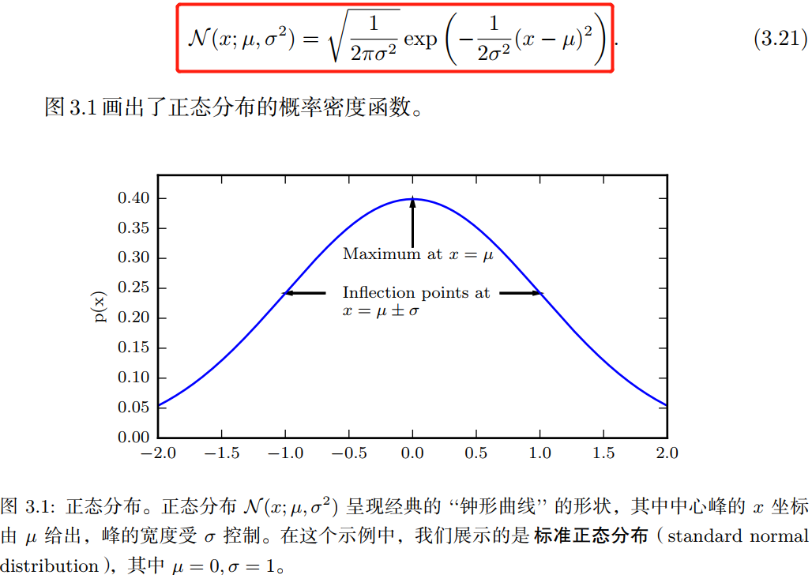

- [一，为什么要使用概率论](#一为什么要使用概率论)
- [二，随机变量](#二随机变量)
- [三，概率分布](#三概率分布)
  - [3.1，离散型变量和概率质量函数](#31离散型变量和概率质量函数)
  - [3.2，连续型变量和概率密度分布函数](#32连续型变量和概率密度分布函数)
- [四，边缘概率](#四边缘概率)
- [五，条件概率](#五条件概率)
  - [5.1，条件概率的链式法则](#51条件概率的链式法则)
  - [5.2，独立性和条件独立性](#52独立性和条件独立性)
  - [5.3，期望、方差和协方差](#53期望方差和协方差)
- [六，常用概率分布](#六常用概率分布)
  - [6.1，高斯分布](#61高斯分布)
  - [6.2，sigmoid 函数性质](#62sigmoid-函数性质)
- [七，信息论(相对熵和交叉熵)](#七信息论相对熵和交叉熵)
- [参考资料](#参考资料)

概率论是用于表示不确定性声明的数学框架。它不仅提供了量化不确定性的方法，也提供了用于导出新的不确定性**声明**（`statement`）的公理。概率论的知识在机器学习和深度学习领域都有广泛应用，是学习这两门学科的基础。在人工智能领域，概率论主要有两种用途。首先，概率法则告诉我们 AI 系统如何推理，据此我们设计一些算法来计算或者估算由概率论导出的表达式。其次，我们可以用概率和统计从理论上分析我们提出的 AI 系统的行为。

概率论使我们能够提出不确定的声明以及在不确定性存在的情况下进行推理，而信息论使我们能够量化概率分布中的不确定性总量。
> 本文内容大多来自《深度学习》（花书）第三章概率与信息论。目录的生成是参考此篇 [文章](https://ecotrust-canada.github.io/markdown-toc/)。

## 一，为什么要使用概率论

机器学习通常必须处理不确定量，有时可能还需要处理随机（非确定性）量，因此机器学习中会大量使用概率论。

尽管我们的确需要一种用以对不确定性进行表示和推理的方法，但是概率论并不能明显地提供我们在人工智能领域需要的所有工具。概率论最初的发展是为了分析事件发生的频率。

## 二，随机变量

**随机变量**（`random variable`）是可以随机地取不同值的变量，它可以是离散或者连续的。

我们通常用无格式字体 (`plain typeface`) 中的小写字母来表示随机变量本身，而用手写体中的小写字母来表示随机变量能够取到的值。例如， $x_1$ 和 $x_2$ 都是随机变量 $\textrm{x}$ 可能的取值。对于向量值变量，我们会将随机变量写成 $\mathbf{x}$，它的一个可能取值为 $\boldsymbol{x}$。就其本身而言，一个随机变量只是对可能的状态的描述；它必须伴随着一个概率分布来指定每个状态的可能性。

## 三，概率分布

**概率分布**（`probability distribution`）用来描述随机变量或一簇随机变量在每一个可能取到的状态的可能性大小，狭义地讲，它是指**随机变量的概率分布函数**。具有相同分布函数的随机变量一定是同分布的。

### 3.1，离散型变量和概率质量函数

离散型变量的概率分布可以用**概率质量函数**（`probability mass function, PMF`）.我们通常用大写字母 $P$来表示概率质量函数，通常每一个随机变量都会有一个不同的概率质量函数。

概率质量函数可以同时作用于多个随机变量。这种多个变量的概率分布被称为**联合概率分布**（`joint probability distribution`）。 $P(x = \textrm{x},y = \textrm{y})$ 表示 $x = \textrm{x}$ 和 $y = \textrm{y}$ 同时发生的概率，简写为 $P(x，y)$。

概率质量函数将随机变量能够取得的每个状态映射到随机变量取得该状态的概率。如果一个函数 $P$ 是随机变量 x 的 `PMF`，必须满足以下条件：

+ $P$ 的定义域必须是 x 所有可能状态的集合。
+ $\forall x \in \textrm{x}, 0 \leq  P(x)\leq 1$。不可能发生的事件概率为 `0`，能够确保一定发生的事件概率为 `1`。
+ $\sum_{x \in \textrm{x}}P(x)=1$，**归一化**（`normalized`）。

常见的离散概率分布族有：
+ 伯努利分布
+ 二项分布：一般用二项分布来计算概率的前提是，每次抽出样品后再放回去，并且只能有两种试验结果，比如黑球或红球，正品或次品等。
+ 几何分布
+ `Poisson` 分布（泊松分布）：`Poisson` 近似是二项分布的一种极限形式。
+ 离散均匀分布

### 3.2，连续型变量和概率密度分布函数

连续型随机变量的概率分布用**概率密度函数**（`probability desity function, PDF`）来描述。如过一个函数 $p$ 是概率密度函数，其必须满足以下条件：

+ $p$ 的定义域必须是 $\textrm{x}$ 所有可能状态的集合。
+ $\forall x \in \textrm{x}, p(x)\geq 0$。注意，并不要求 $p(x)\leq 1$。
+ $\int p(x)dx=1$。

我们可以对概率密度函数求积分来获得点集的真实概率质量。特别地，$x$ 落在集合 $\mathbb{S}$ 中的概率可以通过 $p(x)$ 对这个集合求积分来得到。在单变量的例子中，$x$ 落在区间 $[a,b]$ 的概率是 $\int_{[a,b]}p(x)dx$。

常见的离散概率分布族有：
+ 均匀分布
+ **正态分布**：连续型随机变量的概率密度函数如下所示。其密度函数的曲线呈对称钟形，因此又被称之为钟形曲线，其中$\mu$ 是平均值，$\sigma$ 是标准差。正态分布是一种理想分布。$${f(x)={\frac {1}{\sigma {\sqrt {2\pi }}}}e^{\left(-{\frac {1}{2}}\left({\frac {x-\mu }{\sigma }}\right)^{2}\right)}}$$
+ 伽玛分布
+ 指数分布

## 四，边缘概率

有时候，我们知道了一组变量的联合概率分布，但想要了解其中一个子集的概率分布。这种定义在子集上的概率分布被称为**边缘概率分布**（`marginal probability distribution`）。

假设有离散型随机变量 $x$ 和 $y$，知道 $P(x,y)$，可以依据下面的**求和法则**（`sum rule`）来计算 $P(x)$：
$$\forall x \in \textrm{x},P(\textrm{x}=x)=\sum_{y}P(\textrm{x}=x, \textrm{y}=y)$$

”边缘概率“的名称来源于手算边缘概率的计算过程。当 $P(x,y)$ 的每个值被写在由每行表示不同的 $x$ 值，每列表示不同的 $y$ 值形成的网格中时，对网格中的每行求和是很自然的事情，然后将求和的结果 $P(x)$ 写在每行右边的纸的边缘处。

连续性变量则用积分代替求和：
$$p(x) = \int p(x,y)dy$$

## 五，条件概率

某个事件，在给定其他事件发生时出现的概率叫做条件概率。将给定 $\textrm{x} = x$， $\textrm{y} = y$ 发生的条件概率记为 $P(\textrm{y} = y|\textrm{x} = x)$，计算公式如下：

$$P(\textrm{y}=y|\textrm{x}=x)=\frac{P(\textrm{y}=y, \textrm{x}=x)}{P(\textrm{x}=x)}$$

条件概率只在 $P(\textrm{x}=x)\geq 0$ 时有定义。我们不能计算给定在永远不会发生的事件上
的条件概率。

### 5.1，条件概率的链式法则

任何多维随机变量的联合概率分布，都可以分解成只有一个变量的条件概率相乘的形式，这个规则被称为概率的**链式法则**（`chain rule`）。

$$
P(a,b,c) = P(a|b,c)P(b,c) \\
P(b,c) = P(b|c)P(c) \\
P(a,b,c) = P(s|b,c)P(b|c)P(c)
$$

### 5.2，独立性和条件独立性

两个随机变量 $\textrm{x}$ 和 $\textrm{y}$，如果它们的概率分布可以表示成两个因子的乘积形式，并且一个因子只包含 $\textrm{x}$ 另一个因子只包含 $\textrm{y}$，我们就称这两个随机变量是**相互独立**的（`independent`）：

$$\forall x \in \textrm{x},y \in \textrm{y},p(\textrm{x}=x, \textrm{y}=y)=p(\textrm{x}=x)p(\textrm{y}=y)$$

两个相互独立的随机变量同时发生的概率可以通过各自发生的概率的乘积得到。

### 5.3，期望、方差和协方差
> 在概率分布中，期望值和方差或标准差是一种分布的重要特征。期望、数学期望、均值是一个意思。统计中的方差（样本方差）是每个样本值与全体样本值的平均数之差的平方值的平均数。

1，在概率论和统计学中，一个离散型随机变量的期望值（`epectation`）是实验中每次可能的结果乘以其结果概率的总和。函数 $f(x)$ 关于某分布 $P(x)$ 的**期望**（`expectation`）或期望值（`expected value`）是指，当 $x$ 由 $P$ 产生，$f$ 作用于 $x$ 时，$f(x)$ 的平均值。对于离散型随机变量，期望可以通过求和得到：

$$ \mathbb{E}_{\textrm{x}\sim P}[f(x)] = \sum_{x} P(x)f(x)$$

对于连续型随机变量可以通过求积分得到：

$$ \mathbb{E}_{\textrm{x}\sim p}[f(x)] = \int p(x)f(x)dx$$

期望是线性的：

$$ \mathbb{E}_{\textrm{x}}[\alpha f(x) + \beta g(x)] = \alpha \mathbb{E}_{\textrm{x}}[f(x)] + \beta \mathbb{E}_{\textrm{x}} [g(x)]$$

其中 $\alpha$ 和 $\beta$ 不依赖于 $x$。

2，在概率论和统计学中，方差（英语：`variance`）又称变异数、变方，描述的是一个随机变量的离散程度，即一组数字与其平均值之间的距离的度量，是随机变量与其总体均值或样本均值的离差的平方的期望值。其常用的符号表示有 ${\sigma ^{2}}、s^{2}、{\operatorname {Var} (X)}、{V(X)}$，以及 ${\mathbb {V} (X)}$。
> 方差在统计中有非常核心的地位，其应用领域包括描述统计学、推论统计学、假说检定、度量拟合优度（英语：`goodness of fit`），以及蒙特卡洛采样。由于科学分析经常涉及统计，方差也是重要的科研工具。方差是标准差的平方、分布的二阶矩，以及随机变量与其自身的协方差。来源[维基百科-方差](https://zh.m.wikipedia.org/zh-hans/%E6%96%B9%E5%B7%AE)。

**方差**（`variance`）衡量的是当我们对 $x$ 依据它的概率分布进行采样时，随机变量 $\textrm{x}$ 的函数值会呈现多大的差异，或者说一个随机变量的方差描述的是它的离散程度，也就是该变量离其期望值的距离。方差定义如下：
$$Var(f(x)) = \mathbb{E}[(f(x) - \mathbb{E}[f(x)])^2]$$

当方差很小时，$f(x)$ 的值形成的簇比较接近它们的期望值。方差的平方根被称为标准差（`standard deviation`）。

上述期望与方差**关系公式证明**如下:

$$\begin{align}
D(X) 
&= E[X - E(X)]^2 \nonumber\\
&=E[X^2- 2X \cdot E(X) - (E(X))^{2}] \nonumber\\
&=E(X^2) - 2E(X)\cdot E(X) + [E(X)]^{2} \nonumber\\
& = E(X^2) - [E(X)]^{2}
\end{align}
$$

**期望与方差运算性质**如下:

> 更多期望 E(X) 与方差 Var(X) 知识，请参考知乎文章-[【AP统计】期望E(X)与方差Var(X)](https://zhuanlan.zhihu.com/p/64859161)。

## 六，常用概率分布

### 6.1，高斯分布

实数上最常用的分布就是**正态分布**（`normal distribution`），也称为高斯分布（`Gaussian distribution`）

正态分布由两个参数控制，$\mu \in \mathbb{R}$ 和 $\sigma^2 \in (0,\infty)$。参数 $\mu$ 给出了中心峰值的坐标，这也是分布的均值：$\mathbb{E} = \mu$。分布的标准差用 $\sigma$ 表示，方差用 $\sigma^2$ 表示。

### 6.2，sigmoid 函数性质

`sigmoid` 函数在深度学习的模型中用到的概率分布中经常出现。
$$\sigma(x) = \frac{1}{1+exp(-x)}$$
`sigmoid` 函数在变量取绝对值非常大的正值或负值时会出现**饱和**（`saturate`）现象，意味着函数会变得很平，并且对输入的微小改变会变得不敏感。

`sigmoid` 函数的一些性质在后续学习 `BP` 算法等内容时会很有用，我们需要牢记：

$$
\sigma(x) = \frac{exp(x)}{exp(x)+exp(0)} \\
\frac{d}{dx}\sigma(x) = \sigma(x)(1 - \sigma(x)) \\
1 - \sigma(x) = \sigma(-x)
$$

## 七，信息论(相对熵和交叉熵)

信息论是应用数学的一个分支，早期备用在无线通信领域。在深度学习中，主要是使用信息论的一些关键思想来描述概率分布或者量化概率分布之间的相似性。

信息论的基本想法是一个不太可能的事件居然发生了，要比一个非常可能的事件发生，能提供更多的信息。

如果我们对于同一个随机变量 $\textrm{x}$ 有两个单独的概率分布 $P(x)$ 和 $Q(x)$，则可以用 **KL 散度**（ `Kullback-Leibler (KL) divergence`）来**衡量这两个概率分布的差异**：
> `KL` 散度也叫相对熵。

$$D_{KL}(P\parallel Q) = \mathbb{E}_{\textrm{x}\sim p}\begin{bmatrix}
log \frac{P(x)}{Q(x)} \end{bmatrix} = \mathbb{E}_{\textrm{x}\sim p}[log P(x) - log Q(x)]$$

上式的写法是在前面所学内容**数学期望**的基础上给出的，还有一个写法是《机器学习-周志华》书中给出的，更为容易理解：

$$KL(P\parallel Q) = \int_{-\infty }^{+\infty} p(x)log \frac{p(x)}{q(x)} dx$$

其中 $p(x)$ 和 $q(x)$ 分别为 $P$ 和 $Q$ 的概率密度函数。
> 这里假设两个分布均为连续型概率分布，对于离散型概率分布，只需要将积分替换为对所有离散值遍历求和。

`KL` 散度满足非负性和不满足对称性。将上式展开可得：
$$
KL(P\parallel Q) = \int_{-\infty }^{+\infty}p(x)logp(x)dx - \int_{-\infty }^{+\infty}p(x) logq(x)dx = -H(P) + H(P,Q)
$$

$$\text{交叉熵}\ H(P,Q) = \mathbb{E}_{\textrm{x}\sim p} log Q(x)= - \int_{-\infty }^{+\infty}p(x) logq(x)dx$$

其中，$H(P)$ 为熵（`entropy`），$H(P,Q)$ 为交叉熵（`cross entropy`）。**最小化 `KL` 散度其实就是在最小化分布之间的交叉熵**。

在信息论中，熵 $H(P)$ 表示对来自 $P$ 的随机遍历进行编码所需的最小字节数，而交叉熵 $H(P,Q)$ 表示使用 $Q$ 的编码对来自 $P$ 的变量进行编码所需的字节数。因此 KL  散度可认为是使用基于 $Q$ 的编码对来自 $P$ 的变量进行编码所需的“额外字节数”；显然，额外字节数非负，当且仅当 $P=Q$ 时额外字节数为 `0`。

## 参考资料

+ 《深度学习》
+ 《机器学习》