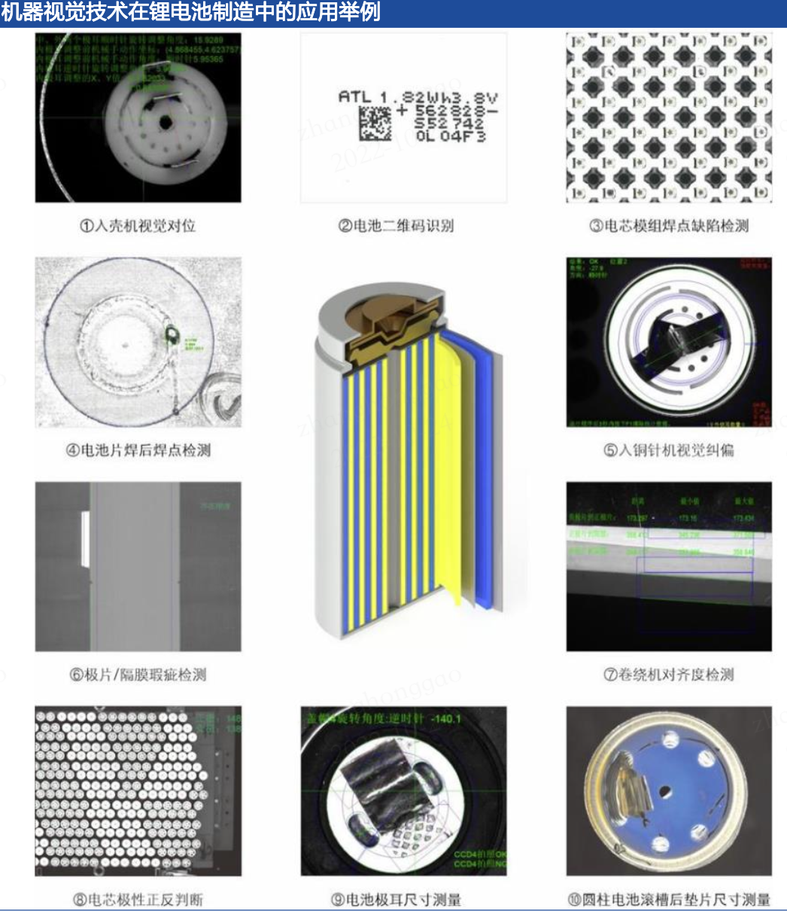
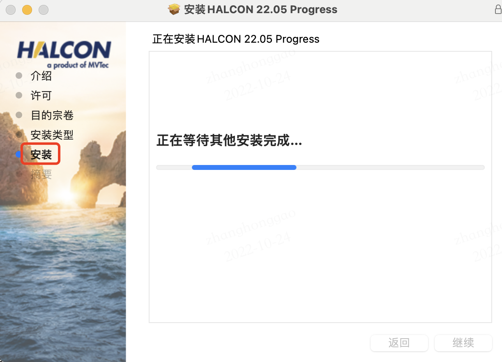
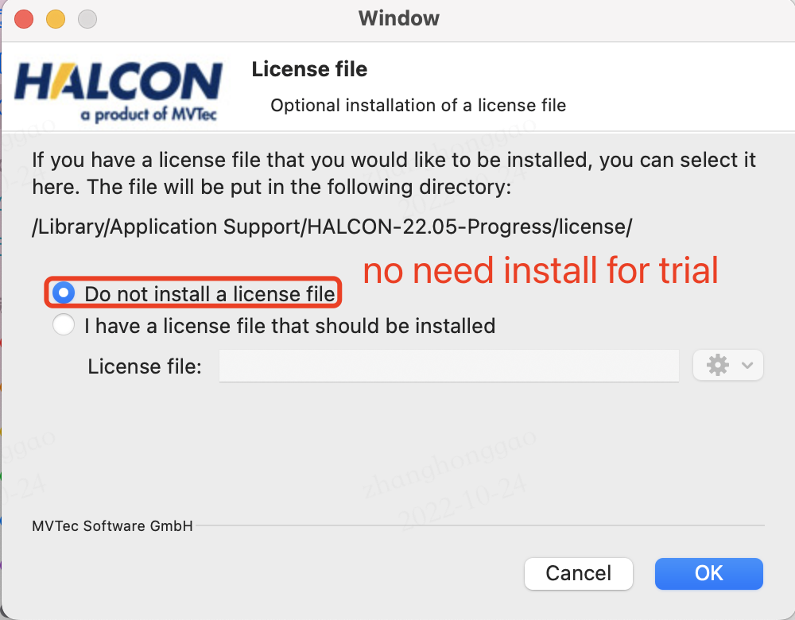
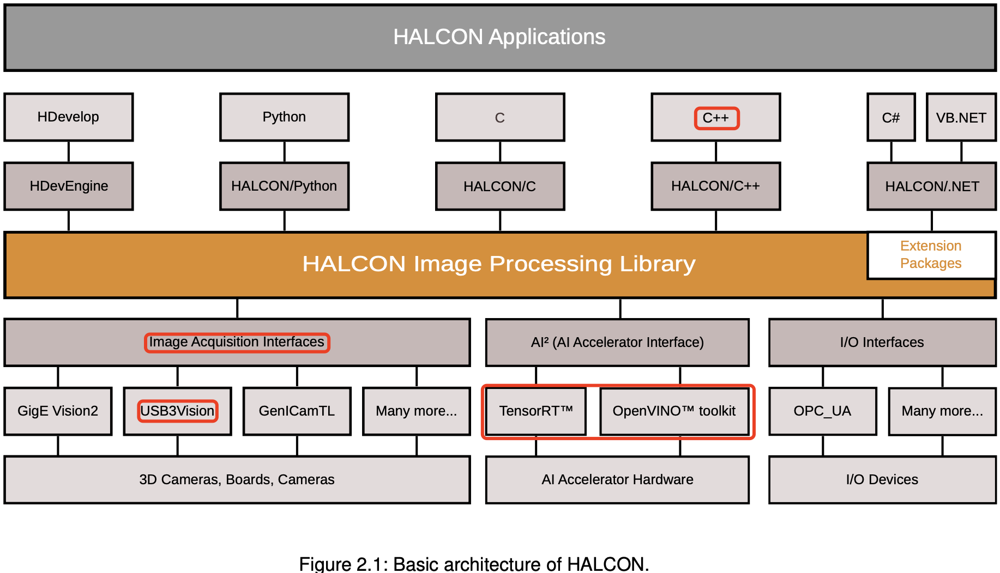
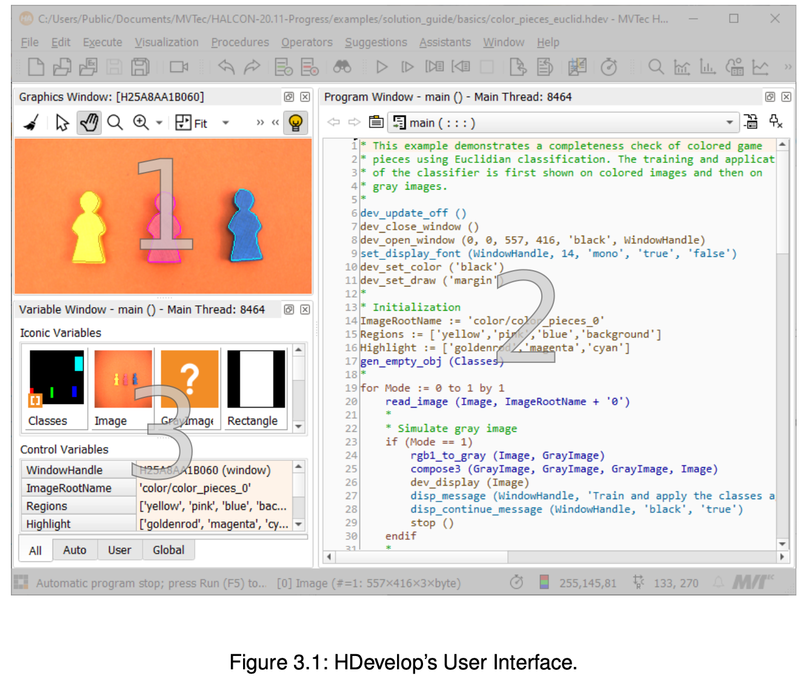

[toc]
## 前言
工业智慧视觉应用主要涉及四个场景：识别、测量、定位、检测。

* **识别**：识别物体的物理特征，包括形状、颜色、字符和条码等，常见的应用场景是 OCR，读取零部件上的字母、数字、字符等用于溯源。
* **测量**：把获取到的图像像素信息标定成常用的度量衡单位，再通过精确计算出目标的几何尺寸。
* **定位**：获取目标的二维/三维位置信息，常用语元件定位，用以辅助机器臂进行后续的抓取等动作。
* **检测**：一般特指缺陷检测，判断产品是否存在缺陷，如零部件缺陷检测等。



## 一，HALCON 概述
`HALCON` 是德国 MVtec 公司开发的一款综合性的机器视觉标准软件，拥有全球通用的集成开发环境（HDevelop）。它节约了产品成本，缩短了软件开发周期——HALCON 灵活的架构便于机器视觉，医学图像和图像分析应用的快速开发。在欧洲以及日本的工业界已经是公认具有最佳效能的机器视觉（Machine Vision）软件。

MVTec 提供了 5 种软件：HALCON、MERLIC、深度学习工具、接口、嵌入式视觉，其中 HALCON 是最核心和应用最广的。

HALCON 主要提供的技术有：条形码和二维码读取、BLOB 分析、物图像分类、计算光学成像、过滤技术、缺陷检查、匹配、1D/2D/3D 测量、形态学处理、OCR 和 OCV、基于样本的识别（SBI）、亚像素边缘检测和线条提取技术、深度学习和 3D 视觉技术。

> 所谓 Blob 分析，即是从连通像素中提取具有相同逻辑状态的特征 (Blob)。

更多技术的描述请参阅官网[资料](https://www.mvtec.com/cn/technologies)。


## 1.1，HALCON 安装
> 注意：**HALCON 目前不支持 arm 处理器版的 M1 Pro 机器**，而且目前主流是在 Windows 开发居多。

注意，需要先在官网**注册账号**，然后才能下载对应软件，MVTec HALCON 提供两个不同的软件版本：[HALCON 订阅版 (HALCON Progress)](https://www.mvtec.com/cn/products/halcon/why-halcon/editions/halcon-progress) 和 [HALCON 永久版 (HALCON Steady)](https://www.mvtec.com/cn/products/halcon/newest-features/halcon-20-11-1)。两个版本是完全独立的。 需要许可证，这意味着没有可能从一个版本 "切换" 到另一个版本。

HALCON 下载安装步骤如下所示：

1. 进入 HALCON [官网](https://www.mvtec.com/cn/downloads/halcon)，选择产品版本、操作系统以及架构后就会下载对应版本软件直接点击下载好的安装包即可安装。
2. 安装的详细步骤截图如下所示，试用版不用安装 `license` 文件，跳过即可。







## 二，HALCON 架构
`HALCON` 架构如下图 2.1 所示。HALCON 机器视觉软件的主要部分就是**图像处理库**，其由超过 2000 多个**算子**组成，当然我们也可以通过拓展包的形式开发自定义算子，并在程序中使用。



`HALCON` 提供了**通用**的图像采集接口来支持不同的图像采集设备（3D相机、相机等），包好特定设备的实现库会在程序运行时动态加载。

### 2.1，算子
> Operators。

我们使用 HALCON 库中任何功能实际上都是通过算子（`Operators`）完成的，每个功能都有多种实现方法，其可以通过算子参数选择。完整的算子列表在 HALCON Operator Reference，其提供了 HDevelop, .NET, Python, C++, 和 C syntax 接口。HALCON库提供的算子的重要特征如下:

* 算子之间没有层次结构，所有算子都是一个级别的。
* 存在逻辑算子。
* 很多算子可以使用并行加速技术。
* 算子的输入输出参数的排序是有**标准化**规则: 输入图标(`iconic`)、输出图标、输入控制和输出控制。

#### 2.1.1，参数和数据结构
>  Quick Guide to HALCON Parameters and Data Structures

`HALCON` 算子的参数有两种基本类型：图标数据和控制数据（iconic data and control data）。图像、区域（`regions`）和 XLD（拓展线描述） 属于标志性数据。

* Images（图像）即包含像素值的矩阵，由多个通道组成，其详细定义可以参考《数字图像处理》书籍。这里感兴趣区域 ROI 指的是输入图像的哪一部分区域会被处理，ROI 可以灵活定义，从简单的矩形到一组未连接到像素点都支持。 
* Regions 由一系列像素组成。区域之中的像素可以不互相连接，任意像素集合都可以作为单个区域处理。
* XLDS 包括所有基于轮廓和多边形的数据。像 `edges_sub_pix` 这样的亚像素精度算子将轮廓作为 XLD 数据返回。 轮廓是一系列 2D 控制点，由线连接。 通常，控制点之间的距离约为 1 个像素。 除了控制点之外，XLD 对象还包含所谓的局部和全局属性。 这些的典型示例是，例如，控制点的边缘幅度或轮廓段的回归参数。 除了提取 XLD 对象外，HALCON 还支持进一步处理。 这方面的示例是基于给定特征范围的轮廓选择，用于将轮廓分割成线、弧、多边形或平行线。

控制数据（`control data`）包括句柄和基本数据类型，如整数、实数、字符串。

**句柄是对复杂数据结构的引用**，例如，与图像采集接口或基于形状匹配的模型的连接。 出于效率和数据安全的原因，在操作符之间传递的不是整个结构而是只有句柄。 句柄是不能更改的神奇值(magic values)，并且可能因执行和版本而异。 一旦所有引用被覆盖，它们就会自动清除。 使用句柄的示例有**图形窗口、文件、套接字、图像采集接口、OCR、OCV、测量和匹配**。

### 2.2，拓展包
为了支持特殊硬件或实现新的算法，HALCON 支持以 **C 语言**实现的自定义算子。拓展包接口包含几个预定义的例程和宏，用于在 C 中轻松处理图像数据和内存对象。成功集成新算子后，它可以像任何其他 HALCON 算子一样使用。

### 2.3，接口
HALCON 支持Python、C、C++ 和 .NET 语言接口，对于·不同编程语言接口，其数据类型、类和算子的命名会有所不同。

#### 2.3.1，HALCON-Python 接口
读取图像并计算连接区域(`connected regions`)数量的示例代码如下。

```python
img = ha.read_image('pcb')
region = ha.threshold(img, 0, 122)
num_regions = ha.count_obj(ha.connection(region)) print(f'Number of Regions: {num_regions}')
```
#### 2.3.2，HALCON-C 接口
C 接口是 HALCON 支持的最简单的接口，每个算子由 1 或 2 个全局函数表示，其中算子的名称和参数序列和 HDevelop 语言相同。

> 因为 HALCON  算子的本身就是由 C 语言实现的，所以 C 是原生接口，支持也是最好。 

以下示例代码也是实现读取图像并计算连接区域(`connected regions`)数量。

```cpp
Hobject img;
read_image(&img, "pcb");
Hobject region;
threshold(img, &region, 0, 122);
Hobject connected_regions;
connection(region, &connected_regions);
Hlong num_regions = 0;
count_obj(connected_regions, &num_regions);
printf("Number of Regions: %" PRIdPTR "\n", num_regions);
```
#### 2.3.3，HALCON-C++ 接口
C++ 接口比 C 接口复杂得多，应用了 C++ 面向对象编程的优点，包括自动类型转换、构造和析构函数等。另外和 C 接口一样，也为每个 HALCON 算子提供了全局函数，来实现程序化的编程风格（a procedural style of programming）。

读取图像并计算连接区域(`connected regions`)数量的 C++ 接口实现代码如下。

```cpp
HImage img{"pcb"};
HRegion region = img.Threshold(0, 122);
Hlong numRegions = region.Connection().CountObj();
std::cout << "Number of Regions: " << numRegions << '\n';
```
#### 2.3.4，HALCON-.NET 接口
略

### 2.4，图像获取接口
HALCON 通过动态库（Windows: 动态加载库 `DLLs`, Linux: 共享库 `shared libraries`）的形式为 50 多个图像采集卡和数百个工业相机提供采集**图像的接口**。库名称以前缀 `hAcq` 开头；HALCON XL 使用以 `xl` 结尾的库。

HALCON 图像采集接口的更新会比 HALCON 库本身更新更为频繁。

成功安装好图像采集设备后，通过 `open_framegrabber` 算子（需配置设备的名称和其他信息）访问设备，通过 `grab_image` 算子获取图像。

### 2.5，I/O 接口
`HALCON` 对不同 `I/O` 设备使用同一类算子实现统一访问。安装好 `I/O` 设备后，使用 `open_io_device` 算子建立连接，指定 I/O 设备接口的名称；建立连接后，通过调用 `open_io_channel` 来打开传输通道，然后使用 `read_io_channel` 和 `write_io_channel` 算子读取和写入值。

## 三，如何开发应用
官方推荐使用 HDevelop（HALCON 机器视觉库的交互式开发环境） 进行快速原型设计。在开发好 HDevelop 程序后需要将其转换为最终环境，方法有以下三种：

* **Start from Scratch**: 从头(`scratch`)开始编写程序意味着手动将 HDevelop 代码翻译成目标编程语言（C++、Python...）。
* **导出 HDevelop 代码**: 使用 HDevelop 的代码导出功能将您的 HDevelop 代码自动翻译成目标编程语言。
* **导出库项目**：：HDevelop 的库导出会生成一个即用型项目文件夹，包括目标语言的包装代码和用于构建项目的 `CMake` 文件。 HDevelop 的库导出使用 `HDevEngine`，一个充当解释器的库。

### 3.1，HDevelop
默认情况下，`HDevelop` 窗口入下图 3.1 所示，窗口主要分为 **3 类**：

1. **图形窗口: **显示（中间）结果。即显示图像、区域和 XLD 等标志性数据。
2. **程序窗口: **即输入和编辑代码的地方。
3. **变量窗口**: 显示所有变量。即显示图标变量（`iconic variables`）和控制变量。图标变量包含图标数据，控制变量包含控制数据。



### 3.2，示例程序
推荐观看视频教程: [ Integrate HDevelop code into a C++ application using the Library Project Export](https://www.mvtec.com/services-support/videos-tutorials/single-video/hdevelop-library-project-export)。

分步说明的描述可以参考 《quick\_guide》 文档的3.2 节内容。

## 四，更多参考资料
HALCON 相关文档描述及下载链接汇总如下表所示。

|REFERENCE MANUAL 参考手册|下载链接|文件大小|
| ----- | ----- | ----- |
|HALCON Operator Reference（HALCON 算子参考资料）|[下载 PDF](https://www.mvtec.com/fileadmin/Redaktion/mvtec.com/products/halcon/documentation/reference/reference_hdevelop.pdf)<br>[在线阅读 （需要 Javascript）](https://www.mvtec.com/cn/products/halcon/work-with-halcon/documentation)|24.8 MB|

|BASICS 基础知识|下载链接|文件大小|
| ----- | ----- | ----- |
|Quick Guide（快速指南）|[下载 PDF](https://www.mvtec.com/fileadmin/Redaktion/mvtec.com/products/halcon/documentation/manuals/quick_guide.pdf)|2.6 MB|
|Installation Guide（安装指南）|[下载 PDF](https://www.mvtec.com/fileadmin/Redaktion/mvtec.com/products/halcon/documentation/manuals/installation_guide.pdf)|0.4 MB|
|HDevelop Users' Guide（HDevelop 用户指南）|[下载 PDF](https://www.mvtec.com/fileadmin/Redaktion/mvtec.com/products/halcon/documentation/manuals/hdevelop_users_guide.pdf)|6.2 MB|
|Solution Guide I - Basics（解决方案指南 I - 基础知识）|[下载 PDF](https://www.mvtec.com/fileadmin/Redaktion/mvtec.com/products/halcon/documentation/solution_guide/solution_guide_i.pdf)|6.7 MB|
|Solution Guide II - A - Image Acquisition（解决方案指南 II-B - 图像采集）|[下载 PDF](https://www.mvtec.com/fileadmin/Redaktion/mvtec.com/products/halcon/documentation/solution_guide/solution_guide_ii_a_image_acquisition.pdf)|0.7 MB|
|Solution Guide II - B - Matching（解决方案指南 II-B - 匹配）|[下载 PDF](https://www.mvtec.com/fileadmin/Redaktion/mvtec.com/products/halcon/documentation/solution_guide/solution_guide_ii_b_matching.pdf)|3.4 MB|
|Solution Guide II - C - 2D Data Codes（解决方案指南 II-C - 二维码）|[下载 PDF](https://www.mvtec.com/fileadmin/Redaktion/mvtec.com/products/halcon/documentation/solution_guide/solution_guide_ii_c_2d_data_codes.pdf)|4.6 MB|
|Solution Guide II - D - Classification（解决方案指南 II-D - 分类）|[下载 PDF](https://www.mvtec.com/fileadmin/Redaktion/mvtec.com/products/halcon/documentation/solution_guide/solution_guide_ii_d_classification.pdf)|4.3 MB|
|Solution Guide III - A - 1D Measuring（解决方案指南 III-A - 1D 测量）|[下载 PDF](https://www.mvtec.com/fileadmin/Redaktion/mvtec.com/products/halcon/documentation/solution_guide/solution_guide_iii_a_1d_measuring.pdf)|1.2 MB|
|Solution Guide III - B - 2D Measuring（解决方案指南 III-B - 2D 测量）|[下载 PDF](https://www.mvtec.com/fileadmin/Redaktion/mvtec.com/products/halcon/documentation/solution_guide/solution_guide_iii_b_2d_measuring.pdf)|2.5 MB|
|Solution Guide III - C - 3D Vision（解决方案指南 III-C - 3D 视觉）|[下载 PDF](https://www.mvtec.com/fileadmin/Redaktion/mvtec.com/products/halcon/documentation/solution_guide/solution_guide_iii_c_3d_vision.pdf)|14.2 MB|
|Technical Updates（技术更新）|[下载 PDF](https://www.mvtec.com/fileadmin/Redaktion/mvtec.com/products/halcon/documentation/manuals/technical_updates.pdf)|0.2 MB|

