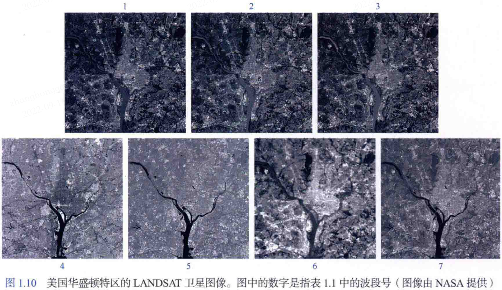
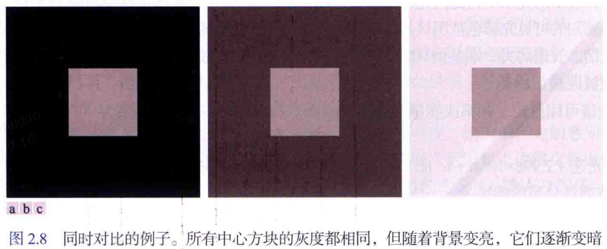
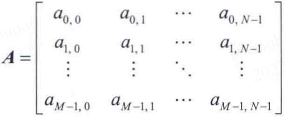
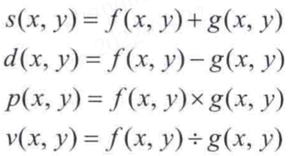
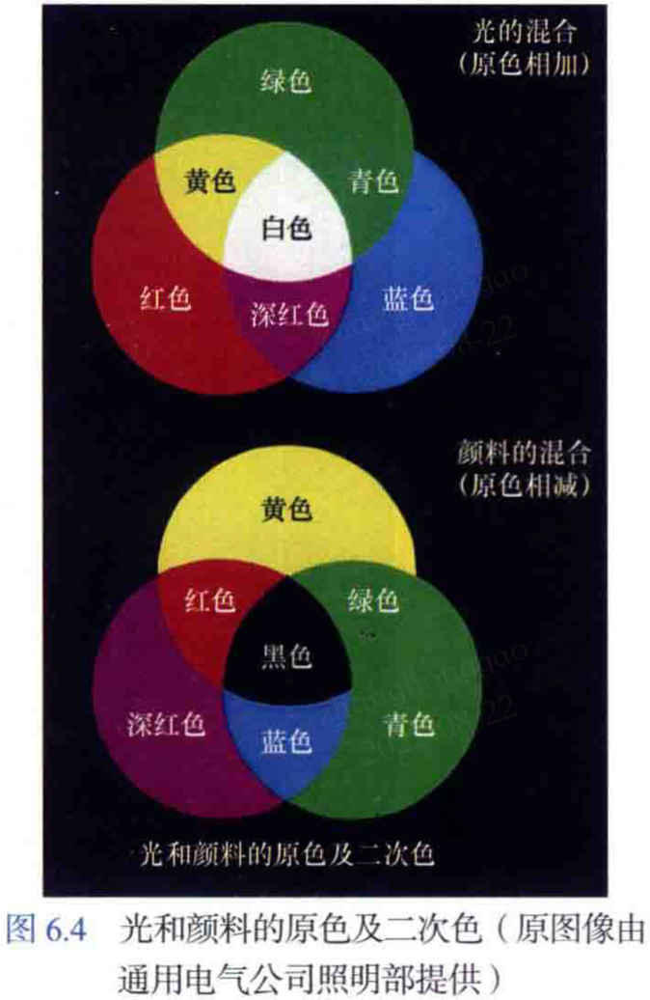

- [一，绪论](#一绪论)
  - [1.1, 什么是数字图像处理](#11-什么是数字图像处理)
  - [1.2，数字图像处理的起源](#12数字图像处理的起源)
  - [1.3，数字图像处理技术应用实例](#13数字图像处理技术应用实例)
  - [1.4，数字图像处理的基本步骤](#14数字图像处理的基本步骤)
  - [1.5，图像处理系统的组成](#15图像处理系统的组成)
- [二，数字图像基础](#二数字图像基础)
  - [2.1，视觉感知要素](#21视觉感知要素)
    - [2.1.1，人眼的结构](#211人眼的结构)
    - [2.1.2，人眼中图像的形成](#212人眼中图像的形成)
    - [2.1.3，亮度适应与辨别](#213亮度适应与辨别)
  - [2.2，电磁波谱](#22电磁波谱)
  - [2.3，图像感知与获取](#23图像感知与获取)
    - [2.3.1，一个简单的成像模型](#231一个简单的成像模型)
  - [2.4，图像取样和量化](#24图像取样和量化)
    - [2.4.1，取样和量化的概念](#241取样和量化的概念)
    - [2.4.2，数字图像表示](#242数字图像表示)
  - [2.5，像素间的一些基本关系](#25像素间的一些基本关系)
  - [2.6，数字图像处理所用的基本数学工具](#26数字图像处理所用的基本数学工具)
    - [2.6.1，对应元素运算和矩阵运算](#261对应元素运算和矩阵运算)
    - [2.6.2，线性运算和非线性运算](#262线性运算和非线性运算)
    - [2.6.3，数字图像处理数学工具-算术运算](#263数字图像处理数学工具-算术运算)
    - [2.6.4，集合运算和逻辑运算](#264集合运算和逻辑运算)
    - [2.6.5，空间运算](#265空间运算)
      - [2.6.5.1，单像素操作](#2651单像素操作)
      - [2.6.5.2，领域运算](#2652领域运算)
      - [2.6.5，几何变换](#265几何变换)
- [三，彩色图像处理](#三彩色图像处理)
  - [3.1，彩色基础](#31彩色基础)
  - [3.2，彩色模型](#32彩色模型)
    - [3.2.1，RGB 彩色模型](#321rgb-彩色模型)
    - [3.2.2，HSI 彩色模型](#322hsi-彩色模型)
- [参考资料](#参考资料)

## 一，绪论

### 1.1, 什么是数字图像处理

一副图像可以定义为一个二维函数 $f(x,y)$，其中 $x$ 和 $y$ 是空间（平面）坐标，任意一对空间坐标 $(x,y)$ 处的幅度值 $f$ 称为图像在该坐标点的强度或灰度。当 $x,y$ 和灰度值 $f$ 都是有限的离散量时，我们称该图像为数字图像。**数字图像处理**是指借助于数字计算机来处理数字图像。注意，数字图像由有限数量的元素组成，每个元素都有一定的位置和数值，这些元素称为**像素**。

图像处理止于何处或其他相关领域（如图像分析和计算机视觉）始于何处，目前人们的看法并不一致。在本书中，将**数字图像处理**定义为其输入和输出都是图像的处理。

### 1.2，数字图像处理的起源

略。
### 1.3，数字图像处理技术应用实例

目前数字图像处理已经应用于各行各业，在本书中，为了更简单表述，将数字图像处理的应用领域根据数字图像源分类（如可见光或 X 射线等）。目前最主要等图像源是电磁波谱，其他重要的图像源还有声波、超声波和电子（电子显微镜中所用的电子束）。

基于电磁波谱辐射的图像是我们比较数字的图像，比如 X 射线和可见光谱段的图像。电磁波可定义为以各种波长传播的正弦波，或可视为无质量的粒子流，每个粒子流以波的形式传播并以光速运动。每个无质量的粒子都包含一定的能量（或一束能量），每束能量称为一个光子。根据每个光子的能量对光谱波段进行分组，得到图 1.5 所示的光谱，其范围从伽玛射线（最高能量）到无线电波（最低能量）。

根据以上电磁波谱，可得到以下电磁波谱成像：

1. 伽玛射线成像：伽玛射线成像的主要用途包括核医学和天文观测。在核医学中，方法是将放射性同位素注入人体，同位素衰变时会发射伽玛射线，图像则由伽玛射线检测器收集到的放射线产生。下图展示了一幅使用伽玛射线成像得到的人体骨骼扫描图像。
2. X 射线成像：X 射线成像除了应用于医学诊断，还被广泛应用于工业和其他领域，如天文学。
3. 紫外波段成像。
4. 可见光和红外波段成像：应用领域最广，如光学显微镜、遥感图像、气象监测图像、工业自动视觉检测等。
5. 微波波段成像：主要应用是雷达。
6. 无线电波成像：应用领域如医学等磁共振成像（MRI）。

一些图像实例效果图如下图所示。

### 1.4，数字图像处理的基本步骤

本书中的数字图像处理步骤如下图所示。

### 1.5，图像处理系统的组成

略。

## 二，数字图像基础

**相机成像的原理**：针孔相机( Pinhole Camera )通过投影变换，可以将三维相机（Camera）坐标转换为二维的图像坐标，这个变换矩阵是相机的内在属性，称为相机内参（Camera Intrinsic） K。
> yaw 航向角，pitch 俯仰角，roll 翻滾角。

### 2.1，视觉感知要素

通过这节内容了解图像被人类感知的基本原理及人类视觉的物理限制。

#### 2.1.1，人眼的结构

下图显示了人眼的简化剖面图。

眼镜最靠内部的膜是视网膜，它布满了整个后部的内壁。眼睛聚焦时，来自物体的光在视网膜上成像。模式视觉由分布在视网膜表面上的哥哥分立光感受器提供，分为两类：锥状体和杆状体。锥状体视觉称为**明视觉或亮视觉**。杆状体视觉称为**暗视觉或微光视觉**。

#### 2.1.2，人眼中图像的形成

数码相机中，既有固定焦距的镜头，也有可变焦距的镜头，不同距离的聚焦时通过**改变镜头和成像平面之间的距离**来实现的。在人眼中，晶状体和成像区域（**视网膜**）之间的距离是固定的，正确的聚焦是通过改变晶状体的形状得到（远离压扁晶状体，接近目标则加厚晶状体），晶状体中心和沿视轴的视网膜之间的距离约为 17mm，焦距范围为 14~17 mm。下图所示的几何关系说明了在视网膜上所形成的图像的尺寸。令 $h$ 表示视网膜图像中物体的高度， 根据几何关系：$15/100 = h/17$，得到 h = 2.5 mm。

#### 2.1.3，亮度适应与辨别

以下两种现象表明人眼的感知亮度不是十几灰度的简单函数：
- “下冲”或“上冲”现象（马赫带效应）。
- 同时对比现象。

### 2.2，电磁波谱

更详细的电磁波谱图如下图所示。波长常用的单位是米（m），常用的单位是微米（表示为 $\mu m$，$1\mu m=10{^-6}m$）。

- 感知的物体颜色由物体反射的光的性质决定。
- 没有颜色的光称为**单色光或无色光**。
- 彩色光源的三个属性：频率、辐射、光通量和**亮度**。

### 2.3，图像感知与获取

将照射能量转换为数字图像主要由三种传感器配置：
- 使用单个传感器获取图像
- 使用条带传感器获取图像：如磁共振成像（MRI）和正电子发射断层成像（PET）等。
- 使用阵列传感器获取图像: 如单反相机和手机相机。

#### 2.3.1，一个简单的成像模型

如 1.1 节所述，我们用形如 $f(x,y)$ 的**二维函数**来表示图像，在空间坐标 (x,y) 处 $f$ 的值是一个标量，其范围 $0\leq f(x,y) < \infty$。

### 2.4，图像取样和量化

多少传感器的输出都是**连续**的电压被判刑，这些波形的幅度和空间特性都与正被感测的物理现象相关。要产生一幅数字图像，就需要把感测得到的连续数据转化为数字形式，这包括两个步骤：**取样和量化**。

#### 2.4.1，取样和量化的概念

一幅连续图像 $f$，对坐标值进行数字化称为**取样**（或采样），对幅度值进行数字化称为**量化**。
#### 2.4.2，数字图像表示

在计算机中，数字图像可用一个 $M\times N$矩阵表示，图像长为 $M$，宽为 $N$，矩阵中的每个元素即为图像的像素。

### 2.5，像素间的一些基本关系

- 像素的相邻像素
- 邻接、连通、区域和边界
- 距离测度：两个像素的距离，通过欧几里得（欧式）距离计算：$D(p,q) = \sqrt{[(x-u)^2 + (y-v)^2]}$
### 2.6，数字图像处理所用的基本数学工具

#### 2.6.1，对应元素运算和矩阵运算

略。

#### 2.6.2，线性运算和非线性运算

线性运算更为重要，包含了大量适用于图像处理的理论与实践成果；非线形运算范围比较有限。
#### 2.6.3，数字图像处理数学工具-算术运算
算术运算常用在特定的天文、医学等领域，将两幅图像经过算术运算从而得到更为清晰的图像，两幅图像的算术运算表示如下：

这些加减乘除运算都是对应的像素运算，算术运算一般有以下应用：

1. 使用图像相加（平均）降低噪声。
2. 使用图像相减比较图像。
3. 使用图像相乘/相除校正阴影和模板。

`3` 种算法运算的实际应用效果对比图如下所示：

#### 2.6.4，集合运算和逻辑运算
#### 2.6.5，空间运算

空间运算是直接对图像的像素执行数学操作，分为三类：（1）单像素运算；（2）领域运算；（3）几何空间运算。

##### 2.6.5.1，单像素操作
用一个变化函数$T$改变图像中各个像素的灰度: 

$s = T(z)$

上述公式对应单像素操作，$z$是原图像中像素的灰度，$s$是处理后图像中对应像素的（映射）的灰度。

##### 2.6.5.2，领域运算
假设领域运算对应的是计算大小为 $m\times n$、中心为$(x,y)$的矩形领域中像素的平均值，这个区域中的像素坐标是集合$S_{xy}$的元素，那么其对应的领域运算公式如下：

$g(x,y) = \frac{1}{mn} \sum_{(r,c)\in S_{xy}}f(r,c)$

上述公式中，$r$和$c$是像素的行和列坐标，属于集合$S_{xy}$，图像$g$是通过移动坐标$(x,y)$，使得领域的中心诸葛四郎移动图像$f$中的所有像素，然后在每个新位置都重复这一领域运算得到，对应的示意图如下：

> 典型的就是 `CNN` 模型中卷积层的滤波器操作。

##### 2.6.5，几何变换
几何变换即改变图像中像素的空间排列，由两种基本运算组成：

1. 坐标的空间变换；
2. 灰度内插，即为变换后的像素赋灰度值（灰度图）。

坐标变换公式可表示为：

最为重要的是**放射变换**，它包括缩放变换、平移变换、旋转变换和剪切变换。式(2.44)无法表示平移变换（需要在公式右侧添加一个常数二维向量），所以需将上式升级为，如下所示的齐次坐标变换。

常见图像几何操作对应的仿射矩阵 `A` 、变换坐标公式以及示意图如下表所示：

## 三，彩色图像处理
### 3.1，彩色基础
光的特性是色彩科学的核心，如果光是无色（无颜色）的，那么其属性就只有亮度或数值，具体体现就是20世纪20年度的黑白电影。其中术语灰度（或亮度）级是关于（从黑色变为灰色最终变为白色）灰度的一个测量，是一个标量。

彩色光在电磁波谱中的波长范围是 400～700nm，描述光源质量的 3 个基本量是辐射亮度、发光强度和亮度。人眼的生理结构特性表现为其对红色、绿色和蓝色光更为敏感，该特性使得人眼看到的颜色是三原色 \[红 R、绿 G、蓝 B\] 的不同组合。三原色相加可以产生光的二次色，如深红色（R+B）、青色（G+B）和黄色（R+G）。

区分不同颜色的特性通常是**亮度、色调和饱和度，**色调与饱和度一起称为色度**。**

* **亮度**：亮度体现的是发光强度（灰度级）的消色概念。
* **色调**：色调是混合光波中与主导波长相关的属性，表示被观察者感知的主导色。即，当我们说一个物体颜色说红色、橙色或红色时，说的就是物体的色调。
* **饱和度**：饱和度指的是相对的纯度（纯色被白光稀释的程度），或与一种色调混合的白光量。纯光谱颜色是完全饱和的，非光谱颜色如淡紫色（紫色加白色）是不饱和度，饱和度与所加白光量成反比。

### 3.2，彩色模型
彩色模型（也称彩色空间或彩色系统）的目的是以某种标准的方式来方便地规定颜色。彩色模型本质上规定：（1）坐标系；（2）坐标系内的字空间，模型内的每种颜色都可由字空间内包含的一个点来表示。数字图像处理中的面向硬件的彩色模型常用有以下几种：

* 针对彩色显示器和彩色摄像机开发的 `RGB` 模型。
* 针对彩色打印机开发的 `CMY` 模型。
* 针对人们描述和解释颜色的方式开发的 `HSI` （色调、饱和度、亮度）模型。

#### 3.2.1，RGB 彩色模型
在 RGB 模型中，每种颜色都以其红色、绿色和蓝色光谱成分显示，该模型是根据笛卡尔坐标系建立的。RGB 彩色立方体简图如下所示：

全彩色图像通常是指一幅 `24` 比特的 `RGB` 彩色图像（每幅分量图像都是 `8` 位，值域是 \[0, 255\]），颜色总数自然是 $(2^8)^3$=16777216。

#### 3.2.2，HSI 彩色模型
`RGB` 、`CMY` 和 `CMYK` 模型适合硬件实现但是并不能很好的描述人类世纪解释的颜色；观察彩色物体时，我们会用色调、饱和度和亮度来描述这个物体，由此提出了 `HSI` 彩色模型（色调、饱和度、亮度）。

从 RGB 到 HSI 的彩色变换的公式如下：

## 参考资料
《数字图像处理第四版》