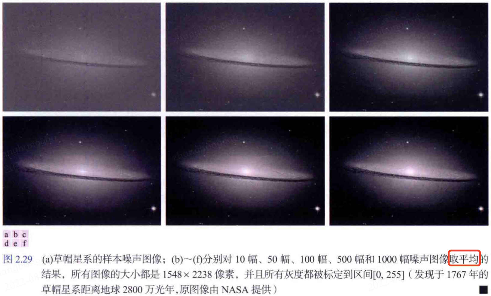
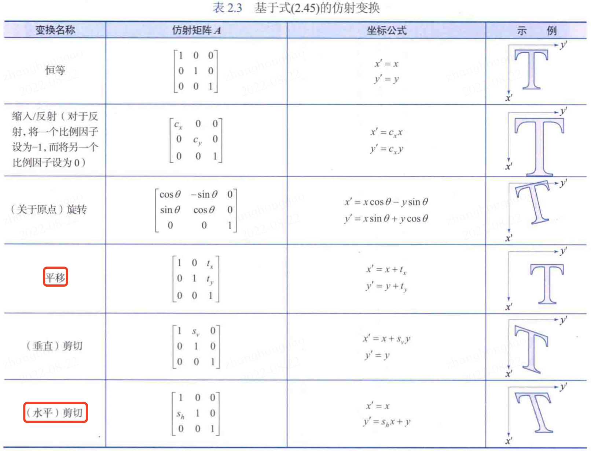
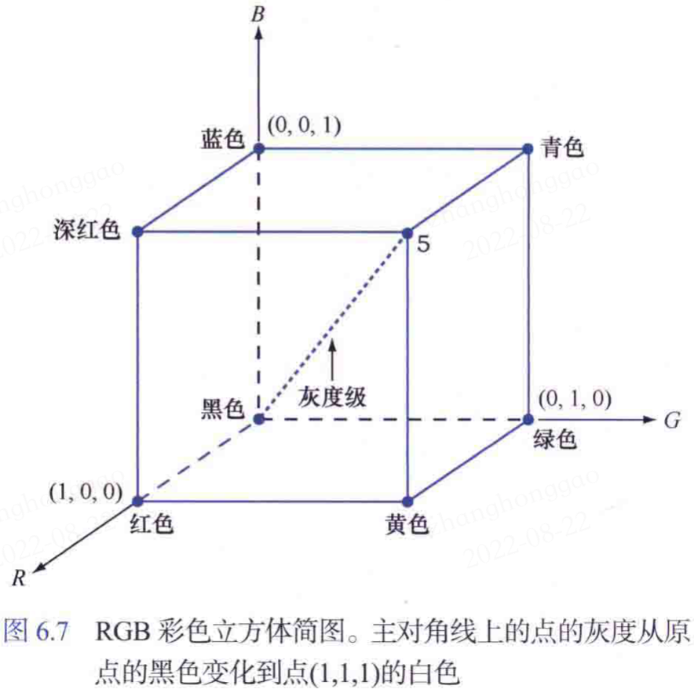

- [一，数字图像处理基础](#一数字图像处理基础)
  - [1.1，数字图像表示](#11数字图像表示)
  - [1.2，数字图像处理数学工具-算术运算](#12数字图像处理数学工具-算术运算)
  - [1.3，数字图像处理数学工具-空间运算](#13数字图像处理数学工具-空间运算)
    - [1.3.1，单像素操作](#131单像素操作)
    - [1.3.2，领域运算](#132领域运算)
    - [1.3.3，几何变换](#133几何变换)
- [二，彩色图像处理](#二彩色图像处理)
  - [2.1，彩色基础](#21彩色基础)
  - [2.2，彩色模型](#22彩色模型)
    - [2.2.1，RGB 彩色模型](#221rgb-彩色模型)
    - [2.2.2，HSI 彩色模型](#222hsi-彩色模型)
- [参考资料](#参考资料)

## 一，数字图像处理基础
### 1.1，数字图像表示
**相机成像的原理**：针孔相机( Pinhole Camera )通过投影变换，可以将三维相机（Camera）坐标转换为二维的图像坐标，这个变换矩阵是相机的内在属性，称为相机内参（Camera Intrinsic） K。
> yaw 航向角，pitch 俯仰角，roll 翻滾角。

在计算机中，数字图像可用一个 $M\times N$矩阵表示，图像长为 $M$，宽为 $N$，矩阵中的每个元素即为图像的像素。

### 1.2，数字图像处理数学工具-算术运算
算术运算常用在特定的天文、医学等领域，将两幅图像经过算术运算从而得到更为清晰的图像，两幅图像的算术运算表示如下：

这些加减乘除运算都是对应的像素运算，算术运算一般有以下应用：

1. 使用图像相加（平均）降低噪声。
2. 使用图像相减比较图像。
3. 使用图像相乘/相除校正阴影和模板。

`3` 种算法运算的实际应用效果对比图如下所示：

### 1.3，数字图像处理数学工具-空间运算
空间运算是直接对图像的像素执行数学操作，分为三类：（1）单像素运算；（2）领域运算；（3）几何空间运算。

#### 1.3.1，单像素操作
用一个变化函数$T$改变图像中各个像素的灰度: 

$s = T(z)$

上述公式对应单像素操作，$z$是原图像中像素的灰度，$s$是处理后图像中对应像素的（映射）的灰度。

#### 1.3.2，领域运算
假设领域运算对应的是计算大小为 $m\times n$、中心为$(x,y)$的矩形领域中像素的平均值，这个区域中的像素坐标是集合$S_{xy}$的元素，那么其对应的领域运算公式如下：

$g(x,y) = \frac{1}{mn} \sum_{(r,c)\in S_{xy}}f(r,c)$

上述公式中，$r$和$c$是像素的行和列坐标，属于集合$S_{xy}$，图像$g$是通过移动坐标$(x,y)$，使得领域的中心诸葛四郎移动图像$f$中的所有像素，然后在每个新位置都重复这一领域运算得到，对应的示意图如下：

> 典型的就是 `CNN` 模型中卷积层的滤波器操作。

#### 1.3.3，几何变换
几何变换即改变图像中像素的空间排列，由两种基本运算组成：

1. 坐标的空间变换；
2. 灰度内插，即为变换后的像素赋灰度值（灰度图）。

坐标变换公式可表示为：

最为重要的是**放射变换**，它包括缩放变换、平移变换、旋转变换和剪切变换。式(2.44)无法表示平移变换（需要在公式右侧添加一个常数二维向量），所以需将上式升级为，如下所示的齐次坐标变换。

常见图像几何操作对应的仿射矩阵 `A` 、变换坐标公式以及示意图如下表所示：

## 二，彩色图像处理
### 2.1，彩色基础
光的特性是色彩科学的核心，如果光是无色（无颜色）的，那么其属性就只有亮度或数值，具体体现就是20世纪20年度的黑白电影。其中术语灰度（或亮度）级是关于（从黑色变为灰色最终变为白色）灰度的一个测量，是一个标量。

彩色光在电磁波谱中的波长范围是 400～700nm，描述光源质量的 3 个基本量是辐射亮度、发光强度和亮度。人眼的生理结构特性表现为其对红色、绿色和蓝色光更为敏感，该特性使得人眼看到的颜色是三原色 \[红 R、绿 G、蓝 B\] 的不同组合。三原色相加可以产生光的二次色，如深红色（R+B）、青色（G+B）和黄色（R+G）。

区分不同颜色的特性通常是**亮度、色调和饱和度，**色调与饱和度一起称为色度**。**

* **亮度**：亮度体现的是发光强度（灰度级）的消色概念。
* **色调**：色调是混合光波中与主导波长相关的属性，表示被观察者感知的主导色。即，当我们说一个物体颜色说红色、橙色或红色时，说的就是物体的色调。
* **饱和度**：饱和度指的是相对的纯度（纯色被白光稀释的程度），或与一种色调混合的白光量。纯光谱颜色是完全饱和的，非光谱颜色如淡紫色（紫色加白色）是不饱和度，饱和度与所加白光量成反比。

### 2.2，彩色模型
彩色模型（也称彩色空间或彩色系统）的目的是以某种标准的方式来方便地规定颜色。彩色模型本质上规定：（1）坐标系；（2）坐标系内的字空间，模型内的每种颜色都可由字空间内包含的一个点来表示。数字图像处理中的面向硬件的彩色模型常用有以下几种：

* 针对彩色显示器和彩色摄像机开发的 `RGB` 模型。
* 针对彩色打印机开发的 `CMY` 模型。
* 针对人们描述和解释颜色的方式开发的 `HSI` （色调、饱和度、亮度）模型。

#### 2.2.1，RGB 彩色模型
在 RGB 模型中，每种颜色都以其红色、绿色和蓝色光谱成分显示，该模型是根据笛卡尔坐标系建立的。RGB 彩色立方体简图如下所示：

全彩色图像通常是指一幅 `24` 比特的 `RGB` 彩色图像（每幅分量图像都是 `8` 位，值域是 \[0, 255\]），颜色总数自然是 $(2^8)^3$=16777216。

#### 2.2.2，HSI 彩色模型
`RGB` 、`CMY` 和 `CMYK` 模型适合硬件实现但是并不能很好的描述人类世纪解释的颜色；观察彩色物体时，我们会用色调、饱和度和亮度来描述这个物体，由此提出了 `HSI` 彩色模型（色调、饱和度、亮度）。

从 RGB 到 HSI 的彩色变换的公式如下：

## 参考资料
《数字图像处理第四版》