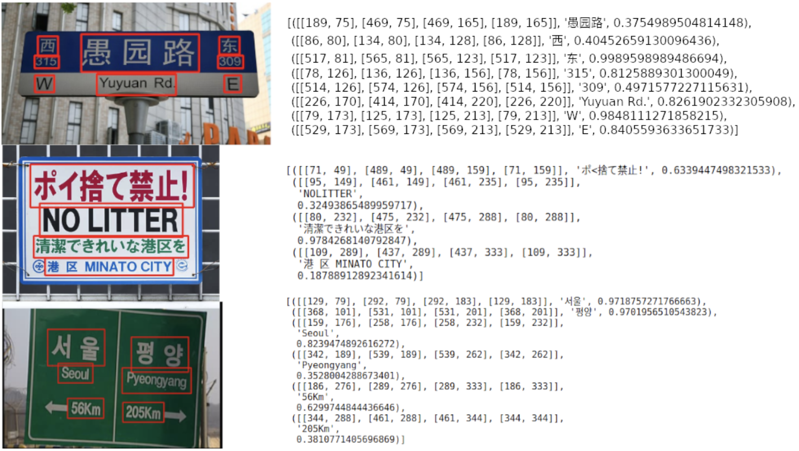
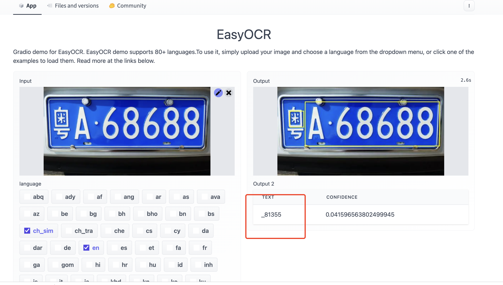
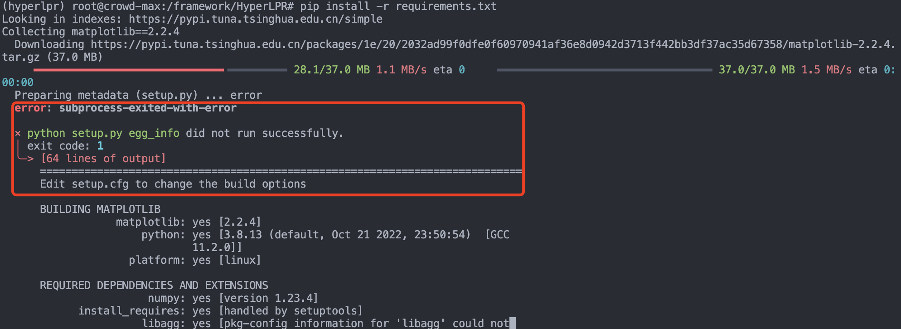
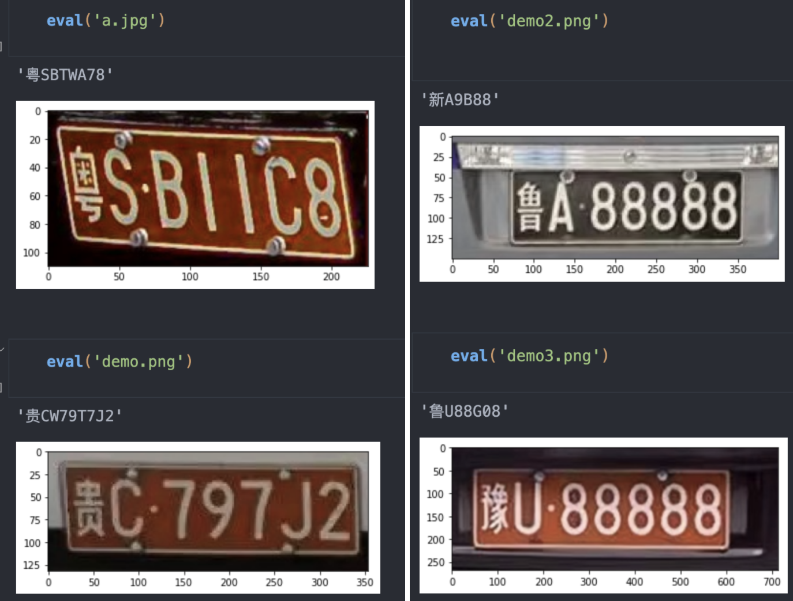
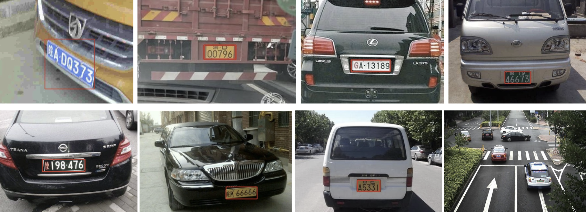

# GitHub 车牌检测识别项目调研.md
## 一，EasyOCR
### 1.1，仓库介绍
[EasyOCR](https://github.com/JaidedAI/EasyOCR) 是一个用于从图像中提取文本的 python 库, 它是一种通用的 OCR，既可以读取自然场景文本，也可以读取文档中的密集文本。目前支持 80 多种语言和所有流行的书写脚本，包括：拉丁文、中文、阿拉伯文、梵文、西里尔文等。

EasyOCR 仓库 截止到 `2022-11-8`日，`star` 数为 `16.2k`，其文件目录和作者给出的一些示例效果如下。

```bash
├── custom_model.md
├── Dockerfile
├── easyocr
├── easyocr.egg-info
├── examples
├── LICENSE
├── MANIFEST.in
├── README.md
├── releasenotes.md
├── requirements.txt
├── scripts
├── setup.cfg
├── setup.py
├── trainer
└── unit_test
```


### 1.2，使用记录
1，**安装较为麻烦**

在自行安装了 `cuda` 库和 `pytorch` 的基础上，可通过 `pip install easyocr` 命令安装 `easyocr` 库，但是注意卸载掉之前安装的 `opencv-python` 库（如果有）。

2，**代码自动下载模型速度很慢**

下载的仓库里面默认是不提供任何模型的，因此第一次运行快速推理脚本会自动下载对应的 `ocr` 模型，但是！如果网络不稳定，其下载速度非常慢，试了 `n` 次，基本不可能下载成功。

所以一般必须通过 [Model hub](https://www.jaided.ai/easyocr/modelhub) 页面借助浏览器**手动点击下载**对应中英文 `ocr` 识别模型，然后手动把模型文件移动到 `~/.EasyOCR/model` 文件夹下。

`EasyOCR` 仓库主要是通过 `download_and_unzip` 接口下载对应模型文件的，其也是通过调用 `urllib` 模块提供的 `urlretrieve()` 函数来实现文件的下载，其定义如下:

```python
def download_and_unzip(url, filename, model_storage_directory, verbose=True):
    zip_path = os.path.join(model_storage_directory, 'temp.zip')
    reporthook = printProgressBar(prefix='Progress:', suffix='Complete', length=50) if verbose else None
    # url 下载链接，zip_path 文件保存的本地路径, reporthook 利用这个回调函数来显示当前的下载进度
    urlretrieve(url, zip_path, reporthook=reporthook)
    with ZipFile(zip_path, 'r') as zipObj:
        zipObj.extract(filename, model_storage_directory) # 解压到指定目录
    os.remove(zip_path) # 移除下载的压缩包文件
```
3，**车牌场景识别准确率非常低**

经过我的大量测试，其在中国车牌场景下识别率几乎为 `0`，我猜测是因为作者提供的训练模型所用的训练数据没有车牌场景的，而 `ocr` 效果又非常依赖场景数据，所以导致汽车车牌识别率几乎为 `0` ，具体实践效果如下。



## 二，HyperLPR
### 2.1，HyperLPR 概述
[HyperLPR 框架](https://github.com/szad670401/HyperLPR)是 github 作者 [szad670401](https://github.com/szad670401) 开源的基于深度学习高性能中文车牌识别框架，支持多平台，提供了 Window、Linux、Android、IOS、ROS 平台的支持。 Python 依赖于 Keras (>2.0.0) 和 Theano(>0.9) or Tensorflow(>1.1.x) 机器学习库。**项目的 C++ 实现和 Python 实现无任何关联，均为单独实现**。

作者提供的测试用例效果如下：


### 2.3，使用记录
仓库 README 文件描述说 HyperLPR 框架对 python 包支持一键安装: `pip install hyperlpr` 。但是经过我实际测试发现，`pip install hyperlpr` 命令只能成功安装 `hyperlpr` 库.

1，快速上手的 py 代码运行会出错：


2，我把 `demo` 代码移动到 `hyperlpr_py3` 目录下运行，不再报上图的错误，但是又报了 `opencv` 函数版本的问题。

```bash
hyperlpr) root@crowd-max:/framework/HyperLPR/hyperlpr_py3# python test.py 
(1, 3, 150, 400)
40 22 335 123
Traceback (most recent call last):
  File "test.py", line 7, in <module>
    print(HyperLPR_plate_recognition(image))
  File "/opt/miniconda3/envs/hyperlpr/lib/python3.8/site-packages/hyperlpr/__init__.py", line 8, in HyperLPR_plate_recognition
    return PR.plate_recognition(Input_BGR,minSize,charSelectionDeskew)
  File "/opt/miniconda3/envs/hyperlpr/lib/python3.8/site-packages/hyperlpr/hyperlpr.py", line 311, in plate_recognition
    cropped_finetuned = self.finetune(cropped)
  File "/opt/miniconda3/envs/hyperlpr/lib/python3.8/site-packages/hyperlpr/hyperlpr.py", line 263, in finetune
    g = self.to_refine(image_, pts)
  File "/opt/miniconda3/envs/hyperlpr/lib/python3.8/site-packages/hyperlpr/hyperlpr.py", line 231, in to_refine
    mat_ = cv2.estimateRigidTransform(org_pts, target_pts, True)
AttributeError: module 'cv2' has no attribute 'estimateRigidTransform'
```
3，`ubuntu16.04+python3.8+cuda11.0` 环境下，`pip install -r requirements.txt` 命令安装依赖包依然会出错。



### 2.3，使用建议
**个人建议直接使用 C++ 版本**，截止到 2022-11-8 日为止，纯 Python 版本还是有各种问题。

## 三，simple-car-plate-recognition-2
### 3.1，仓库介绍
[simple-car-plate-recognition-2仓库 ](https://github.com/airxiechao/simple-car-plate-recognition-2) 简称：简易车牌字符识别 `2-Inception/CTC` 。

作者使用的字符识别模型是参考 [HyperLPR](https://github.com/zeusees/HyperLPR) 里面的一个叫 `SegmenationFree-Inception` 的模型结构，并改用 `pytorch` 框架实现，然后训练模型，最后测试用整张车牌图片进行字符识别。

作者所用的车牌训练集，是利用 [generateCarPlate](https://github.com/derek285/generateCarPlate) 这个车牌生成工具生成的。

### 3.2，使用记录
直接用车牌做识别，**实际测试下来，不管用作者给的模型，还是自己训练的模型，效果都很差**。



### 3.3，使用建议
虽然代码简单，模型结构容易看懂，但是不建议使用，效果不稳定和太差。

## 四，车牌检测-License-Plate-Detector
### 4.1，仓库介绍
[License-Plate-Detector 仓库](https://github.com/zeusees/License-Plate-Detector) 作者利用 Yolov5 模型进行了车牌检测，训练集使用 `CCPD` 数据集，测试效果如下：



### 4.2，建议
**不建议使用，代码写的不够整洁**，使用不够方便，使用 **yolov5**** 用作车牌检测的模型**的方法还是可以参考下。

## 五，MMOCR
### 5.1，仓库介绍
`mmocr` 是商汤 + `openmmlab` 实验室开发的 **OCR 框架**。`MMOCR` 是基于 `PyTorch` 和 `mmdetection` 的开源工具箱，专注于文本检测，文本识别以及相应的下游任务，如关键信息提取。 它是 `OpenMMLab` 项目的一部分。

主分支目前支持 **PyTorch 1.6 以上**的版本。mmocr 库的安装，可参考我之前的文章-[ubuntu16.04安装mmdetection库](https://github.com/HarleysZhang/2021_algorithm_intern_information/blob/master/1-computer_basics/%E8%BD%AF%E4%BB%B6%E5%AE%89%E8%A3%85/ubuntu16.04%E5%AE%89%E8%A3%85mmdetection%E5%BA%93.md#%E4%B8%89mmdetection-%E5%AE%89%E8%A3%85)。

### 5.2，使用记录
1，官方提供**中文字符识别模型只有一个**，其使用步骤如下：

1. 创建 `mmocr/data/chineseocr/labels` 目录;
2. 为了模型推理成功，下载中文字典，并放置到 `labels` 目录;

```bash
wget -c https://download.openmmlab.com/mmocr/textrecog/sar/dict_printed_chinese_english_digits.txt
mv dict_printed_chinese_english_digits.txt mmocr/data/chineseocr/labels 
```
3. 运行推理脚本。

```bash
python mmocr/utils/ocr.py --det DB_r18 --recog SAR_CN demo/car1.jpeg --output='./'
```
**车牌识别效果不好**，测试结果如下：


2，官方提供的测试用例的推理效果如下:


### 5.3，使用建议
**官方提供的不管是中文还是英文文本识别模型，在车牌场景下识别效果都不好**，不推荐在车牌识别场景下使用，更适合通用场景。

## 六，推荐 YOLOv5-LPRNet-Licence-Recognition
### 6.1，仓库介绍
**YOLOv5-LPRNet-Licence-Recognition** 项目是使用 [YOLOv5s](https://github.com/ultralytics/yolov5) 和 [LPRNet](https://arxiv.org/pdf/1806.10447.pdf) 对中国车牌进行检测和识别，车牌数据集是使用 [CCPD](https://github.com/detectRecog/CCPD)。

**车牌字符识别的准确率**如下:

|`model`|数据集|`epochs`|`acc`|`size`|
| ----- | ----- | ----- | ----- | ----- |
|LPRNet|val|100|94.33%|1.7M|
|LPRNet|test|100|**94.30%**|1.7M|

**总体模型速度**：（`YOLOv5 + LPRNet`）速度：`47.6 FPS`（970 GPU）。

### 6.2，使用记录
作者提供的模型实际测试下来效果还不错，部分示例如下：


